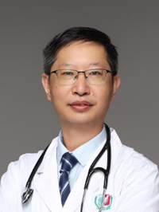

<!-- AUTO-GENERATED-BY: work/generate_obsidian_profiles.py -->

<!-- TEMPLATE: D:\workspace\信息收集整理\医生画像仓库\模板\医生画像模板.md -->

# 何晓青

## 基础信息

| 字段 | 内容 |
|---|---|
| 姓名 | 何晓青 |
| 医院 | 广州医科大学附属第三医院 |
| 科室 | 荔湾院区心血管内科 |
| 职称/身份 | 副教授、副主任医师 |
| 来源链接 | [官网原文](https://www.gy3y.cn/ks/nkxt/xxgnk/doctor_246.html) |
| 采集日期 | 2026-08-13 |

## 简介/擅长

熟练掌握高血压、冠心病、心脏瓣膜病、心律失常、下肢动脉硬化闭塞及夹层动脉瘤等心血管常见病多见病及危急重症的救治，擅长冠脉介入及外周血管介入手术。

## 教育与进修经历

- 何晓青 副主任医师、副教授，硕士研究生导师 加拿大多伦多总医院、美国旧金山州立大学访问学者。

## 可包装亮点

- 何晓青 副主任医师、副教授，硕士研究生导师 加拿大多伦多总医院、美国旧金山州立大学访问学者。
- 目前任广州市医师协会心血管内科医师分会副主任委员，广东省介入性心脏病学会周围血管介入分会委员，广东省胸痛中心协会理事及广东省介入性心脏病学会理事等。
- 获第一届“柔济青年医师”及第十届“羊城好医生”称号。

## 重点疾病/人群标签

- 慢性病：高血压、冠心病、瘤、重症
- 肿瘤：高血压、冠心病、瘤、重症
- 生殖疾病：
- 免疫/风湿：
- 术后恢复/康复：
- 疑难重症：高血压、冠心病、瘤、重症

## 证据摘录

> 只摘录官网公开信息中的短句或关键字段，不复制大段原文。

- 官网身份字段：副教授、副主任医师
- 官网简介/擅长：熟练掌握高血压、冠心病、心脏瓣膜病、心律失常、下肢动脉硬化闭塞及夹层动脉瘤等心血管常见病多见病及危急重症的救治，擅长冠脉介入及外周血管介入手术。
- 官网亮眼经历线索：何晓青 副主任医师、副教授，硕士研究生导师 加拿大多伦多总医院、美国旧金山州立大学访问学者。 目前任广州市医师协会心血管内科医师分会副主任委员，广东省介入性心脏病学会周围血管介入分会委员，广东省胸痛中心协会理事及广东省介入性心脏病学会理事等。 获第一届“柔济青年医师”及第十届“羊城好医生”称号。
- 来源链接：https://www.gy3y.cn/ks/nkxt/xxgnk/doctor_246.html

## BD 画像摘要

何晓青医生可作为慢性病、肿瘤、疑难重症方向的基础画像候选。后续 BD 使用应继续以官网来源和人工复核为准，不添加疗效承诺或无来源包装。

## 合规边界

- 仅使用医院官网、官方公众号、官方小程序等公开渠道。
- 不采集私人电话、私人微信、家庭住址、患者隐私或非公开排班信息。
- 不写“保证治愈”“疗效第一”“包治疑难杂症”等无法由官网证明的表述。
