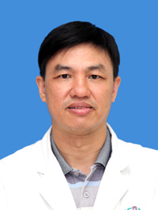

<!-- AUTO-GENERATED-BY: work/generate_obsidian_profiles.py -->

<!-- TEMPLATE: D:\workspace\信息收集整理\医生画像仓库\模板\医生画像模板.md -->

# 佘锡鸾

## 基础信息

| 字段 | 内容 |
|---|---|
| 姓名 | 佘锡鸾 |
| 医院 | 广州医科大学附属第三医院 |
| 科室 | 荔湾院区泌尿外科 |
| 职称/身份 | 主任医师 |
| 来源链接 | [官网原文](https://www.gy3y.cn/ks/wkxt/mnwk/doctor_91.html) |
| 采集日期 | 2026-08-13 |

## 简介/擅长

普通泌尿外科、女性泌尿外科及腔内泌尿外科。对泌尿系结石、泌尿系肿瘤及男性生殖疾病如慢性前列腺炎、前列腺增生、男性不育及勃起功能障碍（ED）诸方面有丰富的临床诊治经验。

## 论文与学术产出

- 在省级医学杂志以上发表论文十余篇。
- 参与编写《膀胱癌》等著作。

## 可包装亮点

- 佘锡鸾 ，主任医师。
- 在省级医学杂志以上发表论文十余篇。

## 重点疾病/人群标签

- 慢性病：慢性、肿瘤、癌、生殖、功能障碍
- 肿瘤：慢性、肿瘤、癌、生殖、功能障碍
- 生殖疾病：慢性、肿瘤、癌、生殖、功能障碍
- 免疫/风湿：
- 术后恢复/康复：慢性、肿瘤、癌、生殖、功能障碍
- 疑难重症：

## 证据摘录

> 只摘录官网公开信息中的短句或关键字段，不复制大段原文。

- 官网身份字段：主任医师
- 官网简介/擅长：普通泌尿外科、女性泌尿外科及腔内泌尿外科。对泌尿系结石、泌尿系肿瘤及男性生殖疾病如慢性前列腺炎、前列腺增生、男性不育及勃起功能障碍（ED）诸方面有丰富的临床诊治经验。
- 官网亮眼经历线索：佘锡鸾 ，主任医师。 在省级医学杂志以上发表论文十余篇。
- 来源链接：https://www.gy3y.cn/ks/wkxt/mnwk/doctor_91.html

## BD 画像摘要

佘锡鸾医生可作为慢性病、肿瘤、生殖疾病、术后恢复/康复方向的基础画像候选。后续 BD 使用应继续以官网来源和人工复核为准，不添加疗效承诺或无来源包装。

## 合规边界

- 仅使用医院官网、官方公众号、官方小程序等公开渠道。
- 不采集私人电话、私人微信、家庭住址、患者隐私或非公开排班信息。
- 不写“保证治愈”“疗效第一”“包治疑难杂症”等无法由官网证明的表述。
