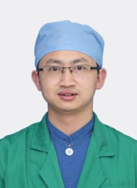

<!-- AUTO-GENERATED-BY: work/generate_obsidian_profiles.py -->

<!-- TEMPLATE: D:\workspace\信息收集整理\医生画像仓库\模板\医生画像模板.md -->

# 刘先保

## 基础信息

| 字段 | 内容 |
|---|---|
| 姓名 | 刘先保 |
| 医院 | 广州医科大学附属第三医院 |
| 科室 | 荔湾院区麻醉科、黄埔院区麻醉科 |
| 职称/身份 | 副主任医师 |
| 来源链接 | [官网原文](https://www.gy3y.cn/ks/wkxt/mzk/doctor_258.html) |
| 采集日期 | 2026-08-13 |

## 简介/擅长

从事临床麻醉20余年，擅长采用超声引导高龄骨科相关神经组滞技术，积极推广超声在各种神经组滞、椎管内穿刺、血管穿刺技术以及腹部、肺部中应用。在骨科、重症产科麻醉具有丰富的临床经验。

## 科研项目与成果

- 发表学术论文30篇（SCI收录7篇），获得实用新型专利1项，主持省市各项课题5项，指导本科生获得大学生创新创业训练计划三项（含国家级1项）。

## 论文与学术产出

- 发表学术论文30篇（SCI收录7篇），获得实用新型专利1项，主持省市各项课题5项，指导本科生获得大学生创新创业训练计划三项（含国家级1项）。

## 可包装亮点

- 刘先保，副主任医师，硕士研究生导师，广州医科大学附属第三医院麻醉科副主任、教学主任、外科第四党支部书记。
- 现任广东省临床医学会麻醉学分会常务委员、广州市医学会麻醉医师分会常务委员、广东省医学会麻醉分会创伤与骨科学组成员、广东省医学会麻醉分会青年委员会委员、广东省医师协会麻醉科分会青年学组成员、广州医师协会麻醉科分会常务委员、广东省药学会麻醉专家委员会委员、广东省医师协会疼痛科医师分会委员。
- 发表学术论文30篇（SCI收录7篇），获得实用新型专利1项，主持省市各项课题5项，指导本科生获得大学生创新创业训练计划三项（含国家级1项）。

## 重点疾病/人群标签

- 慢性病：
- 肿瘤：
- 生殖疾病：
- 免疫/风湿：
- 术后恢复/康复：疼痛、重症
- 疑难重症：疼痛、重症

## 证据摘录

> 只摘录官网公开信息中的短句或关键字段，不复制大段原文。

- 官网身份字段：副主任医师
- 官网简介/擅长：从事临床麻醉20余年，擅长采用超声引导高龄骨科相关神经组滞技术，积极推广超声在各种神经组滞、椎管内穿刺、血管穿刺技术以及腹部、肺部中应用。在骨科、重症产科麻醉具有丰富的临床经验。
- 官网亮眼经历线索：刘先保，副主任医师，硕士研究生导师，广州医科大学附属第三医院麻醉科副主任、教学主任、外科第四党支部书记。 现任广东省临床医学会麻醉学分会常务委员、广州市医学会麻醉医师分会常务委员、广东省医学会麻醉分会创伤与骨科学组成员、广东省医学会麻醉分会青年委员会委员、广东省医师协会麻醉科分会青年学组成员、广州医师协会麻醉科分会常务委员、广东省药学会麻醉专家委员会委员、广东省医师协会疼痛科医师分会委员。 发表学术论文30篇（SCI收录7篇），获得实…
- 来源链接：https://www.gy3y.cn/ks/wkxt/mzk/doctor_258.html

## BD 画像摘要

刘先保医生可作为术后恢复/康复、疑难重症方向的基础画像候选。后续 BD 使用应继续以官网来源和人工复核为准，不添加疗效承诺或无来源包装。

## 合规边界

- 仅使用医院官网、官方公众号、官方小程序等公开渠道。
- 不采集私人电话、私人微信、家庭住址、患者隐私或非公开排班信息。
- 不写“保证治愈”“疗效第一”“包治疑难杂症”等无法由官网证明的表述。
