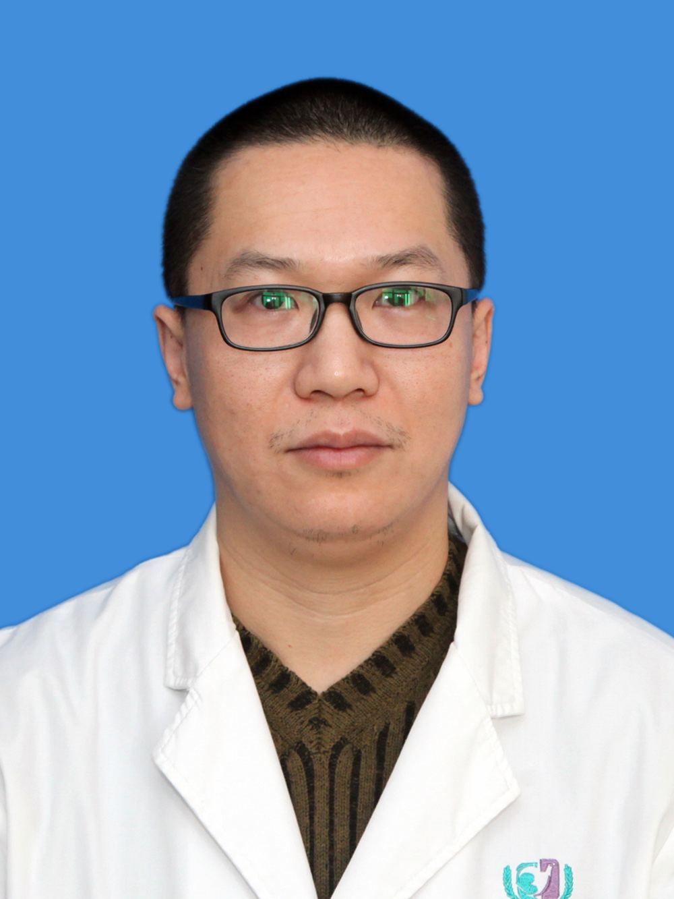

<!-- AUTO-GENERATED-BY: work/generate_obsidian_profiles.py -->

<!-- TEMPLATE: D:\workspace\信息收集整理\医生画像仓库\模板\医生画像模板.md -->

# 刘瓅

## 基础信息

| 字段 | 内容 |
|---|---|
| 姓名 | 刘瓅 |
| 医院 | 广州医科大学附属第三医院 |
| 科室 | 荔湾院区妇 科 |
| 职称/身份 | 副主任医师 |
| 来源链接 | [官网原文](https://www.gy3y.cn/ks/fckyjs/fk/doctor_302.html) |
| 采集日期 | 2026-08-13 |

## 简介/擅长

开设的刘瓅输卵管疾病工作室，专注于腹腔镜下生殖器官的保护、盆腔生殖结构重建以及输卵管的修复整形：如输卵管积水、输卵管堵塞、输卵管积脓、输卵管妊娠等输卵管相关病变。此外，对妇科常见疾病如子宫肌瘤、卵巢肿瘤等疾病也具有丰富经验。

## 可包装亮点

- 刘瓅，副主任医师，专注妇科临床实践研究 ， 对患者术前术后的管理以及手术指征的把握有着科学而独特的简介 。

## 重点疾病/人群标签

- 慢性病：
- 肿瘤：肿瘤、瘤、生殖、不孕、卵巢、术后
- 生殖疾病：肿瘤、瘤、生殖、不孕、卵巢、术后
- 免疫/风湿：
- 术后恢复/康复：肿瘤、瘤、生殖、不孕、卵巢、术后
- 疑难重症：

## 证据摘录

> 只摘录官网公开信息中的短句或关键字段，不复制大段原文。

- 官网身份字段：副主任医师
- 官网简介/擅长：开设的刘瓅输卵管疾病工作室，专注于腹腔镜下生殖器官的保护、盆腔生殖结构重建以及输卵管的修复整形：如输卵管积水、输卵管堵塞、输卵管积脓、输卵管妊娠等输卵管相关病变。此外，对妇科常见疾病如子宫肌瘤、卵巢肿瘤等疾病也具有丰富经验。
- 官网亮眼经历线索：刘瓅，副主任医师，专注妇科临床实践研究 ， 对患者术前术后的管理以及手术指征的把握有着科学而独特的简介 。
- 来源链接：https://www.gy3y.cn/ks/fckyjs/fk/doctor_302.html

## BD 画像摘要

刘瓅医生可作为肿瘤、生殖疾病、术后恢复/康复方向的基础画像候选。后续 BD 使用应继续以官网来源和人工复核为准，不添加疗效承诺或无来源包装。

## 合规边界

- 仅使用医院官网、官方公众号、官方小程序等公开渠道。
- 不采集私人电话、私人微信、家庭住址、患者隐私或非公开排班信息。
- 不写“保证治愈”“疗效第一”“包治疑难杂症”等无法由官网证明的表述。
