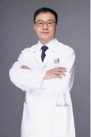

<!-- AUTO-GENERATED-BY: work/generate_obsidian_profiles.py -->

<!-- TEMPLATE: D:\workspace\信息收集整理\医生画像仓库\模板\医生画像模板.md -->

# 刘震

## 基础信息

| 字段 | 内容 |
|---|---|
| 姓名 | 刘震 |
| 医院 | 广州医科大学附属第三医院 |
| 科室 | 荔湾院区康复医学科 |
| 职称/身份 | 主任医师 |
| 来源链接 | [官网原文](https://www.gy3y.cn/ks/mjz/kfyxk/doctor_342.html) |
| 采集日期 | 2026-08-13 |

## 简介/擅长

儿童青少年骨发育姿势异常（头颅畸形、漏斗胸、鸡胸、脊柱侧弯、足内外翻、扁平足）；产后一体化康复（腹直肌分离、盆底肌障碍、骶尾部疼痛、耻骨联合分离疼痛、假胯宽、减脂、内脏下垂）；颞下颌关节紊乱病；男性康复（慢性前列腺炎、男性ED、前列腺增生症）；内脏康复（脂肪肝、胃肠疾病、心肺疾病、薄型子宫、慢性子宫内膜炎）；脊髓损伤、颈肩腰腿痛、骨与关节损伤；脑卒中、脑外伤康复，对重症或病情复杂患者（如气管切开的植物人、重型颅脑外伤、大面积脑梗塞等）的临床康复治疗有较高造诣。获得广州地区临床特色技术项目、市重点领域科技攻关项目、市数字化智能制造康复辅具创新工程技术研究中心，第八届羊城好医生。

## 科研项目与成果

- 获得广州地区临床特色技术项目、市重点领域科技攻关项目、市数字化智能制造康复辅具创新工程技术研究中心，第八届羊城好医生。

## 可包装亮点

- 刘震 临床医学博士，主任医师，博士研究生导师，广州医科大学附属第三医院康复医学科主任，康复医学教研室主任。
- 主要社会职务： 中国医院协会医疗康复机构分会委员、中国老年医学学会康复分会委员、中国医促会康复医学分会委员、广东省保健协会抗衰老及脑变性病防治分会副主任委员、广东省医学会物理医学与康复学分会骨关节康复学组副组长、广东省医师协会康复科医师分会常委、广东省康复医学会科普委员会副主任委员、广州市康复医学科医疗质量控制中心专家委员会副主任、广东省临床医学学会整合康…
- 获得广州地区临床特色技术项目、市重点领域科技攻关项目、市数字化智能制造康复辅具创新工程技术研究中心，第八届羊城好医生。
- 儿童 足内外翻、X型腿、扁平足： 3D打印的矫形鞋垫精准价廉。

## 重点疾病/人群标签

- 慢性病：慢性、生殖、卵巢、术后、康复、恢复、疼痛、功能障碍、重症、复杂
- 肿瘤：
- 生殖疾病：慢性、生殖、卵巢、术后、康复、恢复、疼痛、功能障碍、重症、复杂
- 免疫/风湿：
- 术后恢复/康复：慢性、生殖、卵巢、术后、康复、恢复、疼痛、功能障碍、重症、复杂
- 疑难重症：慢性、生殖、卵巢、术后、康复、恢复、疼痛、功能障碍、重症、复杂

## 证据摘录

> 只摘录官网公开信息中的短句或关键字段，不复制大段原文。

- 官网身份字段：主任医师
- 官网简介/擅长：儿童青少年骨发育姿势异常（头颅畸形、漏斗胸、鸡胸、脊柱侧弯、足内外翻、扁平足）；产后一体化康复（腹直肌分离、盆底肌障碍、骶尾部疼痛、耻骨联合分离疼痛、假胯宽、减脂、内脏下垂）；颞下颌关节紊乱病；男性康复（慢性前列腺炎、男性ED、前列腺增生症）；内脏康复（脂肪肝、胃肠疾病、心肺疾病、薄型子宫、慢性子宫内膜炎）；脊髓损伤、颈肩腰腿痛、骨与关节损伤；脑卒中、脑外伤康复，对重症或病情复杂患者（如气管切开的植物人、重型颅脑外伤、大面积脑梗塞等）…
- 官网亮眼经历线索：刘震 临床医学博士，主任医师，博士研究生导师，广州医科大学附属第三医院康复医学科主任，康复医学教研室主任。 主要社会职务： 中国医院协会医疗康复机构分会委员、中国老年医学学会康复分会委员、中国医促会康复医学分会委员、广东省保健协会抗衰老及脑变性病防治分会副主任委员、广东省医学会物理医学与康复学分会骨关节康复学组副组长、广东省医师协会康复科医师分会常委、广东省康复医学会科普委员会副主任委员、广州市康复医学科医疗质量控制中心专家委员会副主…
- 来源链接：https://www.gy3y.cn/ks/mjz/kfyxk/doctor_342.html

## BD 画像摘要

刘震医生可作为慢性病、生殖疾病、术后恢复/康复、疑难重症方向的基础画像候选。后续 BD 使用应继续以官网来源和人工复核为准，不添加疗效承诺或无来源包装。

## 合规边界

- 仅使用医院官网、官方公众号、官方小程序等公开渠道。
- 不采集私人电话、私人微信、家庭住址、患者隐私或非公开排班信息。
- 不写“保证治愈”“疗效第一”“包治疑难杂症”等无法由官网证明的表述。
