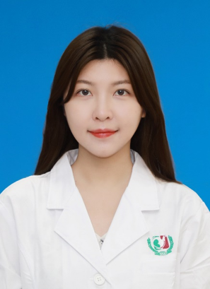

<!-- AUTO-GENERATED-BY: work/generate_obsidian_profiles.py -->

<!-- TEMPLATE: D:\workspace\信息收集整理\医生画像仓库\模板\医生画像模板.md -->

# 区晓雯

## 基础信息

| 字段 | 内容 |
|---|---|
| 姓名 | 区晓雯 |
| 医院 | 广州医科大学附属第三医院 |
| 科室 | 黄埔院区医学检验科 |
| 职称/身份 | 检验技师 |
| 来源链接 | [官网原文](https://www.gy3y.cn/ks/hp/yjbm/yxjyk/doctor_516.html) |
| 采集日期 | 2026-08-13 |

## 简介/擅长

从事临床医学检验工作四年，在临床检验、分子生物学检验领域有较丰富的理论基础和实践经验，参与构建分子诊断实验室的质量管理体系和标准操作规程，熟练掌握核酸提取、荧光定量PCR、RNA恒温扩增等技术。

## 科研项目与成果

- 区晓雯 医学硕士，检验技师，分子组成员 研究方向/专业特长 从事临床医学检验工作四年，在临床检验、分子生物学检验领域有较丰富的理论基础和实践经验，参与构建分子诊断实验室的质量管理体系和标准操作规程，熟练掌握核酸提取、荧光定量PCR、RNA恒温扩增等技术。

## 可包装亮点

- 学术兼职 广州市医学会微生物学与免疫学分会委员会委员 教育背景 广州医科大学医学检验技术专业 学士 广州医科大学免疫学专业 硕士

## 重点疾病/人群标签

- 慢性病：
- 肿瘤：
- 生殖疾病：
- 免疫/风湿：
- 术后恢复/康复：
- 疑难重症：

## 证据摘录

> 只摘录官网公开信息中的短句或关键字段，不复制大段原文。

- 官网身份字段：检验技师
- 官网简介/擅长：从事临床医学检验工作四年，在临床检验、分子生物学检验领域有较丰富的理论基础和实践经验，参与构建分子诊断实验室的质量管理体系和标准操作规程，熟练掌握核酸提取、荧光定量PCR、RNA恒温扩增等技术。
- 官网亮眼经历线索：学术兼职 广州市医学会微生物学与免疫学分会委员会委员 教育背景 广州医科大学医学检验技术专业 学士 广州医科大学免疫学专业 硕士
- 异常提示：职称/身份需人工复核
- 来源链接：https://www.gy3y.cn/ks/hp/yjbm/yxjyk/doctor_516.html

## BD 画像摘要

区晓雯医生可作为广州医科大学附属第三医院黄埔院区医学检验科的基础医生资料入库。当前重点方向以总底表标签为准，官网未展示的信息保持空白。

## 合规边界

- 仅使用医院官网、官方公众号、官方小程序等公开渠道。
- 不采集私人电话、私人微信、家庭住址、患者隐私或非公开排班信息。
- 不写“保证治愈”“疗效第一”“包治疑难杂症”等无法由官网证明的表述。
