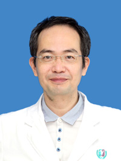

<!-- AUTO-GENERATED-BY: work/generate_obsidian_profiles.py -->

<!-- TEMPLATE: D:\workspace\信息收集整理\医生画像仓库\模板\医生画像模板.md -->

# 卢雄

## 基础信息

| 字段 | 内容 |
|---|---|
| 姓名 | 卢雄 |
| 医院 | 广州医科大学附属第三医院 |
| 科室 | 荔湾院区心血管内科 |
| 职称/身份 | 副主任医师 |
| 来源链接 | [官网原文](https://www.gy3y.cn/ks/nkxt/xxgnk/doctor_5.html) |
| 采集日期 | 2026-08-13 |

## 简介/擅长

一直从事心血管专业，熟悉心血管各种高危病的诊治，曾赴珠江医院进修冠脉介入。

## 教育与进修经历

- 卢雄 副主任医师 一直从事心血管专业，熟悉心血管各种高危病的诊治，曾赴珠江医院进修冠脉介入。

## 可包装亮点

- 卢雄 副主任医师 一直从事心血管专业，熟悉心血管各种高危病的诊治，曾赴珠江医院进修冠脉介入。
- 现为广东省心脏介入学会委员、广东省医师协会心脏重症医师工作委员会委员，冠脉介入治疗技术精湛，多年来奋战在急性心梗抢救一线，挽救无数重症患者生命，受到广大患者的认可和好评。

## 重点疾病/人群标签

- 慢性病：
- 肿瘤：
- 生殖疾病：
- 免疫/风湿：
- 术后恢复/康复：
- 疑难重症：重症、高危

## 证据摘录

> 只摘录官网公开信息中的短句或关键字段，不复制大段原文。

- 官网身份字段：副主任医师
- 官网简介/擅长：一直从事心血管专业，熟悉心血管各种高危病的诊治，曾赴珠江医院进修冠脉介入。
- 官网亮眼经历线索：卢雄 副主任医师 一直从事心血管专业，熟悉心血管各种高危病的诊治，曾赴珠江医院进修冠脉介入。 现为广东省心脏介入学会委员、广东省医师协会心脏重症医师工作委员会委员，冠脉介入治疗技术精湛，多年来奋战在急性心梗抢救一线，挽救无数重症患者生命，受到广大患者的认可和好评。
- 来源链接：https://www.gy3y.cn/ks/nkxt/xxgnk/doctor_5.html

## BD 画像摘要

卢雄医生可作为疑难重症方向的基础画像候选。后续 BD 使用应继续以官网来源和人工复核为准，不添加疗效承诺或无来源包装。

## 合规边界

- 仅使用医院官网、官方公众号、官方小程序等公开渠道。
- 不采集私人电话、私人微信、家庭住址、患者隐私或非公开排班信息。
- 不写“保证治愈”“疗效第一”“包治疑难杂症”等无法由官网证明的表述。
