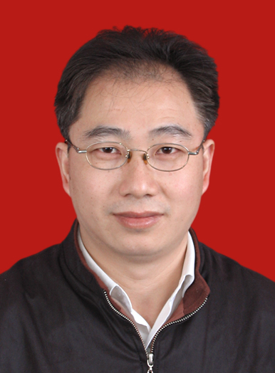

<!-- AUTO-GENERATED-BY: work/generate_obsidian_profiles.py -->

<!-- TEMPLATE: D:\workspace\信息收集整理\医生画像仓库\模板\医生画像模板.md -->

# 吕玉明

## 基础信息

| 字段 | 内容 |
|---|---|
| 姓名 | 吕玉明 |
| 医院 | 广州医科大学附属第三医院 |
| 科室 | 荔湾院区脊柱外科 |
| 职称/身份 | 主任医师 |
| 来源链接 | [官网原文](https://www.gy3y.cn/ks/wkxt/gkyq/doctor_71.html) |
| 采集日期 | 2026-08-13 |

## 简介/擅长

脊柱、关节疾病的诊治和复杂创面的修复。

## 科研项目与成果

- 受聘担任广东省医学会显微外科分会常委，广东省自然科学基金评委，广东省医疗事故鉴定专家和省级劳动能力鉴定医疗卫生专家。
- 在国内外著名杂志发表论文30余篇（SCI收录1篇），主持省自然科学基金、省科技计划项目等科研课题9项。

## 论文与学术产出

- 在国内外著名杂志发表论文30余篇（SCI收录1篇），主持省自然科学基金、省科技计划项目等科研课题9项。

## 可包装亮点

- 吕玉明 脊柱外科 主任医师 擅长领域：脊柱、关节疾病的诊治和复杂创面的修复。
- 详细介绍： 主任医师。
- 受聘担任广东省医学会显微外科分会常委，广东省自然科学基金评委，广东省医疗事故鉴定专家和省级劳动能力鉴定医疗卫生专家。
- 在国内外著名杂志发表论文30余篇（SCI收录1篇），主持省自然科学基金、省科技计划项目等科研课题9项。

## 重点疾病/人群标签

- 慢性病：
- 肿瘤：
- 生殖疾病：
- 免疫/风湿：
- 术后恢复/康复：创面、复杂
- 疑难重症：创面、复杂

## 证据摘录

> 只摘录官网公开信息中的短句或关键字段，不复制大段原文。

- 官网身份字段：主任医师
- 官网简介/擅长：脊柱、关节疾病的诊治和复杂创面的修复。
- 官网亮眼经历线索：吕玉明 脊柱外科 主任医师 擅长领域：脊柱、关节疾病的诊治和复杂创面的修复。 详细介绍： 主任医师。 受聘担任广东省医学会显微外科分会常委，广东省自然科学基金评委，广东省医疗事故鉴定专家和省级劳动能力鉴定医疗卫生专家。 在国内外著名杂志发表论文30余篇（SCI收录1篇），主持省自然科学基金、省科技计划项目等科研课题9项。
- 来源链接：https://www.gy3y.cn/ks/wkxt/gkyq/doctor_71.html

## BD 画像摘要

吕玉明医生可作为术后恢复/康复、疑难重症方向的基础画像候选。后续 BD 使用应继续以官网来源和人工复核为准，不添加疗效承诺或无来源包装。

## 合规边界

- 仅使用医院官网、官方公众号、官方小程序等公开渠道。
- 不采集私人电话、私人微信、家庭住址、患者隐私或非公开排班信息。
- 不写“保证治愈”“疗效第一”“包治疑难杂症”等无法由官网证明的表述。
