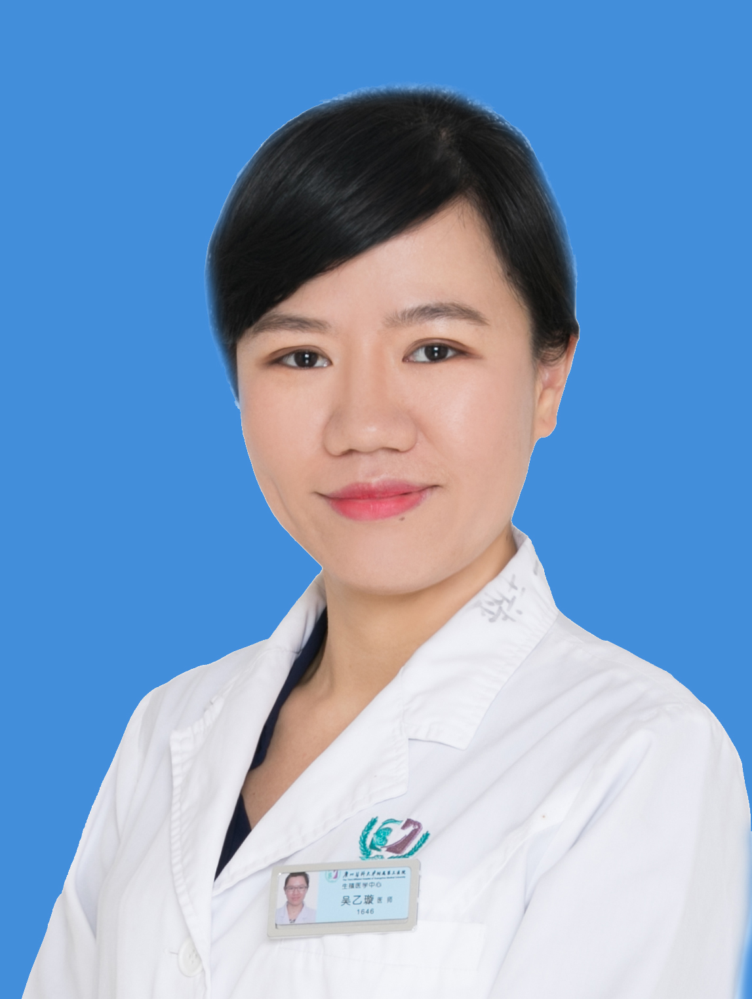

<!-- AUTO-GENERATED-BY: work/generate_obsidian_profiles.py -->

<!-- TEMPLATE: D:\workspace\信息收集整理\医生画像仓库\模板\医生画像模板.md -->

# 吴乙璇

## 基础信息

| 字段 | 内容 |
|---|---|
| 姓名 | 吴乙璇 |
| 医院 | 广州医科大学附属第三医院 |
| 科室 | 荔湾院区生殖医学科（生殖医学中心）、黄埔院区生殖医学中心 |
| 职称/身份 | 副主任医师 |
| 来源链接 | [官网原文](https://www.gy3y.cn/ks/fckyjs/szyxk/doctor_313.html) |
| 采集日期 | 2026-08-13 |

## 简介/擅长

各种病因不孕症的个体化治疗，对多囊卵巢综合征、复发性流产、卵巢早衰有较丰富的临床经验

## 科研项目与成果

- 广州市医学会生殖医学分会委员 擅长各种病因不孕症的个体化治疗，对多囊卵巢综合征、复发性流产、卵巢早衰有较丰富的临床经验 主持广东省教育厅课题1项，作为主要研究者参与国家自然科学基金2项，省卫计委课题1。

## 论文与学术产出

- 以第一作者发表论文近20篇，其中SCI文章12篇。

## 可包装亮点

- 吴乙璇 广州医科大学附属第三医院生殖医学中心 副主任医师，生殖医学硕士 广东省女医师协会女性内分泌专业委员会委员；
- 广东省医学会生殖医学分会委员；
- 广州市医学会生殖医学分会委员 擅长各种病因不孕症的个体化治疗，对多囊卵巢综合征、复发性流产、卵巢早衰有较丰富的临床经验 主持广东省教育厅课题1项，作为主要研究者参与国家自然科学基金2项，省卫计委课题1。
- 以第一作者发表论文近20篇，其中SCI文章12篇。

## 重点疾病/人群标签

- 慢性病：
- 肿瘤：
- 生殖疾病：生殖、不孕、卵巢、多囊
- 免疫/风湿：
- 术后恢复/康复：
- 疑难重症：

## 证据摘录

> 只摘录官网公开信息中的短句或关键字段，不复制大段原文。

- 官网身份字段：副主任医师
- 官网简介/擅长：各种病因不孕症的个体化治疗，对多囊卵巢综合征、复发性流产、卵巢早衰有较丰富的临床经验
- 官网亮眼经历线索：吴乙璇 广州医科大学附属第三医院生殖医学中心 副主任医师，生殖医学硕士 广东省女医师协会女性内分泌专业委员会委员； 广东省医学会生殖医学分会委员； 广州市医学会生殖医学分会委员 擅长各种病因不孕症的个体化治疗，对多囊卵巢综合征、复发性流产、卵巢早衰有较丰富的临床经验 主持广东省教育厅课题1项，作为主要研究者参与国家自然科学基金2项，省卫计委课题1。 以第一作者发表论文近20篇，其中SCI文章12篇。
- 来源链接：https://www.gy3y.cn/ks/fckyjs/szyxk/doctor_313.html

## BD 画像摘要

吴乙璇医生可作为生殖疾病方向的基础画像候选。后续 BD 使用应继续以官网来源和人工复核为准，不添加疗效承诺或无来源包装。

## 合规边界

- 仅使用医院官网、官方公众号、官方小程序等公开渠道。
- 不采集私人电话、私人微信、家庭住址、患者隐私或非公开排班信息。
- 不写“保证治愈”“疗效第一”“包治疑难杂症”等无法由官网证明的表述。
