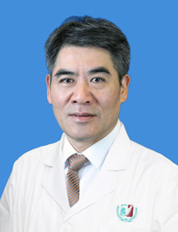

<!-- AUTO-GENERATED-BY: work/generate_obsidian_profiles.py -->

<!-- TEMPLATE: D:\workspace\信息收集整理\医生画像仓库\模板\医生画像模板.md -->

# 吴增晖

## 基础信息

| 字段 | 内容 |
|---|---|
| 姓名 | 吴增晖 |
| 医院 | 广州医科大学附属第三医院 |
| 科室 | 荔湾院区脊柱外科 |
| 职称/身份 | 主任医师、教授 |
| 来源链接 | [官网原文](https://www.gy3y.cn/ks/wkxt/gkyq/doctor_308.html) |
| 采集日期 | 2026-08-13 |

## 简介/擅长

脊柱各类疾患和脊柱脊髓损伤的诊断和治疗。对颈椎病、脊柱侧凸畸形、脊柱滑脱和腰腿痛的诊断和外科手术治疗具有丰富的经验。在脊柱畸形的矫正、脊柱非融合技术和脊柱外科的微创治疗方面有良好的理论基础和临床技术。在国内率先开展了XLIF脊柱微创手术

## 教育与进修经历

- 第一军医大学博士毕业。

## 科研项目与成果

- 主持全国自然科学基金、军队及广东省科研基金6项。
- 曾获军队医疗成果一等奖1项，广东省科技进步一等奖1项，中华医学科技二等奖1项，军队科技进步和广东省科技进步二等奖6项、三等奖6项，发表论文30余篇，主编专著4部，专著副主编2部。

## 论文与学术产出

- 《中国骨科临床与基础研究杂志》副主编、《中国现代手术学杂志》、《中国临床解剖学》、《创伤外科杂志》等编委。
- 曾获军队医疗成果一等奖1项，广东省科技进步一等奖1项，中华医学科技二等奖1项，军队科技进步和广东省科技进步二等奖6项、三等奖6项，发表论文30余篇，主编专著4部，专著副主编2部。

## 可包装亮点

- 吴增晖 脊柱外科 主任医师 /教授 擅长领域：颈椎病、脊柱侧凸畸形、脊柱滑脱和腰腿痛的诊断。
- 详细介绍： 主任医师，医学博士，博士导师。
- 1999年在北京大学第三医院学习颈椎外科，2006年赴美国纽约大学和内华达大学医学中心学习微创脊柱外科，2008年赴澳大利亚阿德莱德皇家医院和儿童医院、2009年赴美国华盛顿大学脊柱外科中心学习脊柱畸形的诊治。
- 全国脊柱内镜常委，颈椎、腰椎学组和脊柱微创学组委员，广东省医学会脊柱分会副主任委员，广东省数字骨科学会副主任委员。

## 重点疾病/人群标签

- 慢性病：
- 肿瘤：
- 生殖疾病：
- 免疫/风湿：
- 术后恢复/康复：
- 疑难重症：

## 证据摘录

> 只摘录官网公开信息中的短句或关键字段，不复制大段原文。

- 官网身份字段：主任医师、教授
- 官网简介/擅长：脊柱各类疾患和脊柱脊髓损伤的诊断和治疗。对颈椎病、脊柱侧凸畸形、脊柱滑脱和腰腿痛的诊断和外科手术治疗具有丰富的经验。在脊柱畸形的矫正、脊柱非融合技术和脊柱外科的微创治疗方面有良好的理论基础和临床技术。在国内率先开展了XLIF脊柱微创手术
- 官网亮眼经历线索：吴增晖 脊柱外科 主任医师 /教授 擅长领域：颈椎病、脊柱侧凸畸形、脊柱滑脱和腰腿痛的诊断。 详细介绍： 主任医师，医学博士，博士导师。 1999年在北京大学第三医院学习颈椎外科，2006年赴美国纽约大学和内华达大学医学中心学习微创脊柱外科，2008年赴澳大利亚阿德莱德皇家医院和儿童医院、2009年赴美国华盛顿大学脊柱外科中心学习脊柱畸形的诊治。 全国脊柱内镜常委，颈椎、腰椎学组和脊柱微创学组委员，广东省医学会脊柱分会副主任委员，广东…
- 来源链接：https://www.gy3y.cn/ks/wkxt/gkyq/doctor_308.html

## BD 画像摘要

吴增晖医生可作为广州医科大学附属第三医院荔湾院区脊柱外科的基础医生资料入库。当前重点方向以总底表标签为准，官网未展示的信息保持空白。

## 合规边界

- 仅使用医院官网、官方公众号、官方小程序等公开渠道。
- 不采集私人电话、私人微信、家庭住址、患者隐私或非公开排班信息。
- 不写“保证治愈”“疗效第一”“包治疑难杂症”等无法由官网证明的表述。
