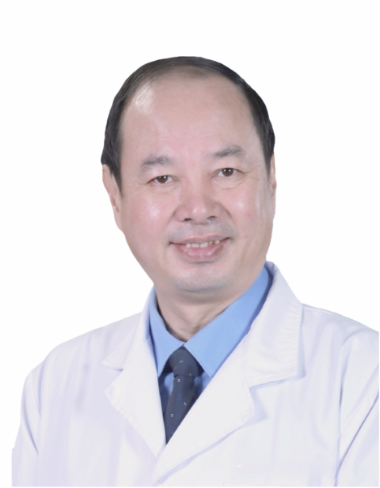

<!-- AUTO-GENERATED-BY: work/generate_obsidian_profiles.py -->

<!-- TEMPLATE: D:\workspace\信息收集整理\医生画像仓库\模板\医生画像模板.md -->

# 吴时光

## 基础信息

| 字段 | 内容 |
|---|---|
| 姓名 | 吴时光 |
| 医院 | 广州医科大学附属第三医院 |
| 科室 | 黄埔院区儿科 |
| 职称/身份 | 主任医师 |
| 来源链接 | [官网原文](https://www.gy3y.cn/ks/hp/ek/xenk/doctor_465.html) |
| 采集日期 | 2026-08-13 |

## 简介/擅长

在精准诊治儿童呼吸系统和消化系统疾病、新生儿疾病、儿童危重症、儿童疑难杂症（长期发热、川崎病、遗尿症、抽动症等）方面具有精湛的医疗技术，积累了丰富的临床经验。

## 可包装亮点

- 特聘专家，获得岭南名医、中国最美基层儿科医师、广东省优秀基层医师等荣誉称号。
- 从事儿科临床工作38年，在精准诊治儿童呼吸系统和消化系统疾病、新生儿疾病、儿童危重症、儿童疑难杂症（长期发热、川崎病、遗尿症、抽动症等）方面具有精湛的医疗技术，积累了丰富的临床经验。
- 学术任职： 广东省医师协会儿科医师分会副主任委员 广东省精准医学应用学会儿童精准诊疗分会、精准免疫分会副主任委员 第一届广东省基层医药学会儿童急救与儿童保健专业委员会副主任委员 中国医师协会新生儿科医师分会新生儿复苏学组委员 广东省医师协会新生儿科医师分会常务委员兼秘书 广东省临床医学会新生儿学专业委员会常务委员 广东省医学会围产医学分会委员

## 重点疾病/人群标签

- 慢性病：
- 肿瘤：
- 生殖疾病：
- 免疫/风湿：免疫、疑难、危重
- 术后恢复/康复：
- 疑难重症：免疫、疑难、危重

## 证据摘录

> 只摘录官网公开信息中的短句或关键字段，不复制大段原文。

- 官网身份字段：主任医师
- 官网简介/擅长：在精准诊治儿童呼吸系统和消化系统疾病、新生儿疾病、儿童危重症、儿童疑难杂症（长期发热、川崎病、遗尿症、抽动症等）方面具有精湛的医疗技术，积累了丰富的临床经验。
- 官网亮眼经历线索：特聘专家，获得岭南名医、中国最美基层儿科医师、广东省优秀基层医师等荣誉称号。 从事儿科临床工作38年，在精准诊治儿童呼吸系统和消化系统疾病、新生儿疾病、儿童危重症、儿童疑难杂症（长期发热、川崎病、遗尿症、抽动症等）方面具有精湛的医疗技术，积累了丰富的临床经验。 学术任职： 广东省医师协会儿科医师分会副主任委员 广东省精准医学应用学会儿童精准诊疗分会、精准免疫分会副主任委员 第一届广东省基层医药学会儿童急救与儿童保健专业委员会副主任委员…
- 来源链接：https://www.gy3y.cn/ks/hp/ek/xenk/doctor_465.html

## BD 画像摘要

吴时光医生可作为免疫/风湿/感染、疑难重症方向的基础画像候选。后续 BD 使用应继续以官网来源和人工复核为准，不添加疗效承诺或无来源包装。

## 合规边界

- 仅使用医院官网、官方公众号、官方小程序等公开渠道。
- 不采集私人电话、私人微信、家庭住址、患者隐私或非公开排班信息。
- 不写“保证治愈”“疗效第一”“包治疑难杂症”等无法由官网证明的表述。
