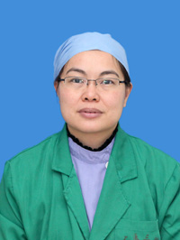

<!-- AUTO-GENERATED-BY: work/generate_obsidian_profiles.py -->

<!-- TEMPLATE: D:\workspace\信息收集整理\医生画像仓库\模板\医生画像模板.md -->

# 吴涯雯

## 基础信息

| 字段 | 内容 |
|---|---|
| 姓名 | 吴涯雯 |
| 医院 | 广州医科大学附属第三医院 |
| 科室 | 荔湾院区麻醉科 |
| 职称/身份 | 主任医师、教授 |
| 来源链接 | [官网原文](https://www.gy3y.cn/ks/wkxt/mzk/doctor_81.html) |
| 采集日期 | 2026-08-13 |

## 简介/擅长

从事临床麻醉工作二十余年，具有扎实的医学理论知识及临床技能，擅长妇产科以及老年病人手术的麻醉，具有丰富的临床经验，多年来一直致力于麻醉知识科普工作。主持省、市各级多项科研课题，国家级权威核心期刊收录论文二十余篇，已培养10多名硕士研究生。

## 教育与进修经历

- 吴涯雯，女，教授，主任医师，硕士生、博士生导师，博士后合作导师，本科毕业于中山医科大学。

## 科研项目与成果

- 主持省、市各级多项科研课题，国家级权威核心期刊收录论文二十余篇，已培养10多名硕士研究生。

## 论文与学术产出

- 主持省、市各级多项科研课题，国家级权威核心期刊收录论文二十余篇，已培养10多名硕士研究生。

## 可包装亮点

- 吴涯雯，女，教授，主任医师，硕士生、博士生导师，博士后合作导师，本科毕业于中山医科大学。
- 现于广州医科大学附属第三医院麻醉科工作，现任广东省科技厅专家库成员、广东省医疗事故鉴定专家库成员、广东省女医师协会麻醉与围术期医学专业委员会常务委员、广州市科信局专家库成员、广州市医疗事故鉴定专家库成员、《实用医学杂志》审稿专家、《中国医药科学》特约编委。

## 重点疾病/人群标签

- 慢性病：
- 肿瘤：
- 生殖疾病：
- 免疫/风湿：
- 术后恢复/康复：
- 疑难重症：

## 证据摘录

> 只摘录官网公开信息中的短句或关键字段，不复制大段原文。

- 官网身份字段：主任医师、教授
- 官网简介/擅长：从事临床麻醉工作二十余年，具有扎实的医学理论知识及临床技能，擅长妇产科以及老年病人手术的麻醉，具有丰富的临床经验，多年来一直致力于麻醉知识科普工作。主持省、市各级多项科研课题，国家级权威核心期刊收录论文二十余篇，已培养10多名硕士研究生。
- 官网亮眼经历线索：吴涯雯，女，教授，主任医师，硕士生、博士生导师，博士后合作导师，本科毕业于中山医科大学。 现于广州医科大学附属第三医院麻醉科工作，现任广东省科技厅专家库成员、广东省医疗事故鉴定专家库成员、广东省女医师协会麻醉与围术期医学专业委员会常务委员、广州市科信局专家库成员、广州市医疗事故鉴定专家库成员、《实用医学杂志》审稿专家、《中国医药科学》特约编委。
- 来源链接：https://www.gy3y.cn/ks/wkxt/mzk/doctor_81.html

## BD 画像摘要

吴涯雯医生可作为广州医科大学附属第三医院荔湾院区麻醉科的基础医生资料入库。当前重点方向以总底表标签为准，官网未展示的信息保持空白。

## 合规边界

- 仅使用医院官网、官方公众号、官方小程序等公开渠道。
- 不采集私人电话、私人微信、家庭住址、患者隐私或非公开排班信息。
- 不写“保证治愈”“疗效第一”“包治疑难杂症”等无法由官网证明的表述。
