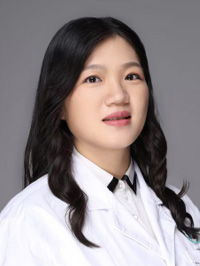

<!-- AUTO-GENERATED-BY: work/generate_obsidian_profiles.py -->

<!-- TEMPLATE: D:\workspace\信息收集整理\医生画像仓库\模板\医生画像模板.md -->

# 唐连

## 基础信息

| 字段 | 内容 |
|---|---|
| 姓名 | 唐连 |
| 医院 | 广州医科大学附属第三医院 |
| 科室 | 荔湾院区盆底诊治中心 |
| 职称/身份 | 主治医师 |
| 来源链接 | [官网原文](https://www.gy3y.cn/ks/fckyjs/pdzzzx/doctor_571.html) |
| 采集日期 | 2026-08-13 |

## 简介/擅长

妇科常见疾病的诊治，如中老年女性子宫脱垂，年轻女性产后盆底功能障碍，子宫肌瘤，卵巢囊肿，宫颈病变、妇科炎症等。

## 教育与进修经历

- 唐连，主治医师，医学博士，毕业于南方医科大学南方医院妇产科。

## 科研项目与成果

- 发表中英文学术论文10余篇，曾参与国家自然科学基金2项，主持广州市科技计划课题2项，院级临床研究课题1项。

## 论文与学术产出

- 发表中英文学术论文10余篇，曾参与国家自然科学基金2项，主持广州市科技计划课题2项，院级临床研究课题1项。

## 可包装亮点

- 发表中英文学术论文10余篇，曾参与国家自然科学基金2项，主持广州市科技计划课题2项，院级临床研究课题1项。

## 重点疾病/人群标签

- 慢性病：
- 肿瘤：瘤、卵巢、功能障碍
- 生殖疾病：瘤、卵巢、功能障碍
- 免疫/风湿：
- 术后恢复/康复：瘤、卵巢、功能障碍
- 疑难重症：

## 证据摘录

> 只摘录官网公开信息中的短句或关键字段，不复制大段原文。

- 官网身份字段：主治医师
- 官网简介/擅长：妇科常见疾病的诊治，如中老年女性子宫脱垂，年轻女性产后盆底功能障碍，子宫肌瘤，卵巢囊肿，宫颈病变、妇科炎症等。
- 官网亮眼经历线索：发表中英文学术论文10余篇，曾参与国家自然科学基金2项，主持广州市科技计划课题2项，院级临床研究课题1项。
- 来源链接：https://www.gy3y.cn/ks/fckyjs/pdzzzx/doctor_571.html

## BD 画像摘要

唐连医生可作为肿瘤、生殖疾病、术后恢复/康复方向的基础画像候选。后续 BD 使用应继续以官网来源和人工复核为准，不添加疗效承诺或无来源包装。

## 合规边界

- 仅使用医院官网、官方公众号、官方小程序等公开渠道。
- 不采集私人电话、私人微信、家庭住址、患者隐私或非公开排班信息。
- 不写“保证治愈”“疗效第一”“包治疑难杂症”等无法由官网证明的表述。
