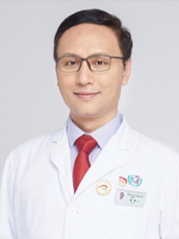

<!-- AUTO-GENERATED-BY: work/generate_obsidian_profiles.py -->

<!-- TEMPLATE: D:\workspace\信息收集整理\医生画像仓库\模板\医生画像模板.md -->

# 夏勇

## 基础信息

| 字段 | 内容 |
|---|---|
| 姓名 | 夏勇 |
| 医院 | 广州医科大学附属第三医院 |
| 科室 | 荔湾院区检验科、黄埔院区医学检验科 |
| 职称/身份 | 主任技师 |
| 来源链接 | [官网原文](https://www.gy3y.cn/ks/yjbm/jyk/doctor_196.html) |
| 采集日期 | 2026-08-13 |

## 简介/擅长

近年来主要从事重要生物标志物的集成一体化快速检测研究；微生物的致病耐药机制及快速检测研究。

## 科研项目与成果

- 主持国家自然科学基金面上项目、广东省科技攻关项目、广州市科技局民生科技攻关重点项目等课题8项。
- 获国家发明专利6项，实用新型专利1项。

## 论文与学术产出

- 以第一作者或通讯作者在ACS Nano、Small、Biosensors and Bioelectronics、Arthritis Rheumatol 及Anal Chem等杂志上发表SCI论文35篇、其中大于10分的6篇。
- 总发表论文56篇，他引4857次，H指数20。
- 副主编专著1部，参编专著3部。
- 主编本科生教材1部。

## 可包装亮点

- 夏勇 医学博士、教授、主任技师、博士生导师、广州市卫健委优秀人才、广州医科大学附属第三医院副院长、检验医学学科带头人 研究方向/专业特长 近年来主要从事重要生物标志物的集成一体化快速检测研究；
- 以第一作者或通讯作者在ACS Nano、Small、Biosensors and Bioelectronics、Arthritis Rheumatol 及Anal Chem等杂志上发表SCI论文35篇、其中大于10分的6篇。
- 总发表论文56篇，他引4857次，H指数20。
- 主持国家自然科学基金面上项目、广东省科技攻关项目、广州市科技局民生科技攻关重点项目等课题8项。

## 重点疾病/人群标签

- 慢性病：
- 肿瘤：
- 生殖疾病：
- 免疫/风湿：
- 术后恢复/康复：
- 疑难重症：

## 证据摘录

> 只摘录官网公开信息中的短句或关键字段，不复制大段原文。

- 官网身份字段：主任技师
- 官网简介/擅长：近年来主要从事重要生物标志物的集成一体化快速检测研究；微生物的致病耐药机制及快速检测研究。
- 官网亮眼经历线索：夏勇 医学博士、教授、主任技师、博士生导师、广州市卫健委优秀人才、广州医科大学附属第三医院副院长、检验医学学科带头人 研究方向/专业特长 近年来主要从事重要生物标志物的集成一体化快速检测研究； 以第一作者或通讯作者在ACS Nano、Small、Biosensors and Bioelectronics、Arthritis Rheumatol 及Anal Chem等杂志上发表SCI论文35篇、其中大于10分的6篇。 总发表论文56篇…
- 异常提示：职称/身份需人工复核
- 来源链接：https://www.gy3y.cn/ks/yjbm/jyk/doctor_196.html

## BD 画像摘要

夏勇医生可作为广州医科大学附属第三医院荔湾院区检验科、黄埔院区医学检验科的基础医生资料入库。当前重点方向以总底表标签为准，官网未展示的信息保持空白。

## 合规边界

- 仅使用医院官网、官方公众号、官方小程序等公开渠道。
- 不采集私人电话、私人微信、家庭住址、患者隐私或非公开排班信息。
- 不写“保证治愈”“疗效第一”“包治疑难杂症”等无法由官网证明的表述。
