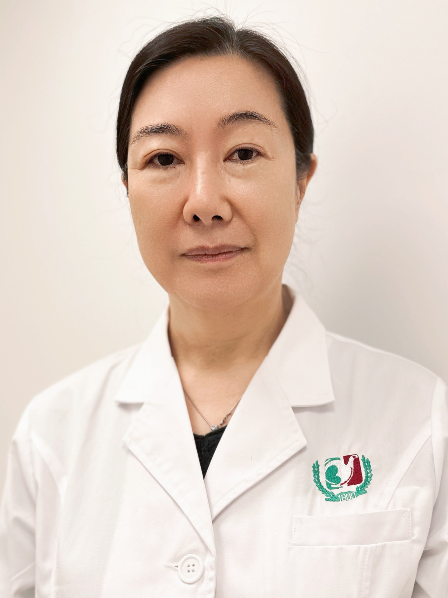

<!-- AUTO-GENERATED-BY: work/generate_obsidian_profiles.py -->

<!-- TEMPLATE: D:\workspace\信息收集整理\医生画像仓库\模板\医生画像模板.md -->

# 姜翙

## 基础信息

| 字段 | 内容 |
|---|---|
| 姓名 | 姜翙 |
| 医院 | 广州医科大学附属第三医院 |
| 科室 | 黄埔院区妇科 |
| 职称/身份 | 主任医师 |
| 来源链接 | [官网原文](https://www.gy3y.cn/ks/hp/fck/fk/doctor_450.html) |
| 采集日期 | 2026-08-13 |

## 简介/擅长

妇科微创治疗，熟练掌握腹腔镜、宫腔镜微创手术技巧；擅长盆底器官脱垂手术治疗，熟练掌握TVM、TVT-O、TVT，在国内率先开展腹腔镜下子宫腹直肌悬吊术；在妇科肿瘤术前可切除性评估、手术指征、手术方式以及手术后辅助治疗等方面都有较为深入的探讨，熟练掌握卵巢癌，宫颈癌子宫内膜癌的各类手术以及盆腔廓清术的手术方式和术后护理。

## 可包装亮点

- 姜翙 主任医师，擅长妇科微创治疗，熟练掌握腹腔镜、宫腔镜微创手术技巧；
- 擅长盆底器官脱垂手术治疗，熟练掌握 TVM、TVT-O、TVT，在国内率先开展腹腔镜下子宫腹直肌悬吊术；
- 2018年度被评为医院“十佳医师”，2018-2020年连续三年入选岭南名医录。

## 重点疾病/人群标签

- 慢性病：
- 肿瘤：肿瘤、癌、卵巢、术后
- 生殖疾病：肿瘤、癌、卵巢、术后
- 免疫/风湿：
- 术后恢复/康复：肿瘤、癌、卵巢、术后
- 疑难重症：

## 证据摘录

> 只摘录官网公开信息中的短句或关键字段，不复制大段原文。

- 官网身份字段：主任医师
- 官网简介/擅长：妇科微创治疗，熟练掌握腹腔镜、宫腔镜微创手术技巧；擅长盆底器官脱垂手术治疗，熟练掌握TVM、TVT-O、TVT，在国内率先开展腹腔镜下子宫腹直肌悬吊术；在妇科肿瘤术前可切除性评估、手术指征、手术方式以及手术后辅助治疗等方面都有较为深入的探讨，熟练掌握卵巢癌，宫颈癌子宫内膜癌的各类手术以及盆腔廓清术的手术方式和术后护理。
- 官网亮眼经历线索：姜翙 主任医师，擅长妇科微创治疗，熟练掌握腹腔镜、宫腔镜微创手术技巧； 擅长盆底器官脱垂手术治疗，熟练掌握 TVM、TVT-O、TVT，在国内率先开展腹腔镜下子宫腹直肌悬吊术； 2018年度被评为医院“十佳医师”，2018-2020年连续三年入选岭南名医录。
- 来源链接：https://www.gy3y.cn/ks/hp/fck/fk/doctor_450.html

## BD 画像摘要

姜翙医生可作为肿瘤、生殖疾病、术后恢复/康复方向的基础画像候选。后续 BD 使用应继续以官网来源和人工复核为准，不添加疗效承诺或无来源包装。

## 合规边界

- 仅使用医院官网、官方公众号、官方小程序等公开渠道。
- 不采集私人电话、私人微信、家庭住址、患者隐私或非公开排班信息。
- 不写“保证治愈”“疗效第一”“包治疑难杂症”等无法由官网证明的表述。
