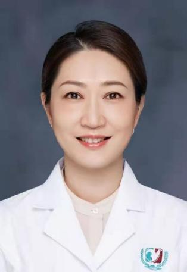

<!-- AUTO-GENERATED-BY: work/generate_obsidian_profiles.py -->

<!-- TEMPLATE: D:\workspace\信息收集整理\医生画像仓库\模板\医生画像模板.md -->

# 孙嫣

## 基础信息

| 字段 | 内容 |
|---|---|
| 姓名 | 孙嫣 |
| 医院 | 广州医科大学附属第三医院 |
| 科室 | 荔湾院区消化内科、黄埔院区消化内科、黄埔院区内镜中心 |
| 职称/身份 | 主任医师、教授 |
| 来源链接 | [官网原文](https://www.gy3y.cn/ks/nkxt/xhnk/doctor_234.html) |
| 采集日期 | 2026-08-13 |

## 简介/擅长

长期从事消化内科及消化内镜的临床与研究工作，研究方向为消化道肿瘤的早期诊治，炎症性肠病的炎癌转化机制及超声内镜的诊断与治疗。擅长消化系统各种常见病、多发病及疑难杂症的诊治，擅长EMR，ESD，超声内镜引导下细针穿刺术、超声内镜引导下胰腺囊肿内引流术等各种内镜下诊断及治疗。

## 教育与进修经历

- 详细介绍 博士研究生导师，美国梅奥诊所访问学者，广州市第八届羊城好医生。

## 科研项目与成果

- 广东省自然科学基金评审专家，广州市科创委基金项目评审专家。
- 主持国家自然科学自然基金1项，主持省、市级科研基金6项，发表SCI收录论文十余篇。

## 论文与学术产出

- 主持国家自然科学自然基金1项，主持省、市级科研基金6项，发表SCI收录论文十余篇。

## 可包装亮点

- 孙嫣 主任医师、教授、 消化内科副主任、 医学博士、 博士研究生导师 特色专长 长期从事消化内科及消化内镜的临床与研究工作，研究方向为消化道肿瘤的早期诊治，炎症性肠病的炎癌转化机制及超声内镜的诊断与治疗。
- 擅长消化系统各种常见病、多发病及疑难杂症的诊治，擅长EMR，ESD，超声内镜引导下细针穿刺术、超声内镜引导下胰腺囊肿内引流术等各种内镜下诊断及治疗。
- 详细介绍 博士研究生导师，美国梅奥诊所访问学者，广州市第八届羊城好医生。
- 学术任职包括中华医学会肠内肠外营养学分会第六届委员会青年学组成员，广东省基层医药学会炎症性肠病专业委员会第一届副主任委员，中国医药教育协会炎症性肠病专业委员会常务委员，广东省医学会消化内镜学分会第七届委员会委员，广东省医师协会消化科医师分会第五届委员会常务委员，广州市医学会消化病学分会第十届委员会常务委员，广州市医学会消化内镜学分会第三届委员会委员。

## 重点疾病/人群标签

- 慢性病：
- 肿瘤：肿瘤、癌、营养、疑难
- 生殖疾病：
- 免疫/风湿：
- 术后恢复/康复：肿瘤、癌、营养、疑难
- 疑难重症：肿瘤、癌、营养、疑难

## 证据摘录

> 只摘录官网公开信息中的短句或关键字段，不复制大段原文。

- 官网身份字段：主任医师、教授
- 官网简介/擅长：长期从事消化内科及消化内镜的临床与研究工作，研究方向为消化道肿瘤的早期诊治，炎症性肠病的炎癌转化机制及超声内镜的诊断与治疗。擅长消化系统各种常见病、多发病及疑难杂症的诊治，擅长EMR，ESD，超声内镜引导下细针穿刺术、超声内镜引导下胰腺囊肿内引流术等各种内镜下诊断及治疗。
- 官网亮眼经历线索：孙嫣 主任医师、教授、 消化内科副主任、 医学博士、 博士研究生导师 特色专长 长期从事消化内科及消化内镜的临床与研究工作，研究方向为消化道肿瘤的早期诊治，炎症性肠病的炎癌转化机制及超声内镜的诊断与治疗。 擅长消化系统各种常见病、多发病及疑难杂症的诊治，擅长EMR，ESD，超声内镜引导下细针穿刺术、超声内镜引导下胰腺囊肿内引流术等各种内镜下诊断及治疗。 详细介绍 博士研究生导师，美国梅奥诊所访问学者，广州市第八届羊城好医生。 学术任职…
- 来源链接：https://www.gy3y.cn/ks/nkxt/xhnk/doctor_234.html

## BD 画像摘要

孙嫣医生可作为肿瘤、术后恢复/康复、疑难重症方向的基础画像候选。后续 BD 使用应继续以官网来源和人工复核为准，不添加疗效承诺或无来源包装。

## 合规边界

- 仅使用医院官网、官方公众号、官方小程序等公开渠道。
- 不采集私人电话、私人微信、家庭住址、患者隐私或非公开排班信息。
- 不写“保证治愈”“疗效第一”“包治疑难杂症”等无法由官网证明的表述。
