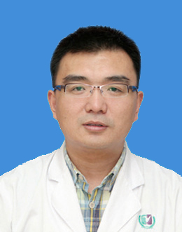

<!-- AUTO-GENERATED-BY: work/generate_obsidian_profiles.py -->

<!-- TEMPLATE: D:\workspace\信息收集整理\医生画像仓库\模板\医生画像模板.md -->

# 安 庚

## 基础信息

| 字段 | 内容 |
|---|---|
| 姓名 | 安 庚 |
| 医院 | 广州医科大学附属第三医院 |
| 科室 | 荔湾院区男科 |
| 职称/身份 | 副主任医师、副教授 |
| 来源链接 | [官网原文](https://www.gy3y.cn/ks/fckyjs/nk/doctor_259.html) |
| 采集日期 | 2026-08-13 |

## 简介/擅长

长期致力于非梗阻性无精子症的病因、诊断和治疗；华南地区率先开展睾丸显微取精（microTESE）联合睾丸组织冷冻技术治疗非梗阻性无精子症超过1000多例。美国康奈尔大学医学院显微男科中心进修。对干细胞与组织工程阴茎海绵体有深入研究，开展全球首例--3D打印阴茎海绵体生物支架修复海绵体缺损并成功生育子代。

## 教育与进修经历

- 硕士/博士后导师；
- 美国康奈尔大学医学院显微男科中心进修。

## 科研项目与成果

- 研究成果发表在Cell Stem Cell (IF:21.46分), Nature Communations (IF:11.87分), Materials Horizons (IF:14.36分), Fertility and Sterility, J Sex M, Urology 等杂志。
- 主持国家自然科学基金和广东省自然科学基金项目。

## 论文与学术产出

- 研究成果发表在Cell Stem Cell (IF:21.46分), Nature Communations (IF:11.87分), Materials Horizons (IF:14.36分), Fertility and Sterility, J Sex M, Urology 等杂志。

## 可包装亮点

- 安庚 ，生殖中心副主任、男科主任，博士、副教授、副主任医师；
- 广东省杰出青年医学人才、广东省高校千百十计划人才、广州市高层次引进骨干人才。
- 兼任中华医学会生殖医学分会青年委员、广东省医学会生殖医学分会常委、广东省医师协会男科学分会常委、广州市医学会男科学会秘书。
- 华南地区率先开展睾丸显微取精（microTESE）联合睾丸组织冷冻技术治疗非梗阻性无精子症超过1000多例。

## 重点疾病/人群标签

- 慢性病：
- 肿瘤：
- 生殖疾病：
- 免疫/风湿：
- 术后恢复/康复：
- 疑难重症：

## 证据摘录

> 只摘录官网公开信息中的短句或关键字段，不复制大段原文。

- 官网身份字段：副主任医师、副教授
- 官网简介/擅长：长期致力于非梗阻性无精子症的病因、诊断和治疗；华南地区率先开展睾丸显微取精（microTESE）联合睾丸组织冷冻技术治疗非梗阻性无精子症超过1000多例。美国康奈尔大学医学院显微男科中心进修。对干细胞与组织工程阴茎海绵体有深入研究，开展全球首例--3D打印阴茎海绵体生物支架修复海绵体缺损并成功生育子代。
- 官网亮眼经历线索：安庚 ，生殖中心副主任、男科主任，博士、副教授、副主任医师； 广东省杰出青年医学人才、广东省高校千百十计划人才、广州市高层次引进骨干人才。 兼任中华医学会生殖医学分会青年委员、广东省医学会生殖医学分会常委、广东省医师协会男科学分会常委、广州市医学会男科学会秘书。 华南地区率先开展睾丸显微取精（microTESE）联合睾丸组织冷冻技术治疗非梗阻性无精子症超过1000多例。
- 异常提示：非医生页面或姓名异常；同名待甄别
- 来源链接：https://www.gy3y.cn/ks/fckyjs/nk/doctor_259.html

## BD 画像摘要

安 庚医生可作为广州医科大学附属第三医院荔湾院区男科的基础医生资料入库。当前重点方向以总底表标签为准，官网未展示的信息保持空白。

## 合规边界

- 仅使用医院官网、官方公众号、官方小程序等公开渠道。
- 不采集私人电话、私人微信、家庭住址、患者隐私或非公开排班信息。
- 不写“保证治愈”“疗效第一”“包治疑难杂症”等无法由官网证明的表述。
