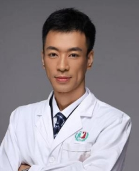

<!-- AUTO-GENERATED-BY: work/generate_obsidian_profiles.py -->

<!-- TEMPLATE: D:\workspace\信息收集整理\医生画像仓库\模板\医生画像模板.md -->

# 尹德龙

## 基础信息

| 字段 | 内容 |
|---|---|
| 姓名 | 尹德龙 |
| 医院 | 广州医科大学附属第三医院 |
| 科室 | 荔湾院区创伤骨科 |
| 职称/身份 | 副主任医师 |
| 来源链接 | [官网原文](https://www.gy3y.cn/ks/wkxt/csgk/doctor_479.html) |
| 采集日期 | 2026-08-13 |

## 简介/擅长

骨科创伤、四肢骨折及关节病变等骨科疾病的诊断与治疗。

## 可包装亮点

- 尹德龙 创伤骨科 副主任医师 擅长领域：骨科创伤、四肢骨折及关节病变等骨科疾病的诊断与治疗。
- 师从湖北省医学会骨科分会主委陈安民教授。
- 中国医师协会骨科分会会员，广东省医学会骨科分化足踝组首届青年委员。
- 2019年5月-2020年8月前往美国杜克大学医疗中心进行访学。

## 重点疾病/人群标签

- 慢性病：
- 肿瘤：
- 生殖疾病：
- 免疫/风湿：
- 术后恢复/康复：
- 疑难重症：

## 证据摘录

> 只摘录官网公开信息中的短句或关键字段，不复制大段原文。

- 官网身份字段：副主任医师
- 官网简介/擅长：骨科创伤、四肢骨折及关节病变等骨科疾病的诊断与治疗。
- 官网亮眼经历线索：尹德龙 创伤骨科 副主任医师 擅长领域：骨科创伤、四肢骨折及关节病变等骨科疾病的诊断与治疗。 师从湖北省医学会骨科分会主委陈安民教授。 中国医师协会骨科分会会员，广东省医学会骨科分化足踝组首届青年委员。 2019年5月-2020年8月前往美国杜克大学医疗中心进行访学。
- 来源链接：https://www.gy3y.cn/ks/wkxt/csgk/doctor_479.html

## BD 画像摘要

尹德龙医生可作为广州医科大学附属第三医院荔湾院区创伤骨科的基础医生资料入库。当前重点方向以总底表标签为准，官网未展示的信息保持空白。

## 合规边界

- 仅使用医院官网、官方公众号、官方小程序等公开渠道。
- 不采集私人电话、私人微信、家庭住址、患者隐私或非公开排班信息。
- 不写“保证治愈”“疗效第一”“包治疑难杂症”等无法由官网证明的表述。
