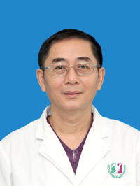

<!-- AUTO-GENERATED-BY: work/generate_obsidian_profiles.py -->

<!-- TEMPLATE: D:\workspace\信息收集整理\医生画像仓库\模板\医生画像模板.md -->

# 崔其亮

## 基础信息

| 字段 | 内容 |
|---|---|
| 姓名 | 崔其亮 |
| 医院 | 广州医科大学附属第三医院 |
| 科室 | 荔湾院区儿 科（普通儿科、新生儿科）、黄埔院区新生儿科 |
| 职称/身份 | 主任医师、教授 |
| 来源链接 | [官网原文](https://www.gy3y.cn/ks/ek/ek1/doctor_148.html) |
| 采集日期 | 2026-08-13 |

## 简介/擅长

在新生儿医学、小儿危重症医学、儿童保健等专业领域有较深学术造诣。

## 科研项目与成果

- 主持广东省自然科学基金、广东省科技厅、广州市科技局等项目十余项，以第一作者或通讯作者发表论文百多篇。

## 论文与学术产出

- 主持广东省自然科学基金、广东省科技厅、广州市科技局等项目十余项，以第一作者或通讯作者发表论文百多篇。

## 可包装亮点

- 崔其亮，广州医科大学附属第三医院儿科教授、主任医师。
- 历任：中国医师协会新生儿医师分会委员兼营养专业委员会副主委，中国医学救援协会儿科救援分会常委，广东省医学会新生儿学分会副主委，广东省医师协会儿科医师分会副主委、新生儿科医师分会副主委、围产医师分会副主委，广东省基层医药学会儿科急救与儿童保健专业委员会副主委，广东省临床医学学会新生儿专业委员会副主委，广州市医学会新生儿科分会主委、儿科分会副主委，广州市儿童保…
- 主持广东省自然科学基金、广东省科技厅、广州市科技局等项目十余项，以第一作者或通讯作者发表论文百多篇。
- 以第一完成人获广东省科学技术奖三等奖、广州市科学技术进步奖二等奖、广州市医药卫生科技进步奖三等奖各1项，以主要完成人获广东省科学技术奖三等奖1项。

## 重点疾病/人群标签

- 慢性病：
- 肿瘤：
- 生殖疾病：
- 免疫/风湿：
- 术后恢复/康复：营养、危重
- 疑难重症：营养、危重

## 证据摘录

> 只摘录官网公开信息中的短句或关键字段，不复制大段原文。

- 官网身份字段：主任医师、教授
- 官网简介/擅长：在新生儿医学、小儿危重症医学、儿童保健等专业领域有较深学术造诣。
- 官网亮眼经历线索：崔其亮，广州医科大学附属第三医院儿科教授、主任医师。 历任：中国医师协会新生儿医师分会委员兼营养专业委员会副主委，中国医学救援协会儿科救援分会常委，广东省医学会新生儿学分会副主委，广东省医师协会儿科医师分会副主委、新生儿科医师分会副主委、围产医师分会副主委，广东省基层医药学会儿科急救与儿童保健专业委员会副主委，广东省临床医学学会新生儿专业委员会副主委，广州市医学会新生儿科分会主委、儿科分会副主委，广州市儿童保健专家委员主委等。 主持广…
- 来源链接：https://www.gy3y.cn/ks/ek/ek1/doctor_148.html

## BD 画像摘要

崔其亮医生可作为术后恢复/康复、疑难重症方向的基础画像候选。后续 BD 使用应继续以官网来源和人工复核为准，不添加疗效承诺或无来源包装。

## 合规边界

- 仅使用医院官网、官方公众号、官方小程序等公开渠道。
- 不采集私人电话、私人微信、家庭住址、患者隐私或非公开排班信息。
- 不写“保证治愈”“疗效第一”“包治疑难杂症”等无法由官网证明的表述。
