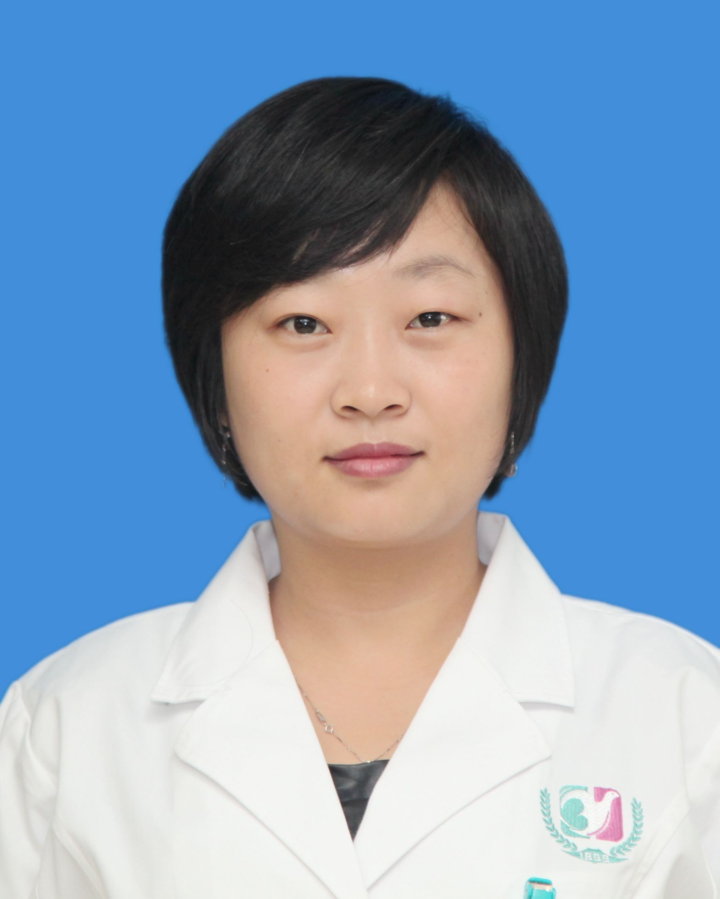

<!-- AUTO-GENERATED-BY: work/generate_obsidian_profiles.py -->

<!-- TEMPLATE: D:\workspace\信息收集整理\医生画像仓库\模板\医生画像模板.md -->

# 崔英

## 基础信息

| 字段 | 内容 |
|---|---|
| 姓名 | 崔英 |
| 医院 | 广州医科大学附属第三医院 |
| 科室 | 荔湾院区精神医学科 |
| 职称/身份 | 副主任医师 |
| 来源链接 | [官网原文](https://www.gy3y.cn/ks/nkxt/jsyxk/doctor_351.html) |
| 采集日期 | 2026-08-13 |

## 简介/擅长

儿童青少年心理问题、孕产妇心理、婚姻情感、睡眠障碍以及各类情绪障碍诊治和治疗；擅长意象对话、精神分析、认知行为等心理治疗。

## 教育与进修经历

- 硕士研究生，中级心理治疗师，2009年于上海精神卫生中心进修心理治疗专项。
- 广州市心理卫生协会常务委员、广东省医学会临床心身医学和心理治疗专业委员、广东省中西医结合双心医学会委员、广东省医学会认知睡眠障碍防治与脑健康管理会委员、广东省医学协会精神科医师分会毕业后医学教育专业委员、广州市医师协会精神医学分会委员。

## 可包装亮点

- 崔 英 ，副主任医师。
- 硕士研究生，中级心理治疗师，2009年于上海精神卫生中心进修心理治疗专项。
- 广州市心理卫生协会常务委员、广东省医学会临床心身医学和心理治疗专业委员、广东省中西医结合双心医学会委员、广东省医学会认知睡眠障碍防治与脑健康管理会委员、广东省医学协会精神科医师分会毕业后医学教育专业委员、广州市医师协会精神医学分会委员。

## 重点疾病/人群标签

- 慢性病：
- 肿瘤：
- 生殖疾病：
- 免疫/风湿：
- 术后恢复/康复：
- 疑难重症：

## 证据摘录

> 只摘录官网公开信息中的短句或关键字段，不复制大段原文。

- 官网身份字段：副主任医师
- 官网简介/擅长：儿童青少年心理问题、孕产妇心理、婚姻情感、睡眠障碍以及各类情绪障碍诊治和治疗；擅长意象对话、精神分析、认知行为等心理治疗。
- 官网亮眼经历线索：崔 英 ，副主任医师。 硕士研究生，中级心理治疗师，2009年于上海精神卫生中心进修心理治疗专项。 广州市心理卫生协会常务委员、广东省医学会临床心身医学和心理治疗专业委员、广东省中西医结合双心医学会委员、广东省医学会认知睡眠障碍防治与脑健康管理会委员、广东省医学协会精神科医师分会毕业后医学教育专业委员、广州市医师协会精神医学分会委员。
- 来源链接：https://www.gy3y.cn/ks/nkxt/jsyxk/doctor_351.html

## BD 画像摘要

崔英医生可作为广州医科大学附属第三医院荔湾院区精神医学科的基础医生资料入库。当前重点方向以总底表标签为准，官网未展示的信息保持空白。

## 合规边界

- 仅使用医院官网、官方公众号、官方小程序等公开渠道。
- 不采集私人电话、私人微信、家庭住址、患者隐私或非公开排班信息。
- 不写“保证治愈”“疗效第一”“包治疑难杂症”等无法由官网证明的表述。
