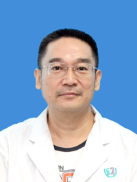

<!-- AUTO-GENERATED-BY: work/generate_obsidian_profiles.py -->

<!-- TEMPLATE: D:\workspace\信息收集整理\医生画像仓库\模板\医生画像模板.md -->

# 幸宇坚

## 基础信息

| 字段 | 内容 |
|---|---|
| 姓名 | 幸宇坚 |
| 医院 | 广州医科大学附属第三医院 |
| 科室 | 荔湾院区中医科 |
| 职称/身份 | 主任中医师 |
| 来源链接 | [官网原文](https://www.gy3y.cn/ks/zyk/zyk1/doctor_158.html) |
| 采集日期 | 2026-08-13 |

## 简介/擅长

开设中医肾病专科 ，主要使用中医辩证施治方法治疗各类泌尿系疾病，如急慢性肾炎、肾病综合征、泌尿系结石、慢性前列腺炎、前列腺增生症以及男性性功能障碍疾患 ，取得了较好的疗效。此外，并擅长治疗中风、高血压病、冠心病、糖尿病以及慢支炎、胃脘痛，抑郁证等内科疾病。

## 科研项目与成果

- 主持广东省中医药管理局建设中医药强省科研项目一项，发表论文20多篇，曾获中共广州市委、广州市政府授予“抗击非典先进个人”称号，并获金质奖章一枚。

## 论文与学术产出

- 主持广东省中医药管理局建设中医药强省科研项目一项，发表论文20多篇，曾获中共广州市委、广州市政府授予“抗击非典先进个人”称号，并获金质奖章一枚。

## 可包装亮点

- 从事中医内科专业近三十年，现为广州中医药学会会员、中华医学会内科学分会会员。
- 主持广东省中医药管理局建设中医药强省科研项目一项，发表论文20多篇，曾获中共广州市委、广州市政府授予“抗击非典先进个人”称号，并获金质奖章一枚。

## 重点疾病/人群标签

- 慢性病：高血压、糖尿病、冠心病、慢性、功能障碍
- 肿瘤：
- 生殖疾病：
- 免疫/风湿：
- 术后恢复/康复：高血压、糖尿病、冠心病、慢性、功能障碍
- 疑难重症：

## 证据摘录

> 只摘录官网公开信息中的短句或关键字段，不复制大段原文。

- 官网身份字段：主任中医师
- 官网简介/擅长：开设中医肾病专科 ，主要使用中医辩证施治方法治疗各类泌尿系疾病，如急慢性肾炎、肾病综合征、泌尿系结石、慢性前列腺炎、前列腺增生症以及男性性功能障碍疾患 ，取得了较好的疗效。此外，并擅长治疗中风、高血压病、冠心病、糖尿病以及慢支炎、胃脘痛，抑郁证等内科疾病。
- 官网亮眼经历线索：从事中医内科专业近三十年，现为广州中医药学会会员、中华医学会内科学分会会员。 主持广东省中医药管理局建设中医药强省科研项目一项，发表论文20多篇，曾获中共广州市委、广州市政府授予“抗击非典先进个人”称号，并获金质奖章一枚。
- 来源链接：https://www.gy3y.cn/ks/zyk/zyk1/doctor_158.html

## BD 画像摘要

幸宇坚医生可作为慢性病、术后恢复/康复方向的基础画像候选。后续 BD 使用应继续以官网来源和人工复核为准，不添加疗效承诺或无来源包装。

## 合规边界

- 仅使用医院官网、官方公众号、官方小程序等公开渠道。
- 不采集私人电话、私人微信、家庭住址、患者隐私或非公开排班信息。
- 不写“保证治愈”“疗效第一”“包治疑难杂症”等无法由官网证明的表述。
