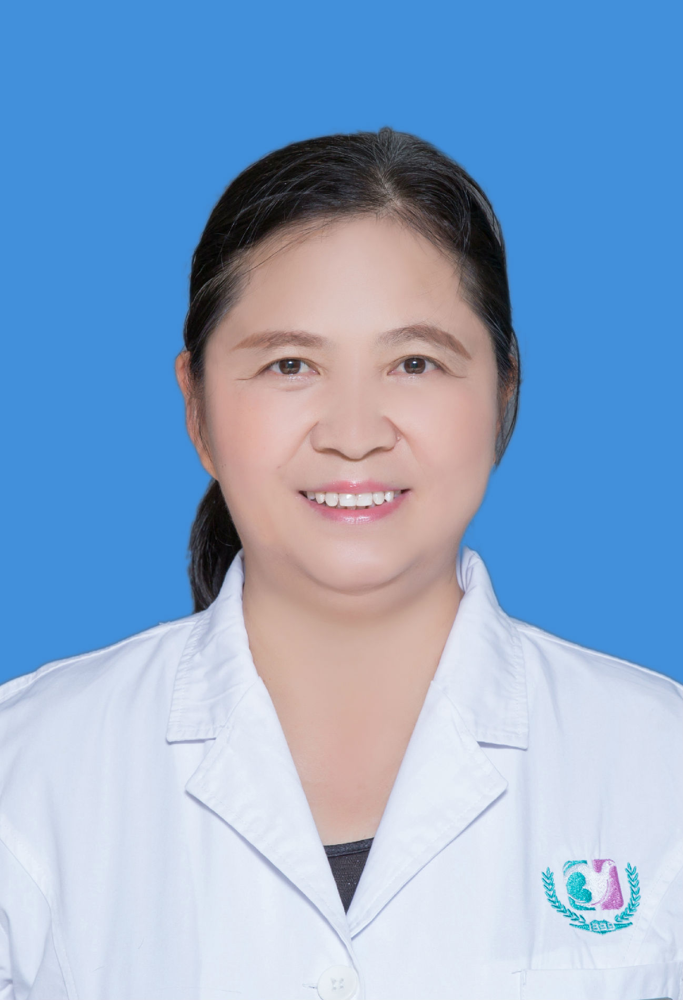

<!-- AUTO-GENERATED-BY: work/generate_obsidian_profiles.py -->

<!-- TEMPLATE: D:\workspace\信息收集整理\医生画像仓库\模板\医生画像模板.md -->

# 张中芳

## 基础信息

| 字段 | 内容 |
|---|---|
| 姓名 | 张中芳 |
| 医院 | 广州医科大学附属第三医院 |
| 科室 | 荔湾院区妇产科门诊 |
| 职称/身份 | 主任医师 |
| 来源链接 | [官网原文](https://www.gy3y.cn/ks/fckyjs/fckmz/doctor_122.html) |
| 采集日期 | 2026-08-13 |

## 简介/擅长

主要从事产科学、围产医学与妇幼保健。着重于妊娠合并症与并发症的研究，对产科常见病及疑难病的诊治有着丰富的临床经验，为降低孕产妇和围产儿的死亡率做出了贡献。

## 科研项目与成果

- 主持省市级科研课题两项，多次被评为医院先进工作者，曾被评为广州市卫生先进工作者，受到广州市人民政府的嘉奖。

## 论文与学术产出

- 在国家级刊物上发表专业论文10余篇，多次获得市级优秀论文奖。

## 可包装亮点

- 张中芳 ，主任医师。
- 有使上万例孕妇安全分娩的经验，具有近千例危重病人的救治经验。
- 着重于妊娠合并症与并发症的研究，对产科常见病及疑难病的诊治有着丰富的临床经验，为降低孕产妇和围产儿的死亡率做出了贡献。
- 在国家级刊物上发表专业论文10余篇，多次获得市级优秀论文奖。

## 重点疾病/人群标签

- 慢性病：
- 肿瘤：
- 生殖疾病：
- 免疫/风湿：
- 术后恢复/康复：
- 疑难重症：疑难、危重

## 证据摘录

> 只摘录官网公开信息中的短句或关键字段，不复制大段原文。

- 官网身份字段：主任医师
- 官网简介/擅长：主要从事产科学、围产医学与妇幼保健。着重于妊娠合并症与并发症的研究，对产科常见病及疑难病的诊治有着丰富的临床经验，为降低孕产妇和围产儿的死亡率做出了贡献。
- 官网亮眼经历线索：张中芳 ，主任医师。 有使上万例孕妇安全分娩的经验，具有近千例危重病人的救治经验。 着重于妊娠合并症与并发症的研究，对产科常见病及疑难病的诊治有着丰富的临床经验，为降低孕产妇和围产儿的死亡率做出了贡献。 在国家级刊物上发表专业论文10余篇，多次获得市级优秀论文奖。
- 来源链接：https://www.gy3y.cn/ks/fckyjs/fckmz/doctor_122.html

## BD 画像摘要

张中芳医生可作为疑难重症方向的基础画像候选。后续 BD 使用应继续以官网来源和人工复核为准，不添加疗效承诺或无来源包装。

## 合规边界

- 仅使用医院官网、官方公众号、官方小程序等公开渠道。
- 不采集私人电话、私人微信、家庭住址、患者隐私或非公开排班信息。
- 不写“保证治愈”“疗效第一”“包治疑难杂症”等无法由官网证明的表述。
