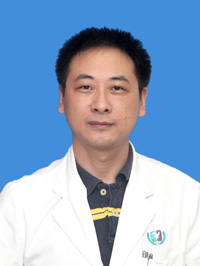

<!-- AUTO-GENERATED-BY: work/generate_obsidian_profiles.py -->

<!-- TEMPLATE: D:\workspace\信息收集整理\医生画像仓库\模板\医生画像模板.md -->

# 张亮

## 基础信息

| 字段 | 内容 |
|---|---|
| 姓名 | 张亮 |
| 医院 | 广州医科大学附属第三医院 |
| 科室 | 荔湾院区脊柱外科 |
| 职称/身份 | 主任医师 |
| 来源链接 | [官网原文](https://www.gy3y.cn/ks/wkxt/gkyq/doctor_69.html) |
| 采集日期 | 2026-08-13 |

## 简介/擅长

脊柱畸形，颈椎病，颈椎管狭窄，颈椎畸形、创伤；腰椎间盘突出，腰椎管狭窄，腰椎滑脱，强直性脊柱炎，椎体骨折经皮椎体成形术。

## 教育与进修经历

- 详细介绍： 医学博士 主任医师，美国哥伦比亚大学医学中心访问学者。

## 可包装亮点

- 张亮 脊柱外科 主任医师 擅长领域：脊柱畸形，颈椎病，颈椎管狭窄，颈椎畸形、创伤；
- 详细介绍： 医学博士 主任医师，美国哥伦比亚大学医学中心访问学者。
- 获广东省科技进步三等奖2项，广州市科技进步奖1项。

## 重点疾病/人群标签

- 慢性病：
- 肿瘤：
- 生殖疾病：
- 免疫/风湿：强直性脊柱炎
- 术后恢复/康复：
- 疑难重症：

## 证据摘录

> 只摘录官网公开信息中的短句或关键字段，不复制大段原文。

- 官网身份字段：主任医师
- 官网简介/擅长：脊柱畸形，颈椎病，颈椎管狭窄，颈椎畸形、创伤；腰椎间盘突出，腰椎管狭窄，腰椎滑脱，强直性脊柱炎，椎体骨折经皮椎体成形术。
- 官网亮眼经历线索：张亮 脊柱外科 主任医师 擅长领域：脊柱畸形，颈椎病，颈椎管狭窄，颈椎畸形、创伤； 详细介绍： 医学博士 主任医师，美国哥伦比亚大学医学中心访问学者。 获广东省科技进步三等奖2项，广州市科技进步奖1项。
- 来源链接：https://www.gy3y.cn/ks/wkxt/gkyq/doctor_69.html

## BD 画像摘要

张亮医生可作为免疫/风湿/感染方向的基础画像候选。后续 BD 使用应继续以官网来源和人工复核为准，不添加疗效承诺或无来源包装。

## 合规边界

- 仅使用医院官网、官方公众号、官方小程序等公开渠道。
- 不采集私人电话、私人微信、家庭住址、患者隐私或非公开排班信息。
- 不写“保证治愈”“疗效第一”“包治疑难杂症”等无法由官网证明的表述。
