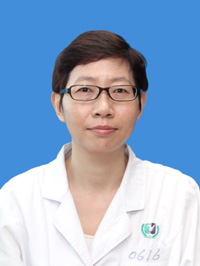

<!-- AUTO-GENERATED-BY: work/generate_obsidian_profiles.py -->

<!-- TEMPLATE: D:\workspace\信息收集整理\医生画像仓库\模板\医生画像模板.md -->

# 张伟雯

## 基础信息

| 字段 | 内容 |
|---|---|
| 姓名 | 张伟雯 |
| 医院 | 广州医科大学附属第三医院 |
| 科室 | 荔湾院区检验科 |
| 职称/身份 | 主任技师 |
| 来源链接 | [官网原文](https://www.gy3y.cn/ks/yjbm/jyk/doctor_197.html) |
| 采集日期 | 2026-08-13 |

## 简介/擅长

专业方向：临床生物化学检验、实验室质量管理

## 科研项目与成果

- 担任广东省医学会检验分会青年委员会委员，广州市医师协会检验医师分会常务委员，广东省肝脏病学会检验诊断分会委员，广东省中西医结合学会医学实验室自动化专业委员会委员。
- 专业方向 ：临床生物化学检验、实验室质量管理

## 可包装亮点

- 担任广东省医学会检验分会青年委员会委员，广州市医师协会检验医师分会常务委员，广东省肝脏病学会检验诊断分会委员，广东省中西医结合学会医学实验室自动化专业委员会委员。

## 重点疾病/人群标签

- 慢性病：
- 肿瘤：
- 生殖疾病：
- 免疫/风湿：
- 术后恢复/康复：
- 疑难重症：

## 证据摘录

> 只摘录官网公开信息中的短句或关键字段，不复制大段原文。

- 官网身份字段：主任技师
- 官网简介/擅长：专业方向：临床生物化学检验、实验室质量管理
- 官网亮眼经历线索：担任广东省医学会检验分会青年委员会委员，广州市医师协会检验医师分会常务委员，广东省肝脏病学会检验诊断分会委员，广东省中西医结合学会医学实验室自动化专业委员会委员。
- 异常提示：职称/身份需人工复核
- 来源链接：https://www.gy3y.cn/ks/yjbm/jyk/doctor_197.html

## BD 画像摘要

张伟雯医生可作为广州医科大学附属第三医院荔湾院区检验科的基础医生资料入库。当前重点方向以总底表标签为准，官网未展示的信息保持空白。

## 合规边界

- 仅使用医院官网、官方公众号、官方小程序等公开渠道。
- 不采集私人电话、私人微信、家庭住址、患者隐私或非公开排班信息。
- 不写“保证治愈”“疗效第一”“包治疑难杂症”等无法由官网证明的表述。
