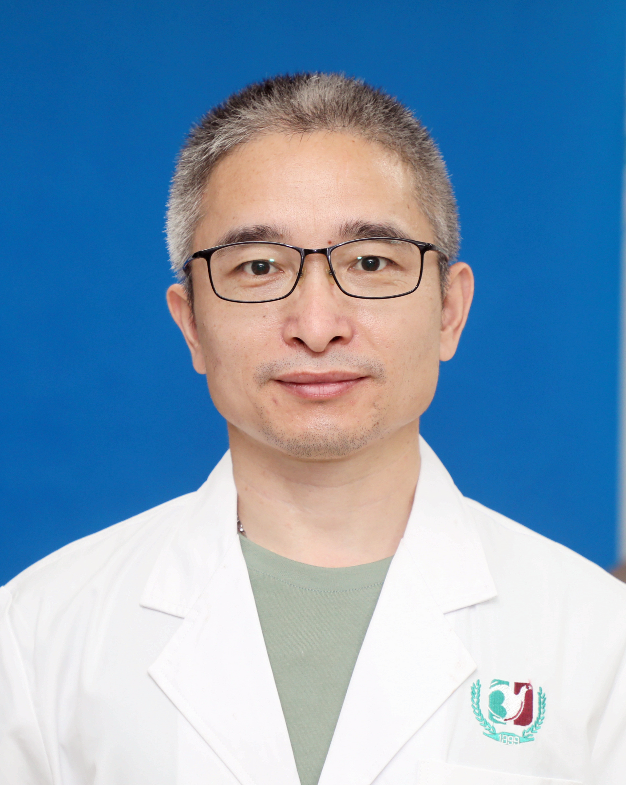

<!-- AUTO-GENERATED-BY: work/generate_obsidian_profiles.py -->

<!-- TEMPLATE: D:\workspace\信息收集整理\医生画像仓库\模板\医生画像模板.md -->

# 张刚

## 基础信息

| 字段 | 内容 |
|---|---|
| 姓名 | 张刚 |
| 医院 | 广州医科大学附属第三医院 |
| 科室 | 荔湾院区小儿外科、黄埔院区小儿外科 |
| 职称/身份 | 副主任医师 |
| 来源链接 | [官网原文](https://www.gy3y.cn/ks/ek/xewk/doctor_324.html) |
| 采集日期 | 2026-08-13 |

## 简介/擅长

小儿常见的斜疝、阑尾炎、肠套叠、先天性巨结肠、肛门直肠畸形、各种肿瘤等外科的诊断和处理。

## 科研项目与成果

- 从事小儿外科临床、教学、科研工作15年，专注先天性发育性畸形及儿童健康领域。
- 主持省市级科研项目3项。
- 发表论文20余篇，SCI收录5篇，主编、参编3部，申请专利2项，涉及先天性结构性畸形的一体化管理、先天性肺气道结构畸形的病因研究、新生儿坏死性小肠结肠的诊疗等。

## 论文与学术产出

- 发表论文20余篇，SCI收录5篇，主编、参编3部，申请专利2项，涉及先天性结构性畸形的一体化管理、先天性肺气道结构畸形的病因研究、新生儿坏死性小肠结肠的诊疗等。

## 可包装亮点

- 张刚， 副主任医师，医学博士，广州医科大学 硕士研究生导师。
- 中国妇幼保健协会新生儿外科学组委员，广东省医学会小儿外科分会委员，广东省医师协会小儿外科分会委员，广东省临床医学学会胎儿医学专业委员会常委。
- 曾在德国 EvKB儿童医院 研学。
- 临床工作中注重微创无痛、循证医学、多学科综合诊疗模式。

## 重点疾病/人群标签

- 慢性病：
- 肿瘤：肿瘤、多学科
- 生殖疾病：
- 免疫/风湿：
- 术后恢复/康复：
- 疑难重症：肿瘤、多学科

## 证据摘录

> 只摘录官网公开信息中的短句或关键字段，不复制大段原文。

- 官网身份字段：副主任医师
- 官网简介/擅长：小儿常见的斜疝、阑尾炎、肠套叠、先天性巨结肠、肛门直肠畸形、各种肿瘤等外科的诊断和处理。
- 官网亮眼经历线索：张刚， 副主任医师，医学博士，广州医科大学 硕士研究生导师。 中国妇幼保健协会新生儿外科学组委员，广东省医学会小儿外科分会委员，广东省医师协会小儿外科分会委员，广东省临床医学学会胎儿医学专业委员会常委。 曾在德国 EvKB儿童医院 研学。 临床工作中注重微创无痛、循证医学、多学科综合诊疗模式。
- 来源链接：https://www.gy3y.cn/ks/ek/xewk/doctor_324.html

## BD 画像摘要

张刚医生可作为肿瘤、疑难重症方向的基础画像候选。后续 BD 使用应继续以官网来源和人工复核为准，不添加疗效承诺或无来源包装。

## 合规边界

- 仅使用医院官网、官方公众号、官方小程序等公开渠道。
- 不采集私人电话、私人微信、家庭住址、患者隐私或非公开排班信息。
- 不写“保证治愈”“疗效第一”“包治疑难杂症”等无法由官网证明的表述。
