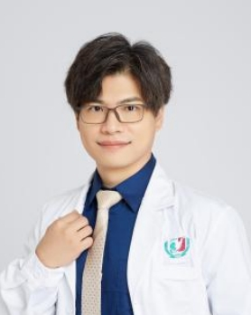

<!-- AUTO-GENERATED-BY: work/generate_obsidian_profiles.py -->

<!-- TEMPLATE: D:\workspace\信息收集整理\医生画像仓库\模板\医生画像模板.md -->

# 张弛

## 基础信息

| 字段 | 内容 |
|---|---|
| 姓名 | 张弛 |
| 医院 | 广州医科大学附属第三医院 |
| 科室 | 荔湾院区关节外科、荔湾院区再生医学与3D打印技术转化研究中心 |
| 职称/身份 | 副主任医师、副教授 |
| 来源链接 | [官网原文](https://www.gy3y.cn/ks/wkxt/gkeq/doctor_279.html) |
| 采集日期 | 2026-08-13 |

## 简介/擅长

运动创伤和中老年人关节疼痛、畸形的诊治；关节置换手术，关节镜下肩袖修补、交叉韧带重建手术以及成人和小儿关节畸形矫正手术。

## 教育与进修经历

- 广州医科大学附属第三医院关节外科学科带头人及行政负责人，广州医科大学再生医学与3D打印技术转化研究中心独立项目负责人，澳大利亚国际肌骨研究所（IMRI）培训医师，印度Ganga骨科中心培训医师，美国宾夕法尼亚大学医院访问学者，台湾三军总医院访问学者，大湾区反肩协作组创始成员，广东省临床医学学会关节外科专委会常委、运动医学专委会常委，广东省医师协会骨关节外科医师分会常委、关节青年学组委员、骨科快速康复学组委员，广东省中西医结合学会关节病专委会常委，广东省创伤学会运动损伤学组委员、肢体重建学组委员，广州市医学会运动医…

## 科研项目与成果

- 广州医科大学附属第三医院关节外科学科带头人及行政负责人，广州医科大学再生医学与3D打印技术转化研究中心独立项目负责人，澳大利亚国际肌骨研究所（IMRI）培训医师，印度Ganga骨科中心培训医师，美国宾夕法尼亚大学医院访问学者，台湾三军总医院访问学者，大湾区反肩协作组创始成员，广东省临床医学学会关节外科专委会常委、运动医学专委会常委，广东省医师协会骨关节外科医师分会常委、关节青年学组委员、骨科快速康复学组委员，广东省中西医结合学会关节病专委会常委，广东省创伤学会运动损伤学组委员、肢体重建学组委员，广州市医学会运动医…
- 主持和参与多个国家级、省市级科研项目，在国内外期刊发表学术论文十余篇，获国家级专利一项，参译著作一部。
- 主持广医三院AI-Joint人工智能辅助关节置换、ARF自体再生因子治疗关节炎等前沿项目。

## 论文与学术产出

- 主持和参与多个国家级、省市级科研项目，在国内外期刊发表学术论文十余篇，获国家级专利一项，参译著作一部。

## 可包装亮点

- 张弛 关节外科 副主任医师 /副教授 擅长领域：运动创伤和中老年人关节疼痛、畸形的诊治；
- 详细介绍： 医学博士，副主任医师，副教授，硕士研究生导师。
- 广州医科大学附属第三医院关节外科学科带头人及行政负责人，广州医科大学再生医学与3D打印技术转化研究中心独立项目负责人，澳大利亚国际肌骨研究所（IMRI）培训医师，印度Ganga骨科中心培训医师，美国宾夕法尼亚大学医院访问学者，台湾三军总医院访问学者，大湾区反肩协作组创始成员，广东省临床医学学会关节外科专委会常委、运动医学专委会常委，广东省医师协会骨关节外科…
- 主持和参与多个国家级、省市级科研项目，在国内外期刊发表学术论文十余篇，获国家级专利一项，参译著作一部。

## 重点疾病/人群标签

- 慢性病：
- 肿瘤：
- 生殖疾病：
- 免疫/风湿：
- 术后恢复/康复：康复、疼痛
- 疑难重症：

## 证据摘录

> 只摘录官网公开信息中的短句或关键字段，不复制大段原文。

- 官网身份字段：副主任医师、副教授
- 官网简介/擅长：运动创伤和中老年人关节疼痛、畸形的诊治；关节置换手术，关节镜下肩袖修补、交叉韧带重建手术以及成人和小儿关节畸形矫正手术。
- 官网亮眼经历线索：张弛 关节外科 副主任医师 /副教授 擅长领域：运动创伤和中老年人关节疼痛、畸形的诊治； 详细介绍： 医学博士，副主任医师，副教授，硕士研究生导师。 广州医科大学附属第三医院关节外科学科带头人及行政负责人，广州医科大学再生医学与3D打印技术转化研究中心独立项目负责人，澳大利亚国际肌骨研究所（IMRI）培训医师，印度Ganga骨科中心培训医师，美国宾夕法尼亚大学医院访问学者，台湾三军总医院访问学者，大湾区反肩协作组创始成员，广东省临床医…
- 来源链接：https://www.gy3y.cn/ks/wkxt/gkeq/doctor_279.html

## BD 画像摘要

张弛医生可作为术后恢复/康复方向的基础画像候选。后续 BD 使用应继续以官网来源和人工复核为准，不添加疗效承诺或无来源包装。

## 合规边界

- 仅使用医院官网、官方公众号、官方小程序等公开渠道。
- 不采集私人电话、私人微信、家庭住址、患者隐私或非公开排班信息。
- 不写“保证治愈”“疗效第一”“包治疑难杂症”等无法由官网证明的表述。
