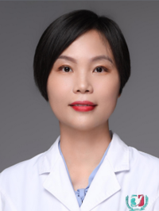

<!-- AUTO-GENERATED-BY: work/generate_obsidian_profiles.py -->

<!-- TEMPLATE: D:\workspace\信息收集整理\医生画像仓库\模板\医生画像模板.md -->

# 张慧

## 基础信息

| 字段 | 内容 |
|---|---|
| 姓名 | 张慧 |
| 医院 | 广州医科大学附属第三医院 |
| 科室 | 荔湾院区儿 科（普通儿科、新生儿科）、黄埔院区儿童保健科、黄埔院区新生儿科 |
| 职称/身份 | 主任医师 |
| 来源链接 | [官网原文](https://www.gy3y.cn/ks/ek/ek1/doctor_150.html) |
| 采集日期 | 2026-08-13 |

## 简介/擅长

新生儿危重症救治、新生儿保健、营养与生长发育、医学教育。

## 教育与进修经历

- 曾在英国、美国、新加坡、台湾等地担任访问学者/进修。
- 任中国医药教育协会毕业后与继续医学教育指导委员会委员、广东省保健协会儿童保健分会常委、广东省医师协会儿科医师分会常委、广州市女医师协会儿童早期发育专业委员会副主任委员、广州市医学会儿科学分会常委、广州医学会新生儿科学分会委员。

## 可包装亮点

- 张 慧 主任医师，硕士研究生导师，广州医科大学附属第三医院儿科副主任、儿科基地教学主任、儿科教研室副主任、广州医科大学临床技能实验中心兼职副主任。
- 擅长：新生儿危重症救治、新生儿保健、营养与生长发育、医学教育。
- 曾在英国、美国、新加坡、台湾等地担任访问学者/进修。
- 任中国医药教育协会毕业后与继续医学教育指导委员会委员、广东省保健协会儿童保健分会常委、广东省医师协会儿科医师分会常委、广州市女医师协会儿童早期发育专业委员会副主任委员、广州市医学会儿科学分会常委、广州医学会新生儿科学分会委员。

## 重点疾病/人群标签

- 慢性病：
- 肿瘤：
- 生殖疾病：
- 免疫/风湿：
- 术后恢复/康复：营养、危重
- 疑难重症：营养、危重

## 证据摘录

> 只摘录官网公开信息中的短句或关键字段，不复制大段原文。

- 官网身份字段：主任医师
- 官网简介/擅长：新生儿危重症救治、新生儿保健、营养与生长发育、医学教育。
- 官网亮眼经历线索：张 慧 主任医师，硕士研究生导师，广州医科大学附属第三医院儿科副主任、儿科基地教学主任、儿科教研室副主任、广州医科大学临床技能实验中心兼职副主任。 擅长：新生儿危重症救治、新生儿保健、营养与生长发育、医学教育。 曾在英国、美国、新加坡、台湾等地担任访问学者/进修。 任中国医药教育协会毕业后与继续医学教育指导委员会委员、广东省保健协会儿童保健分会常委、广东省医师协会儿科医师分会常委、广州市女医师协会儿童早期发育专业委员会副主任委员、广州…
- 来源链接：https://www.gy3y.cn/ks/ek/ek1/doctor_150.html

## BD 画像摘要

张慧医生可作为术后恢复/康复、疑难重症方向的基础画像候选。后续 BD 使用应继续以官网来源和人工复核为准，不添加疗效承诺或无来源包装。

## 合规边界

- 仅使用医院官网、官方公众号、官方小程序等公开渠道。
- 不采集私人电话、私人微信、家庭住址、患者隐私或非公开排班信息。
- 不写“保证治愈”“疗效第一”“包治疑难杂症”等无法由官网证明的表述。
