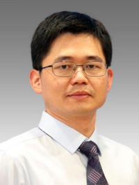

<!-- AUTO-GENERATED-BY: work/generate_obsidian_profiles.py -->

<!-- TEMPLATE: D:\workspace\信息收集整理\医生画像仓库\模板\医生画像模板.md -->

# 张振辉

## 基础信息

| 字段 | 内容 |
|---|---|
| 姓名 | 张振辉 |
| 医院 | 广州医科大学附属第三医院 |
| 科室 | 荔湾院区重症医学科（ICU） |
| 职称/身份 | 主任医师 |
| 来源链接 | [官网原文](https://www.gy3y.cn/ks/nkxt/zzyxk/doctor_549.html) |
| 采集日期 | 2026-08-13 |

## 简介/擅长

广州医科大学附属第三医院院长，广州医科大学附属第三医院重症医学科和广州医科大学附属第二医院重症医学科学科带头人,

## 教育与进修经历

- 张振辉 教授，主任医师，医学博士，博士生/硕士生导师，博士后合作导师，广州医科大学附属第三医院院长，广州医科大学附属第三医院重症医学科和广州医科大学附属第二医院重症医学科学科带头人，广东省杰出青年医学人才，广州市卫健委优秀人才，广东省医院等级评审专家。

## 科研项目与成果

- 广东省医学会重症医学分会副主任委员、广东省医院协会重症医学管理专委会副主任委员、广州市医学会重症医学分会主任委员、呼吸疾病全国重点实验室PI等社会任职。

## 可包装亮点

- 张振辉 教授，主任医师，医学博士，博士生/硕士生导师，博士后合作导师，广州医科大学附属第三医院院长，广州医科大学附属第三医院重症医学科和广州医科大学附属第二医院重症医学科学科带头人，广东省杰出青年医学人才，广州市卫健委优秀人才，广东省医院等级评审专家。
- 广东省医学会重症医学分会副主任委员、广东省医院协会重症医学管理专委会副主任委员、广州市医学会重症医学分会主任委员、呼吸疾病全国重点实验室PI等社会任职。

## 重点疾病/人群标签

- 慢性病：
- 肿瘤：
- 生殖疾病：
- 免疫/风湿：
- 术后恢复/康复：
- 疑难重症：重症

## 证据摘录

> 只摘录官网公开信息中的短句或关键字段，不复制大段原文。

- 官网身份字段：主任医师
- 官网简介/擅长：广州医科大学附属第三医院院长，广州医科大学附属第三医院重症医学科和广州医科大学附属第二医院重症医学科学科带头人,
- 官网亮眼经历线索：张振辉 教授，主任医师，医学博士，博士生/硕士生导师，博士后合作导师，广州医科大学附属第三医院院长，广州医科大学附属第三医院重症医学科和广州医科大学附属第二医院重症医学科学科带头人，广东省杰出青年医学人才，广州市卫健委优秀人才，广东省医院等级评审专家。 广东省医学会重症医学分会副主任委员、广东省医院协会重症医学管理专委会副主任委员、广州市医学会重症医学分会主任委员、呼吸疾病全国重点实验室PI等社会任职。
- 来源链接：https://www.gy3y.cn/ks/nkxt/zzyxk/doctor_549.html

## BD 画像摘要

张振辉医生可作为疑难重症方向的基础画像候选。后续 BD 使用应继续以官网来源和人工复核为准，不添加疗效承诺或无来源包装。

## 合规边界

- 仅使用医院官网、官方公众号、官方小程序等公开渠道。
- 不采集私人电话、私人微信、家庭住址、患者隐私或非公开排班信息。
- 不写“保证治愈”“疗效第一”“包治疑难杂症”等无法由官网证明的表述。
