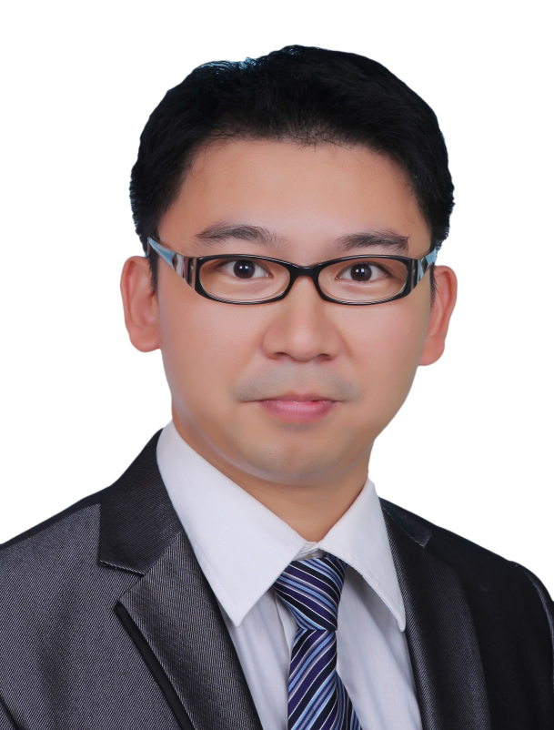

<!-- AUTO-GENERATED-BY: work/generate_obsidian_profiles.py -->

<!-- TEMPLATE: D:\workspace\信息收集整理\医生画像仓库\模板\医生画像模板.md -->

# 张智勇

## 基础信息

| 字段 | 内容 |
|---|---|
| 姓名 | 张智勇 |
| 医院 | 广州医科大学附属第三医院 |
| 科室 | 荔湾院区再生医学与3D打印技术转化研究中心 |
| 职称/身份 | 教授 |
| 来源链接 | [官网原文](https://www.gy3y.cn/ks/wkxt/zsyx/doctor_256.html) |
| 采集日期 | 2026-08-13 |

## 简介/擅长

长期专注骨组织修复再生的转化研究，多项成果已临床转化。

## 教育与进修经历

- 博士毕业于新加坡国立大学，2012-2016年任职于上海交通大学医学院附属第九人民医院、组织工程国家工程中心，担任研究员、博导、课题组长（31岁破格晋升正高职称、博士生导师），2017年起任职于广州医科大学附属第三医院，担任教授、博导，负责创建广州医科大学再生医学与3D打印技术转化研究中心，并担任中心主任。

## 科研项目与成果

- 博士毕业于新加坡国立大学，2012-2016年任职于上海交通大学医学院附属第九人民医院、组织工程国家工程中心，担任研究员、博导、课题组长（31岁破格晋升正高职称、博士生导师），2017年起任职于广州医科大学附属第三医院，担任教授、博导，负责创建广州医科大学再生医学与3D打印技术转化研究中心，并担任中心主任。
- 主持与参与国家重点研究计划（子课题）、863计划重大专项（子课题）、国家自然科学基金（3项）等科研课题10余项；
- 长期专注骨组织修复再生的转化研究，多项成果已临床转化（ 包括1项成果已转让给国外生物技术公司）。
- 长期受邀担任荷兰Reumafonds、新加坡SingHealth、香港HMRF等国际科研基金的外审专家，以及中国国家重点研究计划、教育部长江学者计划等多个国家级、省市级科研基金、学术奖项及重点实验室、学科的评审专家。

## 论文与学术产出

- 发表国际、国内学术会议特邀报告30余场；

## 可包装亮点

- 博士毕业于新加坡国立大学，2012-2016年任职于上海交通大学医学院附属第九人民医院、组织工程国家工程中心，担任研究员、博导、课题组长（31岁破格晋升正高职称、博士生导师），2017年起任职于广州医科大学附属第三医院，担任教授、博导，负责创建广州医科大学再生医学与3D打印技术转化研究中心，并担任中心主任。
- 上海高校“东方学者”特聘教授、上市“启明星”计划、广州市医学领军人才等6项国家级、省、市级人才计划，荣获教育部自然科学一等奖、中华医学科技奖二等奖等13项国际、国内学术奖项 。
- 并指导研究生获得各类创新创业奖项11项；
- 主持与参与国家重点研究计划（子课题）、863计划重大专项（子课题）、国家自然科学基金（3项）等科研课题10余项；

## 重点疾病/人群标签

- 慢性病：
- 肿瘤：
- 生殖疾病：
- 免疫/风湿：
- 术后恢复/康复：
- 疑难重症：

## 证据摘录

> 只摘录官网公开信息中的短句或关键字段，不复制大段原文。

- 官网身份字段：教授
- 官网简介/擅长：长期专注骨组织修复再生的转化研究，多项成果已临床转化。
- 官网亮眼经历线索：博士毕业于新加坡国立大学，2012-2016年任职于上海交通大学医学院附属第九人民医院、组织工程国家工程中心，担任研究员、博导、课题组长（31岁破格晋升正高职称、博士生导师），2017年起任职于广州医科大学附属第三医院，担任教授、博导，负责创建广州医科大学再生医学与3D打印技术转化研究中心，并担任中心主任。 上海高校“东方学者”特聘教授、上市“启明星”计划、广州市医学领军人才等6项国家级、省、市级人才计划，荣获教育部自然科学一等奖、中…
- 来源链接：https://www.gy3y.cn/ks/wkxt/zsyx/doctor_256.html

## BD 画像摘要

张智勇医生可作为广州医科大学附属第三医院荔湾院区再生医学与3D打印技术转化研究中心的基础医生资料入库。当前重点方向以总底表标签为准，官网未展示的信息保持空白。

## 合规边界

- 仅使用医院官网、官方公众号、官方小程序等公开渠道。
- 不采集私人电话、私人微信、家庭住址、患者隐私或非公开排班信息。
- 不写“保证治愈”“疗效第一”“包治疑难杂症”等无法由官网证明的表述。
