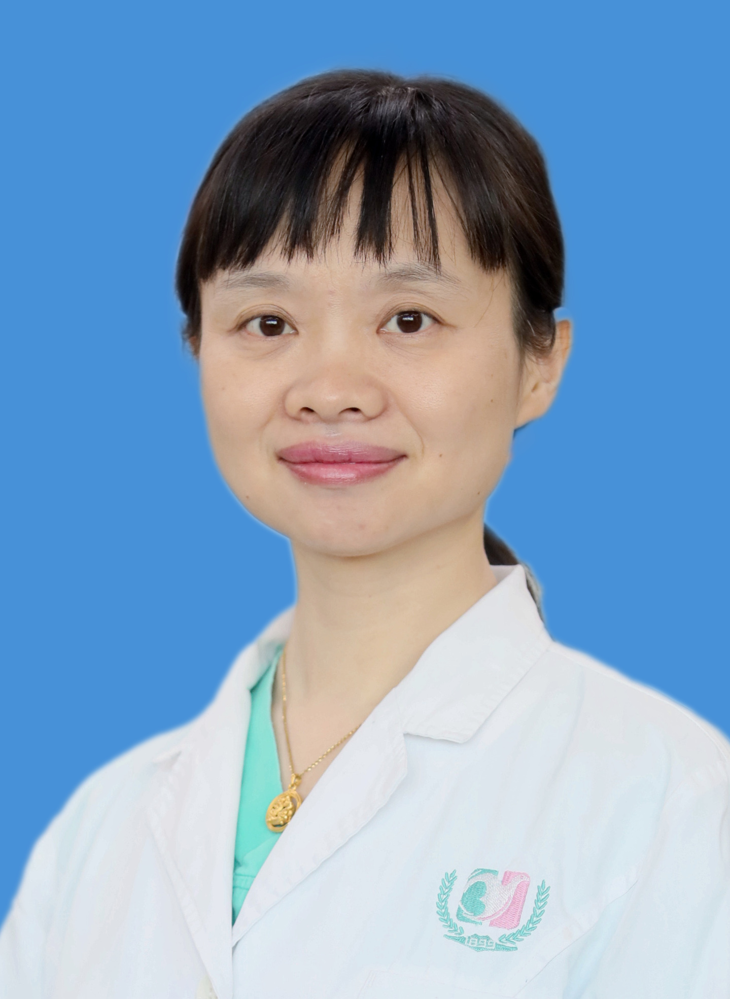

<!-- AUTO-GENERATED-BY: work/generate_obsidian_profiles.py -->

<!-- TEMPLATE: D:\workspace\信息收集整理\医生画像仓库\模板\医生画像模板.md -->

# 张莉

## 基础信息

| 字段 | 内容 |
|---|---|
| 姓名 | 张莉 |
| 医院 | 广州医科大学附属第三医院 |
| 科室 | 荔湾院区消化内科、黄埔院区消化内科、黄埔院区内镜中心 |
| 职称/身份 | 副主任医师 |
| 来源链接 | [官网原文](https://www.gy3y.cn/ks/nkxt/xhnk/doctor_354.html) |
| 采集日期 | 2026-08-13 |

## 简介/擅长

内镜下早癌的诊断和治疗，内镜下粘膜剥离术（ESD）、内镜下全层切除术（EFTR）、内镜下食管环形肌切开术（POEM）等。擅长肝病（脂肪肝、病毒性肝炎、自身免疫性肝病、肝硬化等），胃肠病（消化道早癌、功能性胃肠病、炎症性肠病、进展期肿瘤的化疗等）等消化病诊疗。

## 教育与进修经历

- 张莉 学位：医学博士 职称：副主任医师 专长 擅长内镜下早癌的诊断和治疗，内镜下粘膜剥离术（ESD）、内镜下全层切除术（EFTR）、内镜下食管环形肌切开术（POEM）等。
- 详细介绍 曾任日本医科大学附属病院第一外科担任客座研究员，参加日本厚生省高级临床培训项目，专攻内镜下早癌诊断及粘膜剥离术（ESD）。
- 获得日本胃肠内镜学会颁发的内镜培训认证。

## 科研项目与成果

- 详细介绍 曾任日本医科大学附属病院第一外科担任客座研究员，参加日本厚生省高级临床培训项目，专攻内镜下早癌诊断及粘膜剥离术（ESD）。

## 可包装亮点

- 张莉 学位：医学博士 职称：副主任医师 专长 擅长内镜下早癌的诊断和治疗，内镜下粘膜剥离术（ESD）、内镜下全层切除术（EFTR）、内镜下食管环形肌切开术（POEM）等。
- 获得日本胃肠内镜学会颁发的内镜培训认证。
- 学术任职包括广东省医师协会消化医师消化道早癌学组委员，广州市医师协会消化内镜医师分会委员。

## 重点疾病/人群标签

- 慢性病：
- 肿瘤：肿瘤、癌、化疗、免疫
- 生殖疾病：
- 免疫/风湿：肿瘤、癌、化疗、免疫
- 术后恢复/康复：
- 疑难重症：

## 证据摘录

> 只摘录官网公开信息中的短句或关键字段，不复制大段原文。

- 官网身份字段：副主任医师
- 官网简介/擅长：内镜下早癌的诊断和治疗，内镜下粘膜剥离术（ESD）、内镜下全层切除术（EFTR）、内镜下食管环形肌切开术（POEM）等。擅长肝病（脂肪肝、病毒性肝炎、自身免疫性肝病、肝硬化等），胃肠病（消化道早癌、功能性胃肠病、炎症性肠病、进展期肿瘤的化疗等）等消化病诊疗。
- 官网亮眼经历线索：张莉 学位：医学博士 职称：副主任医师 专长 擅长内镜下早癌的诊断和治疗，内镜下粘膜剥离术（ESD）、内镜下全层切除术（EFTR）、内镜下食管环形肌切开术（POEM）等。 获得日本胃肠内镜学会颁发的内镜培训认证。 学术任职包括广东省医师协会消化医师消化道早癌学组委员，广州市医师协会消化内镜医师分会委员。
- 来源链接：https://www.gy3y.cn/ks/nkxt/xhnk/doctor_354.html

## BD 画像摘要

张莉医生可作为肿瘤、免疫/风湿/感染方向的基础画像候选。后续 BD 使用应继续以官网来源和人工复核为准，不添加疗效承诺或无来源包装。

## 合规边界

- 仅使用医院官网、官方公众号、官方小程序等公开渠道。
- 不采集私人电话、私人微信、家庭住址、患者隐私或非公开排班信息。
- 不写“保证治愈”“疗效第一”“包治疑难杂症”等无法由官网证明的表述。
