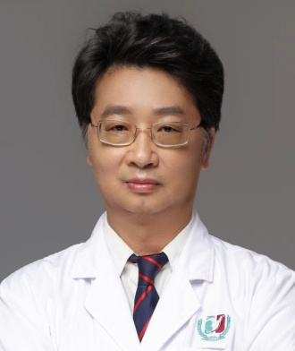

<!-- AUTO-GENERATED-BY: work/generate_obsidian_profiles.py -->

<!-- TEMPLATE: D:\workspace\信息收集整理\医生画像仓库\模板\医生画像模板.md -->

# 张金山

## 基础信息

| 字段 | 内容 |
|---|---|
| 姓名 | 张金山 |
| 医院 | 广州医科大学附属第三医院 |
| 科室 | 荔湾院区核医学科、放射治疗科 |
| 职称/身份 | 主任医师、教授 |
| 来源链接 | [官网原文](https://www.gy3y.cn/ks/yjbm/hyxfszlk/doctor_198.html) |
| 采集日期 | 2026-08-13 |

## 简介/擅长

瘢痕组织增生症、甲亢、婴幼儿皮肤血管瘤、多发性骨转移瘤和癌性骨痛等疾病的放射性核素治疗，以及肿瘤精准外照射放疗。

## 教育与进修经历

- 研究生毕业， 医学博士，硕士研究生导师，核医学科兼放射治疗科主任，住院医师规范化培训核医学专业基地主任，核医学教研室主任，住培全程指导医师。
- 荣誉称号： 荣获2020年度广东省住院医师规范化培训“优秀指导医师”。

## 科研项目与成果

- 从事影像医学与核医学、肿瘤放射治疗的临床医疗、教学和科研工作近30年。

## 可包装亮点

- 张金山，主任医师、教授。
- 研究生毕业， 医学博士，硕士研究生导师，核医学科兼放射治疗科主任，住院医师规范化培训核医学专业基地主任，核医学教研室主任，住培全程指导医师。
- 学术组织兼职： 中华医学会核医学分会体外分析学组委员、广东省医学会核医学分会常委、广东省医师协会核医学分会常委、广东省医院协会核医学管理委员会常委、广东省抗癌协会肿瘤核医学专业委员会常委、广东省中西医结合学会核医学专业委员会副主任委员、广州市医学会核医学分会副主任委员、广州市医师协会放射肿瘤学分会副主任委员等。

## 重点疾病/人群标签

- 慢性病：
- 肿瘤：肿瘤、癌、瘤、放疗
- 生殖疾病：
- 免疫/风湿：
- 术后恢复/康复：
- 疑难重症：

## 证据摘录

> 只摘录官网公开信息中的短句或关键字段，不复制大段原文。

- 官网身份字段：主任医师、教授
- 官网简介/擅长：瘢痕组织增生症、甲亢、婴幼儿皮肤血管瘤、多发性骨转移瘤和癌性骨痛等疾病的放射性核素治疗，以及肿瘤精准外照射放疗。
- 官网亮眼经历线索：张金山，主任医师、教授。 研究生毕业， 医学博士，硕士研究生导师，核医学科兼放射治疗科主任，住院医师规范化培训核医学专业基地主任，核医学教研室主任，住培全程指导医师。 学术组织兼职： 中华医学会核医学分会体外分析学组委员、广东省医学会核医学分会常委、广东省医师协会核医学分会常委、广东省医院协会核医学管理委员会常委、广东省抗癌协会肿瘤核医学专业委员会常委、广东省中西医结合学会核医学专业委员会副主任委员、广州市医学会核医学分会副主任委员…
- 来源链接：https://www.gy3y.cn/ks/yjbm/hyxfszlk/doctor_198.html

## BD 画像摘要

张金山医生可作为肿瘤方向的基础画像候选。后续 BD 使用应继续以官网来源和人工复核为准，不添加疗效承诺或无来源包装。

## 合规边界

- 仅使用医院官网、官方公众号、官方小程序等公开渠道。
- 不采集私人电话、私人微信、家庭住址、患者隐私或非公开排班信息。
- 不写“保证治愈”“疗效第一”“包治疑难杂症”等无法由官网证明的表述。
