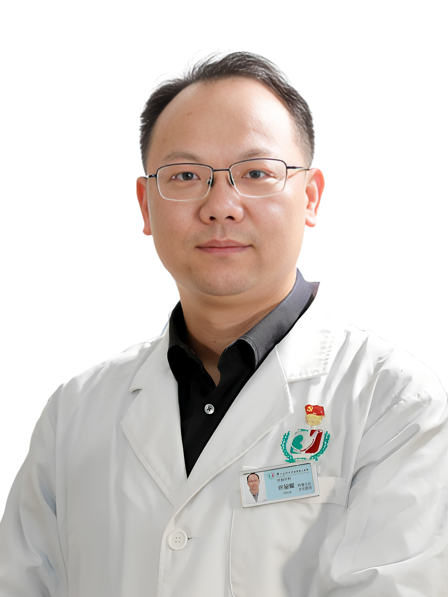

<!-- AUTO-GENERATED-BY: work/generate_obsidian_profiles.py -->

<!-- TEMPLATE: D:\workspace\信息收集整理\医生画像仓库\模板\医生画像模板.md -->

# 徐鋆耀

## 基础信息

| 字段 | 内容 |
|---|---|
| 姓名 | 徐鋆耀 |
| 医院 | 广州医科大学附属第三医院 |
| 科室 | 荔湾院区普外一区（肝胆外科）、黄埔院区普通外科、黄埔院区肝胆外科 |
| 职称/身份 | 主任医师 |
| 来源链接 | [官网原文](https://www.gy3y.cn/ks/wkxt/pwyq/doctor_444.html) |
| 采集日期 | 2026-08-13 |

## 简介/擅长

肝胆胰疾病的腹腔镜微创治疗，其中腹腔镜左半肝切除术在2015年“美敦力镜技学院腹腔镜肝切除比赛”获得卓越奖、腹腔镜胰十二指肠切除术在2019年 “第四届全国普通外科中青年医师手术展播暨中华外科金手指奖”评比中获得优胜奖、腹腔镜肝中叶切除术获得2020年中华外科中华医学会外科学分会青年委员会和中华外科杂志编辑委员会共同举办的规范化手术视频展播、腹腔镜肝S8段切除术在2022“第一届肝癌规范化手术视频大赛全国总决赛”获二等奖。

## 教育与进修经历

- 徐鋆耀 肝胆外科主任、主任医师、教授、研究生导师、博士后合作导师 医学博士、加拿大多伦多大学博士后 第八、九届“羊城好医生” 国内率先开展肝胆肿瘤个体化综合治疗的基础临床转化研究，通过规范化手术和个体化综合治疗显著提高了肝胆胰肿瘤患者的手术安全性、切除率和长期生存率。

## 科研项目与成果

- 主持国家自然科学青年基金、教育部及省市校级课题7项，在Clinical cancer research、Cell Death & Disease、British Journal of Cancer等杂志发表论文50余篇。

## 论文与学术产出

- 主持国家自然科学青年基金、教育部及省市校级课题7项，在Clinical cancer research、Cell Death & Disease、British Journal of Cancer等杂志发表论文50余篇。
- International J of Surgery, Advanced Science, Journal of Hepatocellular Carcinoma、Experimental Cell Research、World Journal of Surgical Oncology等杂志的审稿人，中华实验外科杂志、临床肝胆病杂志、岭南现代临床外科杂志等杂志编委。

## 可包装亮点

- 徐鋆耀 肝胆外科主任、主任医师、教授、研究生导师、博士后合作导师 医学博士、加拿大多伦多大学博士后 第八、九届“羊城好医生” 国内率先开展肝胆肿瘤个体化综合治疗的基础临床转化研究，通过规范化手术和个体化综合治疗显著提高了肝胆胰肿瘤患者的手术安全性、切除率和长期生存率。
- 主持国家自然科学青年基金、教育部及省市校级课题7项，在Clinical cancer research、Cell Death & Disease、British Journal of Cancer等杂志发表论文50余篇。
- 擅长肝胆胰疾病的腹腔镜微创治疗，其中腹腔镜左半肝切除术在2015年“美敦力镜技学院腹腔镜肝切除比赛”获得卓越奖、腹腔镜胰十二指肠切除术在2019年 “第四届全国普通外科中青年医师手术展播暨中华外科金手指奖”评比中获得优胜奖、腹腔镜肝中叶切除术获得2020年中华外科中华医学会外科学分会青年委员会和中华外科杂志编辑委员会共同举办的规范化手术视频...

## 重点疾病/人群标签

- 慢性病：
- 肿瘤：肿瘤、癌、肝癌
- 生殖疾病：
- 免疫/风湿：
- 术后恢复/康复：
- 疑难重症：

## 证据摘录

> 只摘录官网公开信息中的短句或关键字段，不复制大段原文。

- 官网身份字段：主任医师
- 官网简介/擅长：肝胆胰疾病的腹腔镜微创治疗，其中腹腔镜左半肝切除术在2015年“美敦力镜技学院腹腔镜肝切除比赛”获得卓越奖、腹腔镜胰十二指肠切除术在2019年 “第四届全国普通外科中青年医师手术展播暨中华外科金手指奖”评比中获得优胜奖、腹腔镜肝中叶切除术获得2020年中华外科中华医学会外科学分会青年委员会和中华外科杂志编辑委员会共同举办的规范化手术视频展播、腹腔镜肝S8段切除术在2022“第一届肝癌规范化手术视频大赛全国总决赛”获二等奖。
- 官网亮眼经历线索：徐鋆耀 肝胆外科主任、主任医师、教授、研究生导师、博士后合作导师 医学博士、加拿大多伦多大学博士后 第八、九届“羊城好医生” 国内率先开展肝胆肿瘤个体化综合治疗的基础临床转化研究，通过规范化手术和个体化综合治疗显著提高了肝胆胰肿瘤患者的手术安全性、切除率和长期生存率。 主持国家自然科学青年基金、教育部及省市校级课题7项，在Clinical cancer research、Cell Death & Disease、British Jou…
- 来源链接：https://www.gy3y.cn/ks/wkxt/pwyq/doctor_444.html

## BD 画像摘要

徐鋆耀医生可作为肿瘤方向的基础画像候选。后续 BD 使用应继续以官网来源和人工复核为准，不添加疗效承诺或无来源包装。

## 合规边界

- 仅使用医院官网、官方公众号、官方小程序等公开渠道。
- 不采集私人电话、私人微信、家庭住址、患者隐私或非公开排班信息。
- 不写“保证治愈”“疗效第一”“包治疑难杂症”等无法由官网证明的表述。
