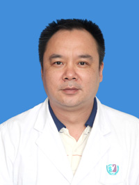

<!-- AUTO-GENERATED-BY: work/generate_obsidian_profiles.py -->

<!-- TEMPLATE: D:\workspace\信息收集整理\医生画像仓库\模板\医生画像模板.md -->

# 曾勉东

## 基础信息

| 字段 | 内容 |
|---|---|
| 姓名 | 曾勉东 |
| 医院 | 广州医科大学附属第三医院 |
| 科室 | 荔湾院区关节外科 |
| 职称/身份 | 主任医师 |
| 来源链接 | [官网原文](https://www.gy3y.cn/ks/wkxt/gkeq/doctor_76.html) |
| 采集日期 | 2026-08-13 |

## 简介/擅长

腰椎间盘突出症、腰椎管狭窄症、腰椎滑脱、颈椎病、脊柱骨折的诊断与治疗

## 可包装亮点

- 曾勉东 关节外科 主任医师 擅长领域：腰椎间盘突出症、腰椎管狭窄症、腰椎滑脱、颈椎病、脊柱骨折的诊断与治疗 详细介绍： 现担任广东省医师协会运动医学医师分会第一、二届委员、广东省医学会骨科学分会第十届委员、广东省医学会运动医学分会第六届委员、广东省医师协会骨关节外科医师分会第二届委员会常务委员、粤港澳大湾区骨关节外科医师联盟第一届成员；
- 广东省医师协会骨关节外科医师分会髋、膝关节置换手术讲师团讲师、广东省医师协会骨科分会第五届委员会委员、广州市医学会关节外科分会委员。

## 重点疾病/人群标签

- 慢性病：
- 肿瘤：
- 生殖疾病：
- 免疫/风湿：风湿、感染、康复
- 术后恢复/康复：风湿、感染、康复
- 疑难重症：

## 证据摘录

> 只摘录官网公开信息中的短句或关键字段，不复制大段原文。

- 官网身份字段：主任医师
- 官网简介/擅长：腰椎间盘突出症、腰椎管狭窄症、腰椎滑脱、颈椎病、脊柱骨折的诊断与治疗
- 官网亮眼经历线索：曾勉东 关节外科 主任医师 擅长领域：腰椎间盘突出症、腰椎管狭窄症、腰椎滑脱、颈椎病、脊柱骨折的诊断与治疗 详细介绍： 现担任广东省医师协会运动医学医师分会第一、二届委员、广东省医学会骨科学分会第十届委员、广东省医学会运动医学分会第六届委员、广东省医师协会骨关节外科医师分会第二届委员会常务委员、粤港澳大湾区骨关节外科医师联盟第一届成员； 广东省医师协会骨关节外科医师分会髋、膝关节置换手术讲师团讲师、广东省医师协会骨科分会第五届委员会委…
- 来源链接：https://www.gy3y.cn/ks/wkxt/gkeq/doctor_76.html

## BD 画像摘要

曾勉东医生可作为免疫/风湿/感染、术后恢复/康复方向的基础画像候选。后续 BD 使用应继续以官网来源和人工复核为准，不添加疗效承诺或无来源包装。

## 合规边界

- 仅使用医院官网、官方公众号、官方小程序等公开渠道。
- 不采集私人电话、私人微信、家庭住址、患者隐私或非公开排班信息。
- 不写“保证治愈”“疗效第一”“包治疑难杂症”等无法由官网证明的表述。
