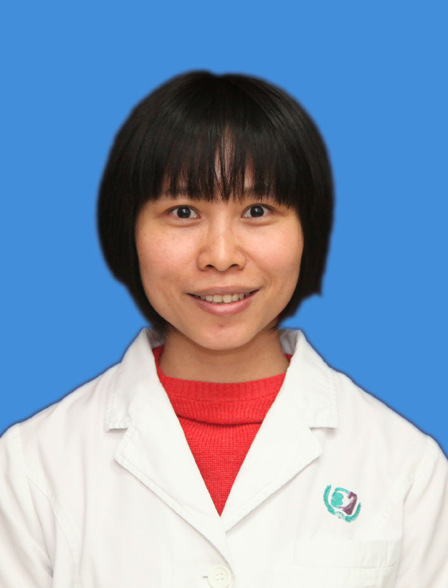

<!-- AUTO-GENERATED-BY: work/generate_obsidian_profiles.py -->

<!-- TEMPLATE: D:\workspace\信息收集整理\医生画像仓库\模板\医生画像模板.md -->

# 李少英

## 基础信息

| 字段 | 内容 |
|---|---|
| 姓名 | 李少英 |
| 医院 | 广州医科大学附属第三医院 |
| 科室 | 荔湾院区法医物证司法鉴定所 |
| 职称/身份 | 副主任技师、主检法医师 |
| 来源链接 | [官网原文](https://www.gy3y.cn/ks/fckyjs/fywzsfjds/doctor_270.html) |
| 采集日期 | 2026-08-13 |

## 简介/擅长

从事遗传病的DNA诊断、DNA鉴定、胚胎植入前遗传诊断和遗传咨询等临床和基础研究工作。

## 科研项目与成果

- 现为临床基因检测实验室技术负责人、广东省妇幼保健学会产前诊断技术专家委员会常委。
- 工作以来，一直在妇产科研究所从事遗传病的DNA诊断、DNA鉴定、胚胎植入前遗传诊断和遗传咨询等临床和基础研究工作；
- 此外，负责标准化基因检测实验室建立，编写相关操作工作手册并监督执行。

## 可包装亮点

- 现为临床基因检测实验室技术负责人、广东省妇幼保健学会产前诊断技术专家委员会常委。

## 重点疾病/人群标签

- 慢性病：
- 肿瘤：
- 生殖疾病：胚胎
- 免疫/风湿：
- 术后恢复/康复：
- 疑难重症：

## 证据摘录

> 只摘录官网公开信息中的短句或关键字段，不复制大段原文。

- 官网身份字段：副主任技师、主检法医师
- 官网简介/擅长：从事遗传病的DNA诊断、DNA鉴定、胚胎植入前遗传诊断和遗传咨询等临床和基础研究工作。
- 官网亮眼经历线索：现为临床基因检测实验室技术负责人、广东省妇幼保健学会产前诊断技术专家委员会常委。
- 来源链接：https://www.gy3y.cn/ks/fckyjs/fywzsfjds/doctor_270.html

## BD 画像摘要

李少英医生可作为生殖疾病方向的基础画像候选。后续 BD 使用应继续以官网来源和人工复核为准，不添加疗效承诺或无来源包装。

## 合规边界

- 仅使用医院官网、官方公众号、官方小程序等公开渠道。
- 不采集私人电话、私人微信、家庭住址、患者隐私或非公开排班信息。
- 不写“保证治愈”“疗效第一”“包治疑难杂症”等无法由官网证明的表述。
