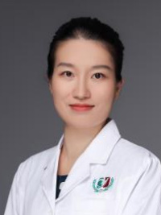

<!-- AUTO-GENERATED-BY: work/generate_obsidian_profiles.py -->

<!-- TEMPLATE: D:\workspace\信息收集整理\医生画像仓库\模板\医生画像模板.md -->

# 李竞雄

## 基础信息

| 字段 | 内容 |
|---|---|
| 姓名 | 李竞雄 |
| 医院 | 广州医科大学附属第三医院 |
| 科室 | 荔湾院区妇科肿瘤病区 |
| 职称/身份 | 主治医师 |
| 来源链接 | [官网原文](https://www.gy3y.cn/ks/fckyjs/fkzl/doctor_605.html) |
| 采集日期 | 2026-08-13 |

## 简介/擅长

2015年至今在广医三院妇研所从事妇产科临床、教研工作。

## 教育与进修经历

- 李竞雄，主治医师，讲师，博士毕业于南方医科大学妇产科学专业。

## 科研项目与成果

- 参与国家自然科学基金课题研究2项，主持省、市级科研课题各1项，以第一作者发表SCI论文数篇，临床专利2项。

## 论文与学术产出

- 参与国家自然科学基金课题研究2项，主持省、市级科研课题各1项，以第一作者发表SCI论文数篇，临床专利2项。

## 可包装亮点

- 2024年被评为广东省“组团式”援藏优秀医疗人才。
- 参与国家自然科学基金课题研究2项，主持省、市级科研课题各1项，以第一作者发表SCI论文数篇，临床专利2项。
- 社会任职：广东省临床医学会肿瘤专业青年委员。

## 重点疾病/人群标签

- 慢性病：
- 肿瘤：肿瘤
- 生殖疾病：
- 免疫/风湿：
- 术后恢复/康复：
- 疑难重症：

## 证据摘录

> 只摘录官网公开信息中的短句或关键字段，不复制大段原文。

- 官网身份字段：主治医师
- 官网简介/擅长：2015年至今在广医三院妇研所从事妇产科临床、教研工作。
- 官网亮眼经历线索：2024年被评为广东省“组团式”援藏优秀医疗人才。 参与国家自然科学基金课题研究2项，主持省、市级科研课题各1项，以第一作者发表SCI论文数篇，临床专利2项。 社会任职：广东省临床医学会肿瘤专业青年委员。
- 来源链接：https://www.gy3y.cn/ks/fckyjs/fkzl/doctor_605.html

## BD 画像摘要

李竞雄医生可作为肿瘤方向的基础画像候选。后续 BD 使用应继续以官网来源和人工复核为准，不添加疗效承诺或无来源包装。

## 合规边界

- 仅使用医院官网、官方公众号、官方小程序等公开渠道。
- 不采集私人电话、私人微信、家庭住址、患者隐私或非公开排班信息。
- 不写“保证治愈”“疗效第一”“包治疑难杂症”等无法由官网证明的表述。
