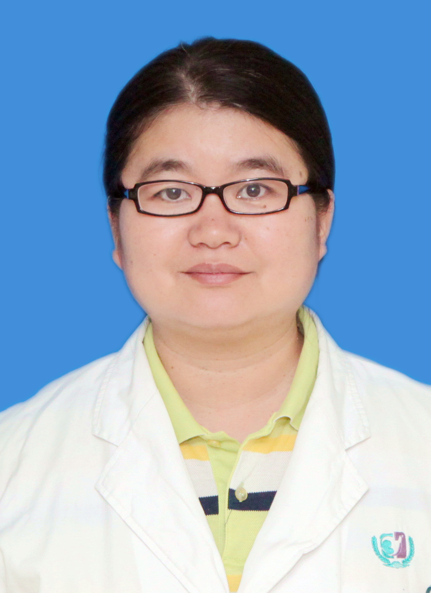

<!-- AUTO-GENERATED-BY: work/generate_obsidian_profiles.py -->

<!-- TEMPLATE: D:\workspace\信息收集整理\医生画像仓库\模板\医生画像模板.md -->

# 杨慧民

## 基础信息

| 字段 | 内容 |
|---|---|
| 姓名 | 杨慧民 |
| 医院 | 广州医科大学附属第三医院 |
| 科室 | 荔湾院区神经内科 |
| 职称/身份 | 副主任医师 |
| 来源链接 | [官网原文](https://www.gy3y.cn/ks/nkxt/sjnk/doctor_352.html) |
| 采集日期 | 2026-08-13 |

## 简介/擅长

主要治疗肌肉疾病、中枢神经系统感染、头痛，重症肌无力、多发性肌炎、周期性麻痹、病毒性脑炎、细菌性脑炎、各种头痛、三叉神经痛、卒中后疼痛、糖尿病周围神经痛、腰腿痛、纤维肌痛、带状疱疹后神经痛、病毒性脑炎及脑膜炎，化脓性脑膜炎、新型隐球菌脑膜炎、结核性脑膜炎、脑寄生虫病等

## 教育与进修经历

- 神经内科博士毕业， 主要治疗肌肉疾病、中枢神经系统感染、头痛，重症肌无力、多发性肌炎、周期性麻痹、病毒性脑炎、细菌性脑炎、各种头痛、三叉神经痛、卒中后疼痛、糖尿病周围神经痛、腰腿痛、纤维肌痛、带状疱疹后神经痛、病毒性脑炎及脑膜炎，化脓性脑膜炎、新型隐球菌脑膜炎、结核性脑膜炎、脑寄生虫病等。

## 可包装亮点

- 杨慧民 ，副主任医师。

## 重点疾病/人群标签

- 慢性病：糖尿病、感染、疼痛、重症
- 肿瘤：
- 生殖疾病：
- 免疫/风湿：糖尿病、感染、疼痛、重症
- 术后恢复/康复：糖尿病、感染、疼痛、重症
- 疑难重症：糖尿病、感染、疼痛、重症

## 证据摘录

> 只摘录官网公开信息中的短句或关键字段，不复制大段原文。

- 官网身份字段：副主任医师
- 官网简介/擅长：主要治疗肌肉疾病、中枢神经系统感染、头痛，重症肌无力、多发性肌炎、周期性麻痹、病毒性脑炎、细菌性脑炎、各种头痛、三叉神经痛、卒中后疼痛、糖尿病周围神经痛、腰腿痛、纤维肌痛、带状疱疹后神经痛、病毒性脑炎及脑膜炎，化脓性脑膜炎、新型隐球菌脑膜炎、结核性脑膜炎、脑寄生虫病等
- 官网亮眼经历线索：杨慧民 ，副主任医师。
- 来源链接：https://www.gy3y.cn/ks/nkxt/sjnk/doctor_352.html

## BD 画像摘要

杨慧民医生可作为慢性病、免疫/风湿/感染、术后恢复/康复、疑难重症方向的基础画像候选。后续 BD 使用应继续以官网来源和人工复核为准，不添加疗效承诺或无来源包装。

## 合规边界

- 仅使用医院官网、官方公众号、官方小程序等公开渠道。
- 不采集私人电话、私人微信、家庭住址、患者隐私或非公开排班信息。
- 不写“保证治愈”“疗效第一”“包治疑难杂症”等无法由官网证明的表述。
