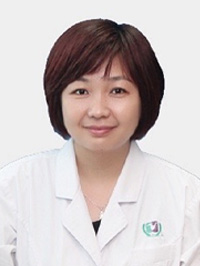

<!-- AUTO-GENERATED-BY: work/generate_obsidian_profiles.py -->

<!-- TEMPLATE: D:\workspace\信息收集整理\医生画像仓库\模板\医生画像模板.md -->

# 林丽英

## 基础信息

| 字段 | 内容 |
|---|---|
| 姓名 | 林丽英 |
| 医院 | 广州医科大学附属第三医院 |
| 科室 | 黄埔院区医学检验科 |
| 职称/身份 | 副主任技师 |
| 来源链接 | [官网原文](https://www.gy3y.cn/ks/hp/yjbm/yxjyk/doctor_506.html) |
| 采集日期 | 2026-08-13 |

## 简介/擅长

从事临床医学检验工作28年，本科毕业于中山大学中山医学院临床医学检验专业。在微生物检验于临床检验领域有较丰富的理论基础和实践经验，熟悉实验室质量管理体系与微生物培养鉴定。

## 教育与进修经历

- 林丽英 本科，副主任技师，黄埔院区检验科微生物室组长，医技第三支部工会女工委 研究方向/专业特长 从事临床医学检验工作28年，本科毕业于中山大学中山医学院临床医学检验专业。
- 曾在北京协和医院检验科微生物进修学习半年。

## 科研项目与成果

- 在微生物检验于临床检验领域有较丰富的理论基础和实践经验，熟悉实验室质量管理体系与微生物培养鉴定。

## 可包装亮点

- 以精准检验护航临床诊疗，用专业服务守护健康为职业理念。
- 曾在北京协和医院检验科微生物进修学习半年。

## 重点疾病/人群标签

- 慢性病：
- 肿瘤：
- 生殖疾病：
- 免疫/风湿：感染
- 术后恢复/康复：
- 疑难重症：

## 证据摘录

> 只摘录官网公开信息中的短句或关键字段，不复制大段原文。

- 官网身份字段：副主任技师
- 官网简介/擅长：从事临床医学检验工作28年，本科毕业于中山大学中山医学院临床医学检验专业。在微生物检验于临床检验领域有较丰富的理论基础和实践经验，熟悉实验室质量管理体系与微生物培养鉴定。
- 官网亮眼经历线索：以精准检验护航临床诊疗，用专业服务守护健康为职业理念。 曾在北京协和医院检验科微生物进修学习半年。
- 来源链接：https://www.gy3y.cn/ks/hp/yjbm/yxjyk/doctor_506.html

## BD 画像摘要

林丽英医生可作为免疫/风湿/感染方向的基础画像候选。后续 BD 使用应继续以官网来源和人工复核为准，不添加疗效承诺或无来源包装。

## 合规边界

- 仅使用医院官网、官方公众号、官方小程序等公开渠道。
- 不采集私人电话、私人微信、家庭住址、患者隐私或非公开排班信息。
- 不写“保证治愈”“疗效第一”“包治疑难杂症”等无法由官网证明的表述。
