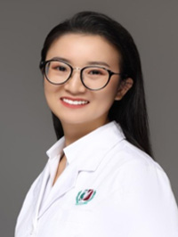

<!-- AUTO-GENERATED-BY: work/generate_obsidian_profiles.py -->

<!-- TEMPLATE: D:\workspace\信息收集整理\医生画像仓库\模板\医生画像模板.md -->

# 林泉士

## 基础信息

| 字段 | 内容 |
|---|---|
| 姓名 | 林泉士 |
| 医院 | 广州医科大学附属第三医院 |
| 科室 | 黄埔院区医学检验科 |
| 职称/身份 | 检验技师 |
| 来源链接 | [官网原文](https://www.gy3y.cn/ks/hp/yjbm/yxjyk/doctor_508.html) |
| 采集日期 | 2026-08-13 |

## 简介/擅长

主要研究方向为感染性疾病的分子诊断，熟练掌握分子诊断实验室的各种常用技术，如PCR，荧光定量PCR，电泳、靶向测序等，能够将以上技术熟练应用于临床疾病的诊断和病情评估。在呼吸道感染、生殖泌尿道感染性疾病、个体化治疗的分子检测方面有着一定的临床工作经验。

## 科研项目与成果

- 林泉士 医学博士、广州医科大学附属第三医院检验科分子组组长 研究方向/专业特长 主要研究方向为感染性疾病的分子诊断，熟练掌握分子诊断实验室的各种常用技术，如PCR，荧光定量PCR，电泳、靶向测序等，能够将以上技术熟练应用于临床疾病的诊断和病情评估。
- 主持完成市级、校级课题各一项，累计发表第一/通讯作者SCI论文8篇。

## 论文与学术产出

- 主持完成市级、校级课题各一项，累计发表第一/通讯作者SCI论文8篇。

## 可包装亮点

- 主持完成市级、校级课题各一项，累计发表第一/通讯作者SCI论文8篇。

## 重点疾病/人群标签

- 慢性病：
- 肿瘤：
- 生殖疾病：
- 免疫/风湿：
- 术后恢复/康复：
- 疑难重症：

## 证据摘录

> 只摘录官网公开信息中的短句或关键字段，不复制大段原文。

- 官网身份字段：检验技师
- 官网简介/擅长：主要研究方向为感染性疾病的分子诊断，熟练掌握分子诊断实验室的各种常用技术，如PCR，荧光定量PCR，电泳、靶向测序等，能够将以上技术熟练应用于临床疾病的诊断和病情评估。在呼吸道感染、生殖泌尿道感染性疾病、个体化治疗的分子检测方面有着一定的临床工作经验。
- 官网亮眼经历线索：主持完成市级、校级课题各一项，累计发表第一/通讯作者SCI论文8篇。
- 异常提示：职称/身份需人工复核
- 来源链接：https://www.gy3y.cn/ks/hp/yjbm/yxjyk/doctor_508.html

## BD 画像摘要

林泉士医生可作为广州医科大学附属第三医院黄埔院区医学检验科的基础医生资料入库。当前重点方向以总底表标签为准，官网未展示的信息保持空白。

## 合规边界

- 仅使用医院官网、官方公众号、官方小程序等公开渠道。
- 不采集私人电话、私人微信、家庭住址、患者隐私或非公开排班信息。
- 不写“保证治愈”“疗效第一”“包治疑难杂症”等无法由官网证明的表述。
