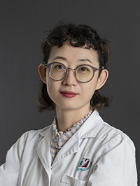

<!-- AUTO-GENERATED-BY: work/generate_obsidian_profiles.py -->

<!-- TEMPLATE: D:\workspace\信息收集整理\医生画像仓库\模板\医生画像模板.md -->

# 江岚

## 基础信息

| 字段 | 内容 |
|---|---|
| 姓名 | 江岚 |
| 医院 | 广州医科大学附属第三医院 |
| 科室 | 黄埔院区超声医学科 |
| 职称/身份 | 副主任医师 |
| 来源链接 | [官网原文](https://www.gy3y.cn/ks/hp/yjbm/csyxk/doctor_360.html) |
| 采集日期 | 2026-08-13 |

## 简介/擅长

主要从事心血管超声、妇科超声、腹部超声、甲状腺及乳腺超声、儿科超声、超声造影、介入超声等临床工作10余年。擅长心血管、妇科、泌尿、甲状腺及乳腺等系统的常见病及疑难病例的诊断，在孕产妇、小儿心脏疾病的诊断及心脏介入超声方面具有丰富的临床经验。

## 教育与进修经历

- 现任中国超声医学工程学会超声心动图专业青年委员，广东省精准医学会超声医学分会常委，广东省医师协会超声医师分会委员心血管专业委员，广东省住院医师规范化培训基地带教导师及考官。

## 科研项目与成果

- 主持和参与多项科研课题，发表国内外论著20余篇,作为副主编及主要作者参编论著多部。

## 论文与学术产出

- 主持和参与多项科研课题，发表国内外论著20余篇,作为副主编及主要作者参编论著多部。

## 可包装亮点

- 江 岚 副主任医师 广州医科大学附属第三医院黄埔院区（妇女儿童医院）超声医学科副主任、心脏超声亚专业组组长、暨南大学医学影像与核医学在读博士。
- 擅长心血管、妇科、泌尿、甲状腺及乳腺等系统的常见病及疑难病例的诊断，在孕产妇、小儿心脏疾病的诊断及心脏介入超声方面具有丰富的临床经验。
- 现任中国超声医学工程学会超声心动图专业青年委员，广东省精准医学会超声医学分会常委，广东省医师协会超声医师分会委员心血管专业委员，广东省住院医师规范化培训基地带教导师及考官。
- 主持和参与多项科研课题，发表国内外论著20余篇,作为副主编及主要作者参编论著多部。

## 重点疾病/人群标签

- 慢性病：
- 肿瘤：
- 生殖疾病：
- 免疫/风湿：
- 术后恢复/康复：
- 疑难重症：疑难

## 证据摘录

> 只摘录官网公开信息中的短句或关键字段，不复制大段原文。

- 官网身份字段：副主任医师
- 官网简介/擅长：主要从事心血管超声、妇科超声、腹部超声、甲状腺及乳腺超声、儿科超声、超声造影、介入超声等临床工作10余年。擅长心血管、妇科、泌尿、甲状腺及乳腺等系统的常见病及疑难病例的诊断，在孕产妇、小儿心脏疾病的诊断及心脏介入超声方面具有丰富的临床经验。
- 官网亮眼经历线索：江 岚 副主任医师 广州医科大学附属第三医院黄埔院区（妇女儿童医院）超声医学科副主任、心脏超声亚专业组组长、暨南大学医学影像与核医学在读博士。 擅长心血管、妇科、泌尿、甲状腺及乳腺等系统的常见病及疑难病例的诊断，在孕产妇、小儿心脏疾病的诊断及心脏介入超声方面具有丰富的临床经验。 现任中国超声医学工程学会超声心动图专业青年委员，广东省精准医学会超声医学分会常委，广东省医师协会超声医师分会委员心血管专业委员，广东省住院医师规范化培训基地带…
- 来源链接：https://www.gy3y.cn/ks/hp/yjbm/csyxk/doctor_360.html

## BD 画像摘要

江岚医生可作为疑难重症方向的基础画像候选。后续 BD 使用应继续以官网来源和人工复核为准，不添加疗效承诺或无来源包装。

## 合规边界

- 仅使用医院官网、官方公众号、官方小程序等公开渠道。
- 不采集私人电话、私人微信、家庭住址、患者隐私或非公开排班信息。
- 不写“保证治愈”“疗效第一”“包治疑难杂症”等无法由官网证明的表述。
