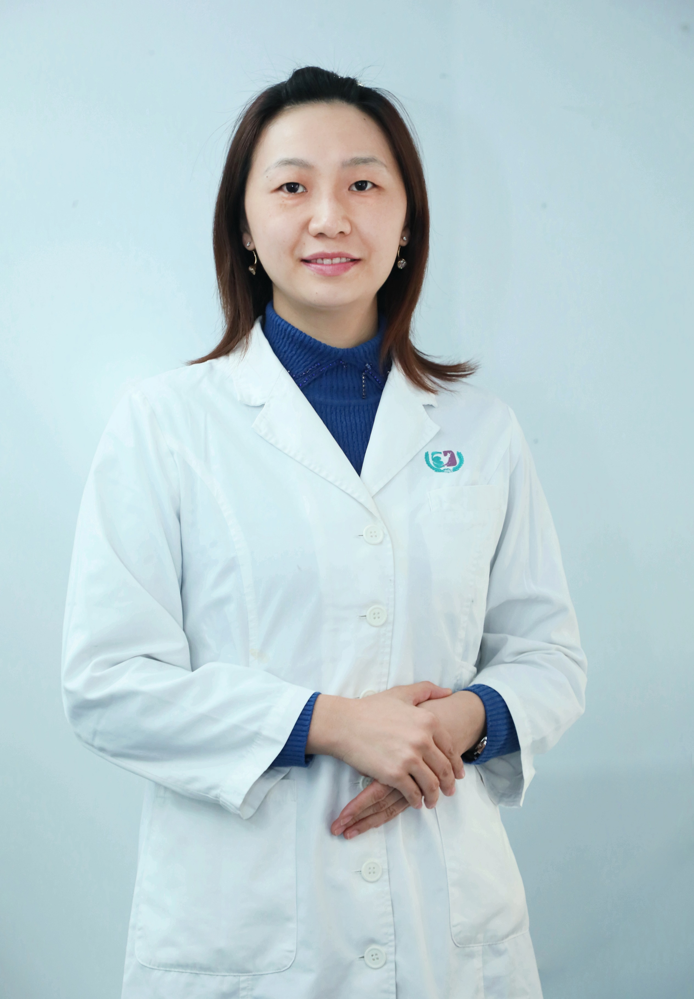

<!-- AUTO-GENERATED-BY: work/generate_obsidian_profiles.py -->

<!-- TEMPLATE: D:\workspace\信息收集整理\医生画像仓库\模板\医生画像模板.md -->

# 熊汉真

## 基础信息

| 字段 | 内容 |
|---|---|
| 姓名 | 熊汉真 |
| 医院 | 广州医科大学附属第三医院 |
| 科室 | 荔湾院区病理科、黄埔院区病理科 |
| 职称/身份 | 副主任医师 |
| 来源链接 | [官网原文](https://www.gy3y.cn/ks/yjbm/blk/doctor_266.html) |
| 采集日期 | 2026-08-13 |

## 简介/擅长

妇产科病理，皮肤病理，细胞学病理。

## 教育与进修经历

- 曾在北京协和医院和广东省皮肤病医院进修专科病理培训；

## 科研项目与成果

- 发表SCI论文十余篇，主持省级及市级课题各一项；

## 论文与学术产出

- 发表SCI论文十余篇，主持省级及市级课题各一项；

## 可包装亮点

- 熊汉真 副主任医师，博士，副教授，病理科行政副主任。
- 广医三院第三层次精英人才培养对象。
- 曾在北京协和医院和广东省皮肤病医院进修专科病理培训；
- 发表SCI论文十余篇，主持省级及市级课题各一项；

## 重点疾病/人群标签

- 慢性病：
- 肿瘤：
- 生殖疾病：
- 免疫/风湿：
- 术后恢复/康复：
- 疑难重症：

## 证据摘录

> 只摘录官网公开信息中的短句或关键字段，不复制大段原文。

- 官网身份字段：副主任医师
- 官网简介/擅长：妇产科病理，皮肤病理，细胞学病理。
- 官网亮眼经历线索：熊汉真 副主任医师，博士，副教授，病理科行政副主任。 广医三院第三层次精英人才培养对象。 曾在北京协和医院和广东省皮肤病医院进修专科病理培训； 发表SCI论文十余篇，主持省级及市级课题各一项；
- 来源链接：https://www.gy3y.cn/ks/yjbm/blk/doctor_266.html

## BD 画像摘要

熊汉真医生可作为广州医科大学附属第三医院荔湾院区病理科、黄埔院区病理科的基础医生资料入库。当前重点方向以总底表标签为准，官网未展示的信息保持空白。

## 合规边界

- 仅使用医院官网、官方公众号、官方小程序等公开渠道。
- 不采集私人电话、私人微信、家庭住址、患者隐私或非公开排班信息。
- 不写“保证治愈”“疗效第一”“包治疑难杂症”等无法由官网证明的表述。
