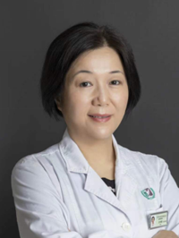

<!-- AUTO-GENERATED-BY: work/generate_obsidian_profiles.py -->

<!-- TEMPLATE: D:\workspace\信息收集整理\医生画像仓库\模板\医生画像模板.md -->

# 王伟群

## 基础信息

| 字段 | 内容 |
|---|---|
| 姓名 | 王伟群 |
| 医院 | 广州医科大学附属第三医院 |
| 科室 | 荔湾院区超声医学科、黄埔院区超声医学科 |
| 职称/身份 | 主任医师、副教授 |
| 来源链接 | [官网原文](https://www.gy3y.cn/ks/yjbm/csyx/doctor_194.html) |
| 采集日期 | 2026-08-13 |

## 简介/擅长

从事超声影像诊断工作三十余年，擅长腹部、妇科、小器官、外周血管等超声诊断，已开展近百例超声引导下腹部、妇科介入诊疗，在盆底超声、子宫输卵管超声造影等较前沿领域工作具有较深造诣，担任华南区子宫输卵管超声造影培训基地带教老师，熟练掌握经阴道实时三维子宫输卵管超声造影技术，已独立插管并完成近 20000 多例。

## 教育与进修经历

- 从事超声影像诊断工作三十余年，擅长腹部、妇科、小器官、外周血管等超声诊断，已开展近百例超声引导下腹部、妇科介入诊疗，在盆底超声、子宫输卵管超声造影等较前沿领域工作具有较深造诣，担任华南区子宫输卵管超声造影培训基地带教老师，熟练掌握经阴道实时三维子宫输卵管超声造影技术，已独立插管并完成近 30000 多例。

## 科研项目与成果

- 主持或参与多项省厅级科研课题，部分在研。

## 论文与学术产出

- 以第一作者在国家级及省级核心杂志发表论文 30 余篇，以第一作者发表 SCI 论文 2 篇，共同第一作者发表 SCI 论文 1 篇。

## 可包装亮点

- 王伟群 主任医师 广州医科大学附属第三医院超声医学科业务主管。
- 现任中国超声医学会腹部超声专业委员，广东省超声医师协会妇产分会常务委员，广东省医疗行业协会超声医学创新与发展管理分会常务委员，广州市医师协会超声分会委员，广东省超声医学工程学会委员，广东省中西医结合超声分会委员。
- 以第一作者在国家级及省级核心杂志发表论文 30 余篇，以第一作者发表 SCI 论文 2 篇，共同第一作者发表 SCI 论文 1 篇。

## 重点疾病/人群标签

- 慢性病：
- 肿瘤：
- 生殖疾病：
- 免疫/风湿：
- 术后恢复/康复：
- 疑难重症：

## 证据摘录

> 只摘录官网公开信息中的短句或关键字段，不复制大段原文。

- 官网身份字段：主任医师、副教授
- 官网简介/擅长：从事超声影像诊断工作三十余年，擅长腹部、妇科、小器官、外周血管等超声诊断，已开展近百例超声引导下腹部、妇科介入诊疗，在盆底超声、子宫输卵管超声造影等较前沿领域工作具有较深造诣，担任华南区子宫输卵管超声造影培训基地带教老师，熟练掌握经阴道实时三维子宫输卵管超声造影技术，已独立插管并完成近 20000 多例。
- 官网亮眼经历线索：王伟群 主任医师 广州医科大学附属第三医院超声医学科业务主管。 现任中国超声医学会腹部超声专业委员，广东省超声医师协会妇产分会常务委员，广东省医疗行业协会超声医学创新与发展管理分会常务委员，广州市医师协会超声分会委员，广东省超声医学工程学会委员，广东省中西医结合超声分会委员。 以第一作者在国家级及省级核心杂志发表论文 30 余篇，以第一作者发表 SCI 论文 2 篇，共同第一作者发表 SCI 论文 1 篇。
- 来源链接：https://www.gy3y.cn/ks/yjbm/csyx/doctor_194.html

## BD 画像摘要

王伟群医生可作为广州医科大学附属第三医院荔湾院区超声医学科、黄埔院区超声医学科的基础医生资料入库。当前重点方向以总底表标签为准，官网未展示的信息保持空白。

## 合规边界

- 仅使用医院官网、官方公众号、官方小程序等公开渠道。
- 不采集私人电话、私人微信、家庭住址、患者隐私或非公开排班信息。
- 不写“保证治愈”“疗效第一”“包治疑难杂症”等无法由官网证明的表述。
