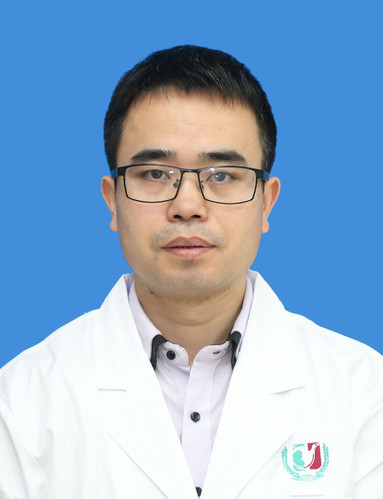

<!-- AUTO-GENERATED-BY: work/generate_obsidian_profiles.py -->

<!-- TEMPLATE: D:\workspace\信息收集整理\医生画像仓库\模板\医生画像模板.md -->

# 王双勇

## 基础信息

| 字段 | 内容 |
|---|---|
| 姓名 | 王双勇 |
| 医院 | 广州医科大学附属第三医院 |
| 科室 | 荔湾院区眼 科、黄埔院区眼科 |
| 职称/身份 | 副主任医师、副教授 |
| 来源链接 | [官网原文](https://www.gy3y.cn/ks/wgk/yk/doctor_303.html) |
| 采集日期 | 2026-08-13 |

## 简介/擅长

主要从事角膜病、白内障的诊治及早产儿视网膜病变的筛查及防治。

## 教育与进修经历

- 美国UIC眼视光学院博士后，中山大学中山眼科中心眼科学博士研究生，中国生物医学学会组织过程与再生医学分会会员，广东省基层医药学会眼科分会副主任委员，广东省视光学会眼表屈光分会常委，广东省眼保健学会儿童青少年眼保健专业委员会常委，主持国家自然科学基金面上项目1项，美国ISPB项目1项，陕西省自然科学基金面上项目1项。

## 科研项目与成果

- 美国UIC眼视光学院博士后，中山大学中山眼科中心眼科学博士研究生，中国生物医学学会组织过程与再生医学分会会员，广东省基层医药学会眼科分会副主任委员，广东省视光学会眼表屈光分会常委，广东省眼保健学会儿童青少年眼保健专业委员会常委，主持国家自然科学基金面上项目1项，美国ISPB项目1项，陕西省自然科学基金面上项目1项。

## 可包装亮点

- 王双勇，眼科副主任，副主任医师、副教授。
- 美国UIC眼视光学院博士后，中山大学中山眼科中心眼科学博士研究生，中国生物医学学会组织过程与再生医学分会会员，广东省基层医药学会眼科分会副主任委员，广东省视光学会眼表屈光分会常委，广东省眼保健学会儿童青少年眼保健专业委员会常委，主持国家自然科学基金面上项目1项，美国ISPB项目1项，陕西省自然科学基金面上项目1项。

## 重点疾病/人群标签

- 慢性病：
- 肿瘤：
- 生殖疾病：
- 免疫/风湿：
- 术后恢复/康复：
- 疑难重症：

## 证据摘录

> 只摘录官网公开信息中的短句或关键字段，不复制大段原文。

- 官网身份字段：副主任医师、副教授
- 官网简介/擅长：主要从事角膜病、白内障的诊治及早产儿视网膜病变的筛查及防治。
- 官网亮眼经历线索：王双勇，眼科副主任，副主任医师、副教授。 美国UIC眼视光学院博士后，中山大学中山眼科中心眼科学博士研究生，中国生物医学学会组织过程与再生医学分会会员，广东省基层医药学会眼科分会副主任委员，广东省视光学会眼表屈光分会常委，广东省眼保健学会儿童青少年眼保健专业委员会常委，主持国家自然科学基金面上项目1项，美国ISPB项目1项，陕西省自然科学基金面上项目1项。
- 来源链接：https://www.gy3y.cn/ks/wgk/yk/doctor_303.html

## BD 画像摘要

王双勇医生可作为广州医科大学附属第三医院荔湾院区眼 科、黄埔院区眼科的基础医生资料入库。当前重点方向以总底表标签为准，官网未展示的信息保持空白。

## 合规边界

- 仅使用医院官网、官方公众号、官方小程序等公开渠道。
- 不采集私人电话、私人微信、家庭住址、患者隐私或非公开排班信息。
- 不写“保证治愈”“疗效第一”“包治疑难杂症”等无法由官网证明的表述。
