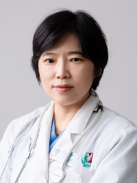

<!-- AUTO-GENERATED-BY: work/generate_obsidian_profiles.py -->

<!-- TEMPLATE: D:\workspace\信息收集整理\医生画像仓库\模板\医生画像模板.md -->

# 王宇光

## 基础信息

| 字段 | 内容 |
|---|---|
| 姓名 | 王宇光 |
| 医院 | 广州医科大学附属第三医院 |
| 科室 | 黄埔院区产科 |
| 职称/身份 | 主任医师 |
| 来源链接 | [官网原文](https://www.gy3y.cn/ks/hp/fck/ck/doctor_483.html) |
| 采集日期 | 2026-08-13 |

## 简介/擅长

妊娠期高血压疾病、早产流产、双胎妊娠、前置胎盘、胎盘植入、产后出血、宫颈机能不全等高危妊娠管理和急危重症孕产妇救治。救治成功率高。手术技艺高超，操作稳、准、快，注重减少患者损伤，术后恢复良好。

## 教育与进修经历

- 教育部学位中心硕士论文评审专家。

## 科研项目与成果

- 1996年来一直从事妇产科临床、教学和科研工作。
- 曾主持省厅级课题多项，参编参译人民卫生出版社《母胎医学》、《威廉姆斯产科学》第25版中文版。

## 论文与学术产出

- 教育部学位中心硕士论文评审专家。
- 曾主持省厅级课题多项，参编参译人民卫生出版社《母胎医学》、《威廉姆斯产科学》第25版中文版。

## 可包装亮点

- 王宇光，女，医学博士，主任医师，硕士研究生导师。
- 曾在美国耶鲁大学母胎医学专业学习，获得2011年美国母胎医学会(SMFM)早产最佳研究奖。
- 擅长妊娠期高血压疾病、早产流产、双胎妊娠、前置胎盘、胎盘植入、产后出血、宫颈机能不全等高危妊娠管理和急危重症孕产妇救治。
- 中国医师协会母胎医学委员会委员、 中华医学会围产医学委员会重症学组委员、 广东省医学会母胎医学委会副主任委员、 广东省妇幼保健协会社会母婴保健服务专委会副主任委员、 广州市医院协会母胎医学管理分会委员会秘书等兼职。

## 重点疾病/人群标签

- 慢性病：高血压、术后、恢复、重症、急危重、高危
- 肿瘤：
- 生殖疾病：
- 免疫/风湿：
- 术后恢复/康复：高血压、术后、恢复、重症、急危重、高危
- 疑难重症：高血压、术后、恢复、重症、急危重、高危

## 证据摘录

> 只摘录官网公开信息中的短句或关键字段，不复制大段原文。

- 官网身份字段：主任医师
- 官网简介/擅长：妊娠期高血压疾病、早产流产、双胎妊娠、前置胎盘、胎盘植入、产后出血、宫颈机能不全等高危妊娠管理和急危重症孕产妇救治。救治成功率高。手术技艺高超，操作稳、准、快，注重减少患者损伤，术后恢复良好。
- 官网亮眼经历线索：王宇光，女，医学博士，主任医师，硕士研究生导师。 曾在美国耶鲁大学母胎医学专业学习，获得2011年美国母胎医学会(SMFM)早产最佳研究奖。 擅长妊娠期高血压疾病、早产流产、双胎妊娠、前置胎盘、胎盘植入、产后出血、宫颈机能不全等高危妊娠管理和急危重症孕产妇救治。 中国医师协会母胎医学委员会委员、 中华医学会围产医学委员会重症学组委员、 广东省医学会母胎医学委会副主任委员、 广东省妇幼保健协会社会母婴保健服务专委会副主任委员、 广州市医…
- 来源链接：https://www.gy3y.cn/ks/hp/fck/ck/doctor_483.html

## BD 画像摘要

王宇光医生可作为慢性病、术后恢复/康复、疑难重症方向的基础画像候选。后续 BD 使用应继续以官网来源和人工复核为准，不添加疗效承诺或无来源包装。

## 合规边界

- 仅使用医院官网、官方公众号、官方小程序等公开渠道。
- 不采集私人电话、私人微信、家庭住址、患者隐私或非公开排班信息。
- 不写“保证治愈”“疗效第一”“包治疑难杂症”等无法由官网证明的表述。
