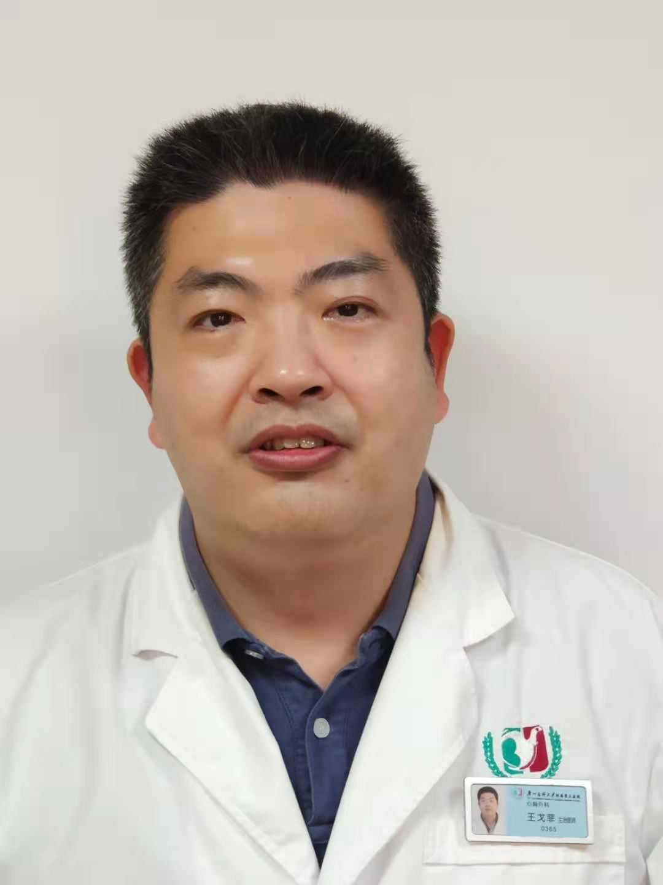

<!-- AUTO-GENERATED-BY: work/generate_obsidian_profiles.py -->

<!-- TEMPLATE: D:\workspace\信息收集整理\医生画像仓库\模板\医生画像模板.md -->

# 王戈菲

## 基础信息

| 字段 | 内容 |
|---|---|
| 姓名 | 王戈菲 |
| 医院 | 广州医科大学附属第三医院 |
| 科室 | 荔湾院区心胸外科 |
| 职称/身份 | 副主任医师 |
| 来源链接 | [官网原文](https://www.gy3y.cn/ks/wkxt/xxwk/doctor_328.html) |
| 采集日期 | 2026-08-13 |

## 简介/擅长

普胸相关外科疾病，包括手汗症、肺大泡、肺部结节、肺部肿瘤、食管肿瘤、纵隔肿瘤、胸壁疾病等。

## 教育与进修经历

- 1995年6月广州医学院临床医学本科毕业，1995年7月起在广州医科大学附属第三人民医院（原广州市第二人民医院）心胸外科工作至今。
- 曾2005年在广医一院进修胸腔镜半年，2009年在安阳市肿瘤医院进修食管疾病2月，2011年在上海市胸科医院进修普胸半年。

## 可包装亮点

- 王戈菲 ，副主任医师。
- 曾2005年在广医一院进修胸腔镜半年，2009年在安阳市肿瘤医院进修食管疾病2月，2011年在上海市胸科医院进修普胸半年。

## 重点疾病/人群标签

- 慢性病：
- 肿瘤：肿瘤
- 生殖疾病：
- 免疫/风湿：
- 术后恢复/康复：
- 疑难重症：

## 证据摘录

> 只摘录官网公开信息中的短句或关键字段，不复制大段原文。

- 官网身份字段：副主任医师
- 官网简介/擅长：普胸相关外科疾病，包括手汗症、肺大泡、肺部结节、肺部肿瘤、食管肿瘤、纵隔肿瘤、胸壁疾病等。
- 官网亮眼经历线索：王戈菲 ，副主任医师。 曾2005年在广医一院进修胸腔镜半年，2009年在安阳市肿瘤医院进修食管疾病2月，2011年在上海市胸科医院进修普胸半年。
- 来源链接：https://www.gy3y.cn/ks/wkxt/xxwk/doctor_328.html

## BD 画像摘要

王戈菲医生可作为肿瘤方向的基础画像候选。后续 BD 使用应继续以官网来源和人工复核为准，不添加疗效承诺或无来源包装。

## 合规边界

- 仅使用医院官网、官方公众号、官方小程序等公开渠道。
- 不采集私人电话、私人微信、家庭住址、患者隐私或非公开排班信息。
- 不写“保证治愈”“疗效第一”“包治疑难杂症”等无法由官网证明的表述。
