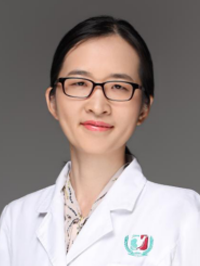

<!-- AUTO-GENERATED-BY: work/generate_obsidian_profiles.py -->

<!-- TEMPLATE: D:\workspace\信息收集整理\医生画像仓库\模板\医生画像模板.md -->

# 王颖

## 基础信息

| 字段 | 内容 |
|---|---|
| 姓名 | 王颖 |
| 医院 | 广州医科大学附属第三医院 |
| 科室 | 黄埔院区药学部 |
| 职称/身份 | 副主任药师 |
| 来源链接 | [官网原文](https://www.gy3y.cn/ks/hp/yjbm/yxb/doctor_379.html) |
| 采集日期 | 2026-08-13 |

## 简介/擅长

小儿用药安全、孕期哺乳期用药风险评估、抗菌药物的合理使用、用药科普等。

## 教育与进修经历

- 从事临床药学工作十余年，目前在新生儿科从事临床药学工作，是中华医学会临床药师培训基地儿科专业的带教师资。
- 支持母乳喂养，任广东省药理学会安全用药培训项目讲师、中国优生优育协会母乳喂养培训师资、任广东省护士协会泌乳顾问国际认证培训班泌乳药理学课程的授课师资。

## 科研项目与成果

- 发表中英文论文20余篇，作为主要成员参与国家自然科学基金、广东省科技厅科研项目等课题多项。
- 支持母乳喂养，任广东省药理学会安全用药培训项目讲师、中国优生优育协会母乳喂养培训师资、任广东省护士协会泌乳顾问国际认证培训班泌乳药理学课程的授课师资。

## 论文与学术产出

- 发表中英文论文20余篇，作为主要成员参与国家自然科学基金、广东省科技厅科研项目等课题多项。

## 可包装亮点

- 从事临床药学工作十余年，目前在新生儿科从事临床药学工作，是中华医学会临床药师培训基地儿科专业的带教师资。
- 发表中英文论文20余篇，作为主要成员参与国家自然科学基金、广东省科技厅科研项目等课题多项。
- 支持母乳喂养，任广东省药理学会安全用药培训项目讲师、中国优生优育协会母乳喂养培训师资、任广东省护士协会泌乳顾问国际认证培训班泌乳药理学课程的授课师资。
- 任广东省药学会妇产药学专委会、广东省药学会药学科普专家委员会等多个委员会的委员。

## 重点疾病/人群标签

- 慢性病：
- 肿瘤：
- 生殖疾病：
- 免疫/风湿：
- 术后恢复/康复：
- 疑难重症：

## 证据摘录

> 只摘录官网公开信息中的短句或关键字段，不复制大段原文。

- 官网身份字段：副主任药师
- 官网简介/擅长：小儿用药安全、孕期哺乳期用药风险评估、抗菌药物的合理使用、用药科普等。
- 官网亮眼经历线索：从事临床药学工作十余年，目前在新生儿科从事临床药学工作，是中华医学会临床药师培训基地儿科专业的带教师资。 发表中英文论文20余篇，作为主要成员参与国家自然科学基金、广东省科技厅科研项目等课题多项。 支持母乳喂养，任广东省药理学会安全用药培训项目讲师、中国优生优育协会母乳喂养培训师资、任广东省护士协会泌乳顾问国际认证培训班泌乳药理学课程的授课师资。 任广东省药学会妇产药学专委会、广东省药学会药学科普专家委员会等多个委员会的委员。
- 来源链接：https://www.gy3y.cn/ks/hp/yjbm/yxb/doctor_379.html

## BD 画像摘要

王颖医生可作为广州医科大学附属第三医院黄埔院区药学部的基础医生资料入库。当前重点方向以总底表标签为准，官网未展示的信息保持空白。

## 合规边界

- 仅使用医院官网、官方公众号、官方小程序等公开渠道。
- 不采集私人电话、私人微信、家庭住址、患者隐私或非公开排班信息。
- 不写“保证治愈”“疗效第一”“包治疑难杂症”等无法由官网证明的表述。
