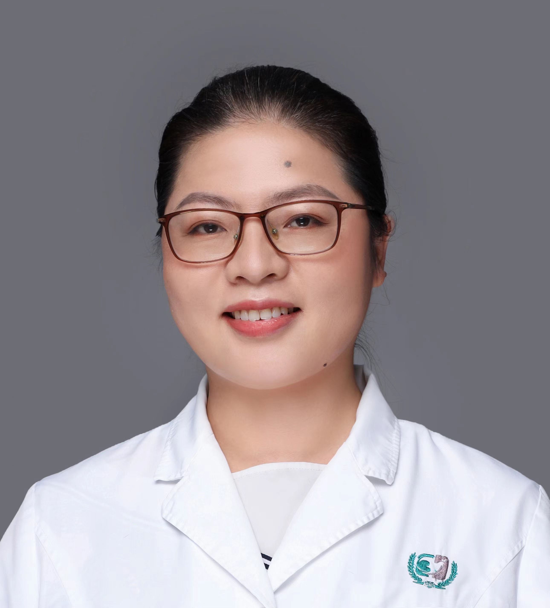

<!-- AUTO-GENERATED-BY: work/generate_obsidian_profiles.py -->

<!-- TEMPLATE: D:\workspace\信息收集整理\医生画像仓库\模板\医生画像模板.md -->

# 纪华英

## 基础信息

| 字段 | 内容 |
|---|---|
| 姓名 | 纪华英 |
| 医院 | 广州医科大学附属第三医院 |
| 科室 | 黄埔院区消化内科 |
| 职称/身份 | 副主任医师 |
| 来源链接 | [官网原文](https://www.gy3y.cn/ks/hp/nk/xhnk/doctor_485.html) |
| 采集日期 | 2026-08-13 |

## 简介/擅长

功能性胃肠病、胃炎、消化性溃疡、胃食管反流病、消化道出血、消化道早癌、肝硬化、病毒性肝炎、脂肪性肝病、酒精性肝病、胆囊炎、胰腺炎等疾病的诊治，擅长超声内镜检查、胃肠动力检测、内镜下消化道早癌精查、内镜下胃肠息肉摘除、内镜下消化道出血止血术等诊疗技术操作。

## 科研项目与成果

- 参与国家自然科学基金、省市级科研基金多项。

## 可包装亮点

- 纪华英 职称：副主任医师 专长 擅长功能性胃肠病、胃炎、消化性溃疡、胃食管反流病、消化道出血、消化道早癌、肝硬化、病毒性肝炎、脂肪性肝病、酒精性肝病、胆囊炎、胰腺炎等疾病的诊治，擅长超声内镜检查、胃肠动力检测、内镜下消化道早癌精查、内镜下胃肠息肉摘除、内镜下消化道出血止血术等诊疗技术操作。
- 详细介绍 学术任职包括广州市医师协会消化内镜医师分会委员，广州市医学会消化病学分会委员。
- 参与国家自然科学基金、省市级科研基金多项。

## 重点疾病/人群标签

- 慢性病：
- 肿瘤：癌
- 生殖疾病：
- 免疫/风湿：
- 术后恢复/康复：
- 疑难重症：

## 证据摘录

> 只摘录官网公开信息中的短句或关键字段，不复制大段原文。

- 官网身份字段：副主任医师
- 官网简介/擅长：功能性胃肠病、胃炎、消化性溃疡、胃食管反流病、消化道出血、消化道早癌、肝硬化、病毒性肝炎、脂肪性肝病、酒精性肝病、胆囊炎、胰腺炎等疾病的诊治，擅长超声内镜检查、胃肠动力检测、内镜下消化道早癌精查、内镜下胃肠息肉摘除、内镜下消化道出血止血术等诊疗技术操作。
- 官网亮眼经历线索：纪华英 职称：副主任医师 专长 擅长功能性胃肠病、胃炎、消化性溃疡、胃食管反流病、消化道出血、消化道早癌、肝硬化、病毒性肝炎、脂肪性肝病、酒精性肝病、胆囊炎、胰腺炎等疾病的诊治，擅长超声内镜检查、胃肠动力检测、内镜下消化道早癌精查、内镜下胃肠息肉摘除、内镜下消化道出血止血术等诊疗技术操作。 详细介绍 学术任职包括广州市医师协会消化内镜医师分会委员，广州市医学会消化病学分会委员。 参与国家自然科学基金、省市级科研基金多项。
- 来源链接：https://www.gy3y.cn/ks/hp/nk/xhnk/doctor_485.html

## BD 画像摘要

纪华英医生可作为肿瘤方向的基础画像候选。后续 BD 使用应继续以官网来源和人工复核为准，不添加疗效承诺或无来源包装。

## 合规边界

- 仅使用医院官网、官方公众号、官方小程序等公开渠道。
- 不采集私人电话、私人微信、家庭住址、患者隐私或非公开排班信息。
- 不写“保证治愈”“疗效第一”“包治疑难杂症”等无法由官网证明的表述。
