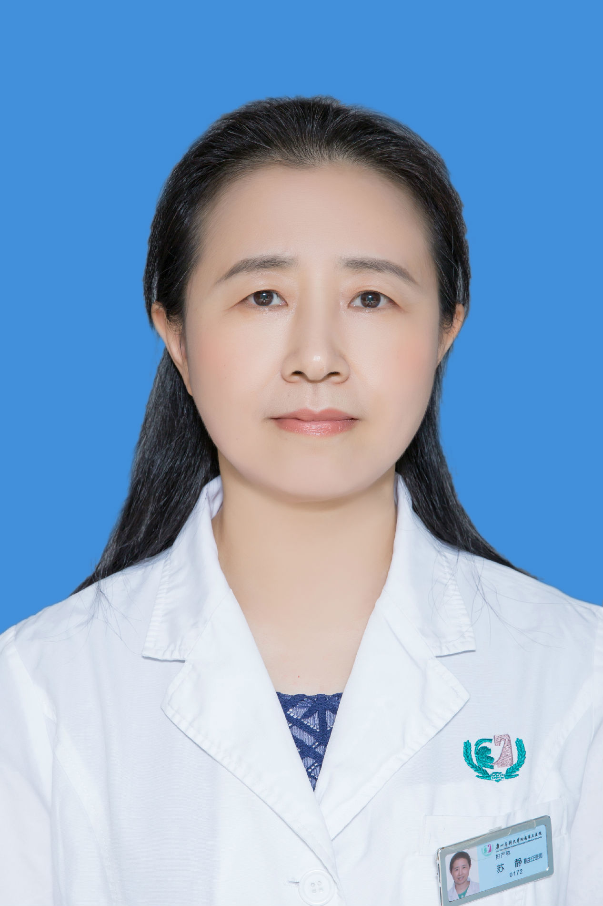

<!-- AUTO-GENERATED-BY: work/generate_obsidian_profiles.py -->

<!-- TEMPLATE: D:\workspace\信息收集整理\医生画像仓库\模板\医生画像模板.md -->

# 苏静

## 基础信息

| 字段 | 内容 |
|---|---|
| 姓名 | 苏静 |
| 医院 | 广州医科大学附属第三医院 |
| 科室 | 荔湾院区妇 科 |
| 职称/身份 | 副主任医师 |
| 来源链接 | [官网原文](https://www.gy3y.cn/ks/fckyjs/fk/doctor_119.html) |
| 采集日期 | 2026-08-13 |

## 简介/擅长

妇科肿瘤、子宫内膜异位症、功能失调性子宫出血、多囊卵巢综合征等疾病的规范化诊断和治疗。

## 论文与学术产出

- 在国家、省、市杂志发表文章多篇，参编《分娩损伤性疾病》、《妊娠合并肝脏疾病》等书，发表了功血、人工肝支持治疗、HELLP综合征等论文多篇。

## 可包装亮点

- 苏 静 ，副主任医师，从事妇产科临床工作近三十年，中华医学会妇产科分会会员。
- 在国家、省、市杂志发表文章多篇，参编《分娩损伤性疾病》、《妊娠合并肝脏疾病》等书，发表了功血、人工肝支持治疗、HELLP综合征等论文多篇。

## 重点疾病/人群标签

- 慢性病：
- 肿瘤：肿瘤、癌、生殖、卵巢、多囊、康复
- 生殖疾病：肿瘤、癌、生殖、卵巢、多囊、康复
- 免疫/风湿：
- 术后恢复/康复：肿瘤、癌、生殖、卵巢、多囊、康复
- 疑难重症：

## 证据摘录

> 只摘录官网公开信息中的短句或关键字段，不复制大段原文。

- 官网身份字段：副主任医师
- 官网简介/擅长：妇科肿瘤、子宫内膜异位症、功能失调性子宫出血、多囊卵巢综合征等疾病的规范化诊断和治疗。
- 官网亮眼经历线索：苏 静 ，副主任医师，从事妇产科临床工作近三十年，中华医学会妇产科分会会员。 在国家、省、市杂志发表文章多篇，参编《分娩损伤性疾病》、《妊娠合并肝脏疾病》等书，发表了功血、人工肝支持治疗、HELLP综合征等论文多篇。
- 来源链接：https://www.gy3y.cn/ks/fckyjs/fk/doctor_119.html

## BD 画像摘要

苏静医生可作为肿瘤、生殖疾病、术后恢复/康复方向的基础画像候选。后续 BD 使用应继续以官网来源和人工复核为准，不添加疗效承诺或无来源包装。

## 合规边界

- 仅使用医院官网、官方公众号、官方小程序等公开渠道。
- 不采集私人电话、私人微信、家庭住址、患者隐私或非公开排班信息。
- 不写“保证治愈”“疗效第一”“包治疑难杂症”等无法由官网证明的表述。
