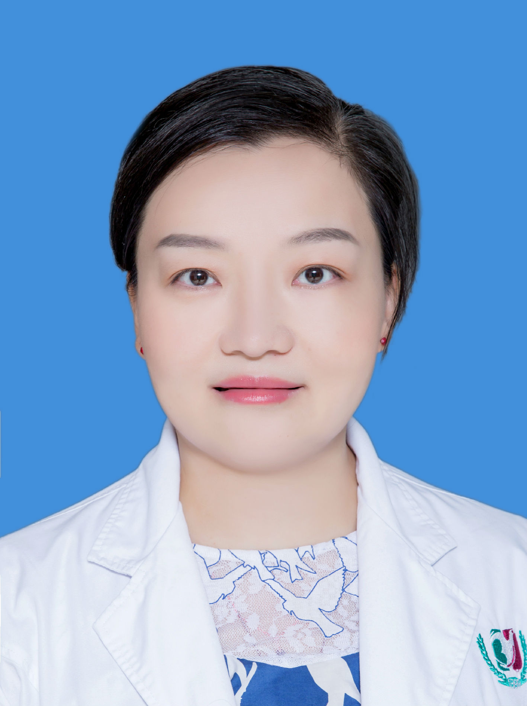

<!-- AUTO-GENERATED-BY: work/generate_obsidian_profiles.py -->

<!-- TEMPLATE: D:\workspace\信息收集整理\医生画像仓库\模板\医生画像模板.md -->

# 蒋亚玲

## 基础信息

| 字段 | 内容 |
|---|---|
| 姓名 | 蒋亚玲 |
| 医院 | 广州医科大学附属第三医院 |
| 科室 | 荔湾院区妇产科门诊 |
| 职称/身份 | 主任医师 |
| 来源链接 | [官网原文](https://www.gy3y.cn/ks/fckyjs/fckmz/doctor_219.html) |
| 采集日期 | 2026-08-13 |

## 简介/擅长

个体化促排卵治疗及辅助生殖技术如人工授精等。同时对优生优育、围产保健、生殖道感染性疾病也有较深的造诣。能独立熟练地完成计划生育手术、宫腔镜、LEEP刀等各类妇科微创手术。目前主要科研方向是生殖的调控和子宫内膜容受性的分子调节机制。

## 教育与进修经历

- 蒋亚玲 主任医师，2003年硕士毕业于华西医科大学，2011年博士毕业于南方医科大学，2013年至2015年在中国科学院干细胞与生殖生物学国家重点实验室完成博士后工作，研究方向是生殖的调控和子宫内膜容受性的分子调节机制。

## 科研项目与成果

- 蒋亚玲 主任医师，2003年硕士毕业于华西医科大学，2011年博士毕业于南方医科大学，2013年至2015年在中国科学院干细胞与生殖生物学国家重点实验室完成博士后工作，研究方向是生殖的调控和子宫内膜容受性的分子调节机制。
- 参与省部级课题2项，在国内外发表专业论文十余篇，其中3篇发表在SCI收录期刊中。
- 2003年开始从事妇产科学的临床、科研、教学工作，熟练掌握妇产科各种常见病、多发病的诊断与治疗，尤其擅长妇科内分泌疾病以及不孕不育的诊断与治疗。

## 论文与学术产出

- 参与省部级课题2项，在国内外发表专业论文十余篇，其中3篇发表在SCI收录期刊中。

## 可包装亮点

- 蒋亚玲 主任医师，2003年硕士毕业于华西医科大学，2011年博士毕业于南方医科大学，2013年至2015年在中国科学院干细胞与生殖生物学国家重点实验室完成博士后工作，研究方向是生殖的调控和子宫内膜容受性的分子调节机制。
- 参与省部级课题2项，在国内外发表专业论文十余篇，其中3篇发表在SCI收录期刊中。

## 重点疾病/人群标签

- 慢性病：
- 肿瘤：
- 生殖疾病：生殖、不孕、卵巢、辅助生殖、妇科内分泌、多囊、感染
- 免疫/风湿：生殖、不孕、卵巢、辅助生殖、妇科内分泌、多囊、感染
- 术后恢复/康复：
- 疑难重症：

## 证据摘录

> 只摘录官网公开信息中的短句或关键字段，不复制大段原文。

- 官网身份字段：主任医师
- 官网简介/擅长：个体化促排卵治疗及辅助生殖技术如人工授精等。同时对优生优育、围产保健、生殖道感染性疾病也有较深的造诣。能独立熟练地完成计划生育手术、宫腔镜、LEEP刀等各类妇科微创手术。目前主要科研方向是生殖的调控和子宫内膜容受性的分子调节机制。
- 官网亮眼经历线索：蒋亚玲 主任医师，2003年硕士毕业于华西医科大学，2011年博士毕业于南方医科大学，2013年至2015年在中国科学院干细胞与生殖生物学国家重点实验室完成博士后工作，研究方向是生殖的调控和子宫内膜容受性的分子调节机制。 参与省部级课题2项，在国内外发表专业论文十余篇，其中3篇发表在SCI收录期刊中。
- 来源链接：https://www.gy3y.cn/ks/fckyjs/fckmz/doctor_219.html

## BD 画像摘要

蒋亚玲医生可作为生殖疾病、免疫/风湿/感染方向的基础画像候选。后续 BD 使用应继续以官网来源和人工复核为准，不添加疗效承诺或无来源包装。

## 合规边界

- 仅使用医院官网、官方公众号、官方小程序等公开渠道。
- 不采集私人电话、私人微信、家庭住址、患者隐私或非公开排班信息。
- 不写“保证治愈”“疗效第一”“包治疑难杂症”等无法由官网证明的表述。
