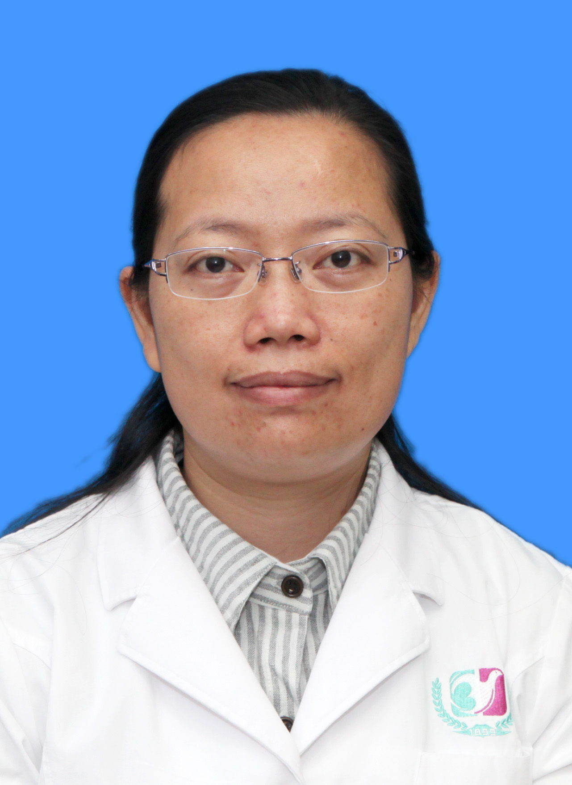

<!-- AUTO-GENERATED-BY: work/generate_obsidian_profiles.py -->

<!-- TEMPLATE: D:\workspace\信息收集整理\医生画像仓库\模板\医生画像模板.md -->

# 蔡款

## 基础信息

| 字段 | 内容 |
|---|---|
| 姓名 | 蔡款 |
| 医院 | 广州医科大学附属第三医院 |
| 科室 | 荔湾院区超声医学科 |
| 职称/身份 | 副主任医师 |
| 来源链接 | [官网原文](https://www.gy3y.cn/ks/yjbm/csyx/doctor_283.html) |
| 采集日期 | 2026-08-13 |

## 简介/擅长

从事超声医学工作和教学二十余年，擅长腹部、浅表器官、血管、妇产科超声诊断

## 科研项目与成果

- 在国家级和省级杂志发表医学论文多篇，参与编写著作多部，参与多项省级科研课题研究工作。

## 论文与学术产出

- 在国家级和省级杂志发表医学论文多篇，参与编写著作多部，参与多项省级科研课题研究工作。

## 可包装亮点

- 蔡 款 ，副主任医师。
- 在国家级和省级杂志发表医学论文多篇，参与编写著作多部，参与多项省级科研课题研究工作。
- 担任广东省医疗行业协会医学影像管理分会委员，广州市医师协会超声医师分会委员等。

## 重点疾病/人群标签

- 慢性病：
- 肿瘤：
- 生殖疾病：
- 免疫/风湿：
- 术后恢复/康复：
- 疑难重症：

## 证据摘录

> 只摘录官网公开信息中的短句或关键字段，不复制大段原文。

- 官网身份字段：副主任医师
- 官网简介/擅长：从事超声医学工作和教学二十余年，擅长腹部、浅表器官、血管、妇产科超声诊断
- 官网亮眼经历线索：蔡 款 ，副主任医师。 在国家级和省级杂志发表医学论文多篇，参与编写著作多部，参与多项省级科研课题研究工作。 担任广东省医疗行业协会医学影像管理分会委员，广州市医师协会超声医师分会委员等。
- 来源链接：https://www.gy3y.cn/ks/yjbm/csyx/doctor_283.html

## BD 画像摘要

蔡款医生可作为广州医科大学附属第三医院荔湾院区超声医学科的基础医生资料入库。当前重点方向以总底表标签为准，官网未展示的信息保持空白。

## 合规边界

- 仅使用医院官网、官方公众号、官方小程序等公开渠道。
- 不采集私人电话、私人微信、家庭住址、患者隐私或非公开排班信息。
- 不写“保证治愈”“疗效第一”“包治疑难杂症”等无法由官网证明的表述。
