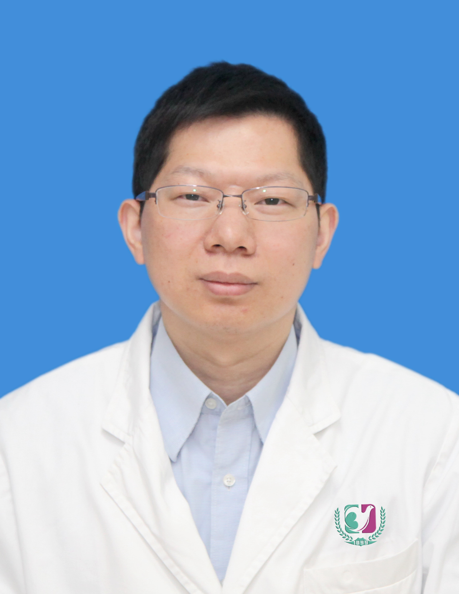

<!-- AUTO-GENERATED-BY: work/generate_obsidian_profiles.py -->

<!-- TEMPLATE: D:\workspace\信息收集整理\医生画像仓库\模板\医生画像模板.md -->

# 薛森新

## 基础信息

| 字段 | 内容 |
|---|---|
| 姓名 | 薛森新 |
| 医院 | 广州医科大学附属第三医院 |
| 科室 | 荔湾院区康复医学科 |
| 职称/身份 | 副主任医师 |
| 来源链接 | [官网原文](https://www.gy3y.cn/ks/mjz/kfyxk/doctor_347.html) |
| 采集日期 | 2026-08-13 |

## 简介/擅长

对脊柱四肢等急慢性疼痛康复、运动损伤康复、孕产康复、神经系统障碍康复有较深入的研究。擅长浮针治疗各种痛症、冷症等。骨关节疾病：颈椎病、腰椎间盘突出症、膝关节痛、肩关节痛（肩周炎、肩峰撞击综合征、肩袖损伤等）、早中期股骨头坏死等。孕产康复：产后腰痛、骶尾痛、耻骨联合分离、注射黄体酮后臀部痛、骨盆倾斜、腹直肌分离、盆底肌松弛、产后乳腺疼痛、产后漏尿便秘等。软组织疾病：肌肉劳损、急性腰扭伤、急慢性踝扭伤、网球肘等。其它：带状疱疹神经痛（浮针+淋巴手法等治疗）、头痛头晕、冷症、肢体麻木等。

## 科研项目与成果

- 从事康复医学20年，在国家级刊物发表论文多篇，国家专利两项。

## 论文与学术产出

- 从事康复医学20年，在国家级刊物发表论文多篇，国家专利两项。

## 可包装亮点

- 薛森新 ，副主任医师，硕士。
- 广东省中医药学会浮针专业委员会会员，广东省康复医学会疼痛康复分会理事，广东省康复医学会手功能康复分会理事。
- 从事康复医学20年，在国家级刊物发表论文多篇，国家专利两项。

## 重点疾病/人群标签

- 慢性病：慢性、康复、疼痛
- 肿瘤：
- 生殖疾病：
- 免疫/风湿：
- 术后恢复/康复：慢性、康复、疼痛
- 疑难重症：

## 证据摘录

> 只摘录官网公开信息中的短句或关键字段，不复制大段原文。

- 官网身份字段：副主任医师
- 官网简介/擅长：对脊柱四肢等急慢性疼痛康复、运动损伤康复、孕产康复、神经系统障碍康复有较深入的研究。擅长浮针治疗各种痛症、冷症等。骨关节疾病：颈椎病、腰椎间盘突出症、膝关节痛、肩关节痛（肩周炎、肩峰撞击综合征、肩袖损伤等）、早中期股骨头坏死等。孕产康复：产后腰痛、骶尾痛、耻骨联合分离、注射黄体酮后臀部痛、骨盆倾斜、腹直肌分离、盆底肌松弛、产后乳腺疼痛、产后漏尿便秘等。软组织疾病：肌肉劳损、急性腰扭伤、急慢性踝扭伤、网球肘等。其它：带状疱疹神经痛（浮针…
- 官网亮眼经历线索：薛森新 ，副主任医师，硕士。 广东省中医药学会浮针专业委员会会员，广东省康复医学会疼痛康复分会理事，广东省康复医学会手功能康复分会理事。 从事康复医学20年，在国家级刊物发表论文多篇，国家专利两项。
- 来源链接：https://www.gy3y.cn/ks/mjz/kfyxk/doctor_347.html

## BD 画像摘要

薛森新医生可作为慢性病、术后恢复/康复方向的基础画像候选。后续 BD 使用应继续以官网来源和人工复核为准，不添加疗效承诺或无来源包装。

## 合规边界

- 仅使用医院官网、官方公众号、官方小程序等公开渠道。
- 不采集私人电话、私人微信、家庭住址、患者隐私或非公开排班信息。
- 不写“保证治愈”“疗效第一”“包治疑难杂症”等无法由官网证明的表述。
